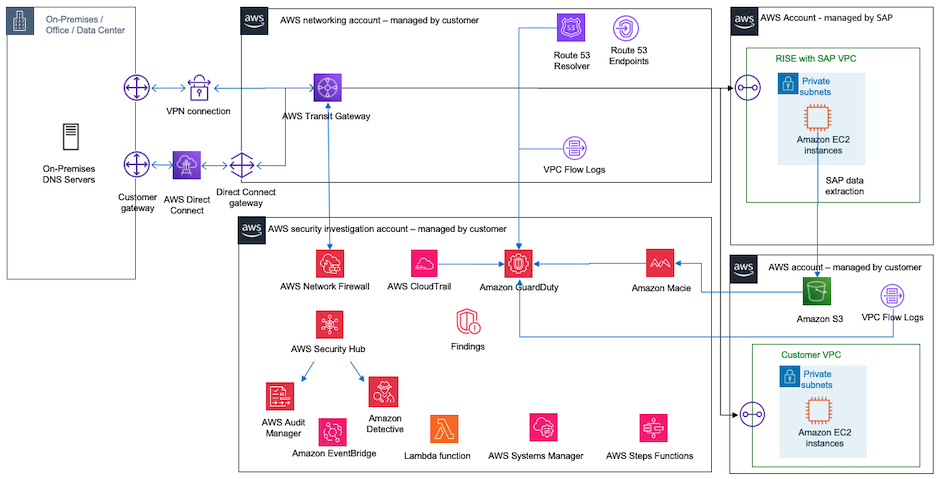

# Using All AWS Security Services

Combining together all services described above allow for an architecture monitoring multiple areas of a RISE on AWS deployment: network traffic, DNS logs, CloudTrail API activity, sensitive information extracted SAP data. Amazon GuardDuty and AWS Security Hub are fed from multiple services and uses AIML intelligence to detect malicious activities and anomalies. Findings are passed to Amazon Detective for a deeper RCA analysis or sent to Amazon EventBridge for custom reporting and alerting.

Below is example architecture of GuardDuty, AWS Network Firewall, Amazon Macie, AWS Security Hub and Amazon Detective combined together to improve security posture of RISE with SAP on AWS deployment

