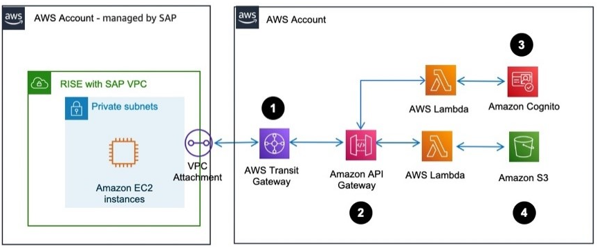

# Application integration

Deploy [Amazon API Gateway](../../../apigateway/latest/developerguide/welcome.md "../../../apigateway/latest/developerguide/welcome.md") to extract data out of SAP S/4HANA via `HTTP` API. API Gateway can consume data from IDOC, BAPI, and RFC. These need to be translated to a web service call. For more information, see [AWS blogs](https://aws.amazon.com/blogs/awsforsap/category/application-services/amazon-api-gateway-application-services/ "https://aws.amazon.com/blogs/awsforsap/category/application-services/amazon-api-gateway-application-services/"). The following image shows this scenario.

Data flow

1. RISE with SAP VPC is connected to your AWS account not managed by SAP, via AWS Transit Gateway.
2. Amazon API Gateway is configured to route the authentication to AWS Lambda and Amazon Cognito
3. Amazon Cognito authenticates the session.
4. Once authenticated, Amazon API Gateway routes the package to AWS Lambda.
5. AWS Lambda stores the data in an Amazon S3 bucket.
