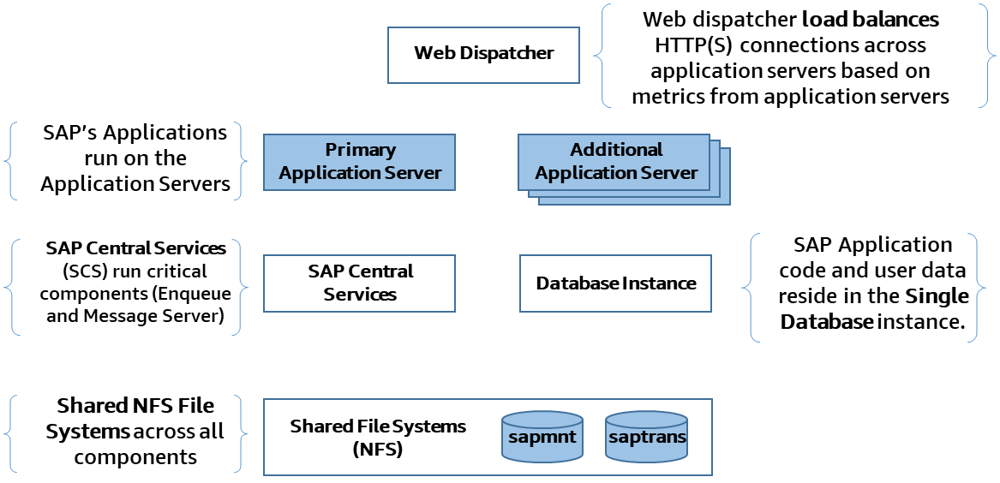
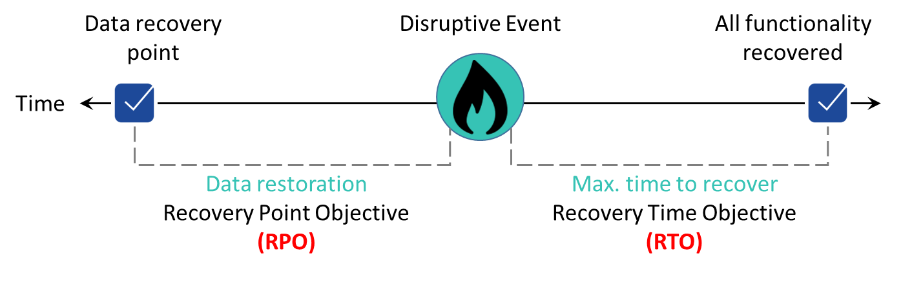
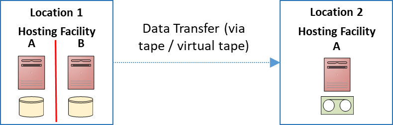
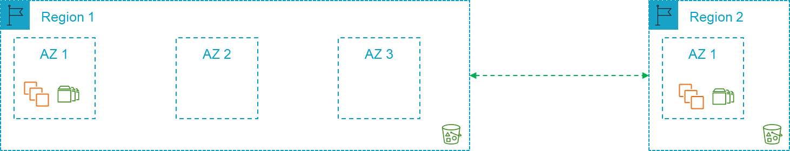
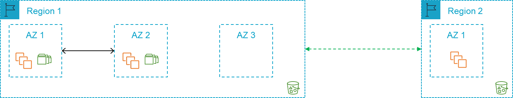
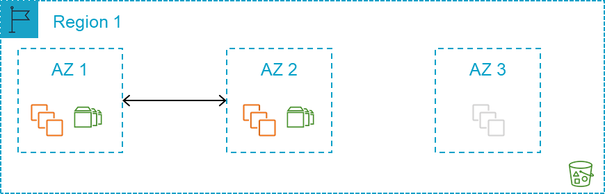

# Introduction

For decades, SAP customers protected SAP workloads on premise with two common patterns: high availability and disaster recovery. The advent of cloud computing provided an opportunity to rethink HADR capabilities for SAP, using modern architectures and technologies.

Let’s recap the SAP system design and single points of failure that are part of the SAP n-tier architecture.

## SAP NetWeaver architecture single points of failure

**Figure 1: SAP single points of failure**

Figure 1 shows the typical SAP NetWeaver architecture, which has several single points of failure which are listed below:

- SAP Central Services (message server and enqueue processes)
- SAP Application Server
- NFS (shared storage)
- Database
- SAP Web Dispatcher

For the SAP Central Services and Database, protection can be added by deploying additional hosts. For example, an additional host running the SAP replicated enqueue can protect the loss of application level locks (enqueue locks) and an additional host running a secondary database instance can protect against data loss.

However, the inherent design of these single points of failure limits the ability to easily take advantage of cloud native features to provide high availability and reliability.

Amazon Elastic File Service (Amazon EFS) is a highly available and durable managed NFS service that runs actively across multiple physical locations (AWS Availability Zones). This service can help protect one of the SAP single points of failure.

## High availability and disaster recovery

High availability (HA) is the attribute of a system to provide service during defined periods, at acceptable or agreed upon levels and to mask unplanned outages from end users. This is often achieved by using clustered servers. These servers provide automated failure detection, recovery or highly resilient hardware, robust testing, and problem and change management.

Disaster recovery (DR) protects against unplanned major outages, such as site disasters, through reliable and predictable recovery on a different hardware and/or physical location. The loss of data due to corruption or malware is considered a logical disaster event. It is normally resolved in a separate solution, such as recovery from the latest backup or storage snapshot. Logical DR does not necessarily imply a fail over to another facility.

From the perspective of documented and measurable data points, HADR requirements are often defined in terms of the following:

- **Percentage uptime** is the percentage of uptime in a given period (monthly or annual).
- **Mean time to recovery (MTTR)** is the average time required to recover from failure.
- **Return to service (RTS)** is the time it takes to bring the system back to service for the users.
- **Recovery time objective (RTO)** is the maximum length of time that a system or service can be down, how long a solution takes to recover, and the time it takes for a service to be available again.
- **Recovery point objective (RPO)** is how much data a business is willing to lose, expressed in time. It’s the maximum time between a failure and the recovery point.

**Figure 1: SAP single points of failure**

≈

## On premises vs. cloud deployment patterns

Traditionally, customers with high availability requirements would deploy their primary compute capabilities in a single data center or hosting facility, often in two separate rooms or data center halls with disparate cooling and power, and high-speed network connectivity. Some customers would run two hosting facilities in close proximity, with a separation of compute capabilities, yet close enough to not be impacted by network latency.

To meet disaster recovery requirements (the preceding scenarios represent an elevated risk to unforeseen location failure), many customers would extend their architecture to include a secondary location where a copy of their data resided, with additional idle compute capacity. The distance between the primary and secondary locations often created the need for asynchronous transfer of data which impacted the recovery point objective. This was the standard and generally accepted architecture pattern for high availability and disaster recovery for many industries and companies running SAP.

**Figure 3: On-premises disaster recovery**

In Figure 3, we give an example of an approach that customers often take on premises. In **Location 1**, the customer has two hosting facilities often separate rooms or halls in the same data center where they deploy a high availability architecture for the SAP single point of failure. **Location 2** is the disaster recovery location in which the SAP systems are recovered, in the event of a significant failure of both hosting facilities in **Location 1**.

Customers migrating their SAP workloads to cloud providers still revert to this architecture and map it to AWS Regions and Availability Zones (AZs) as depicted in Figure 4. While this architecture can work in your environment, it does not follow the [AWS Well-Architected Framework](https://aws.amazon.com/architecture/well-architected/ "https://aws.amazon.com/architecture/well-architected/") which helps cloud architects build secure, high-performing, resilient, and efficient infrastructure for their applications.

**Figure 4: On-premises to AWS region mapping approach**

AWS isolates facilities geographically in Regions and Availability Zones. A Multi-AZ approach provides distance while maintaining performance for the primary compute capacity. This approach (Figure 5) greatly reduces the risk of location failure.

**Figure 5: Alternative approach for on premises to AWS region mapping**

With the risk of location failure significantly reduced for the primary compute capacity, the requirements for a second Region can be evaluated based on business requirements. You can rapidly deploy required capacity in the same or different Region with AWS. Idle hardware is no longer an issue. Data backups can be stored on Amazon Simple Storage Service (Amazon S3) in a single AWS Region or in multiple AWS Regions by leveraging cross-Region replication. This architecture can be simplified and be made readily available (Figure 6).

**Figure 6: Single AWS Region approach**

In addition to considering the impact of infrastructure or hosting facility failure, another scenario to consider is the loss of business data due to accidental or malicious technical activity.

Loss of business data due to accidental or malicious technical activity is referred to as _logical disaster recovery_. It requires a decision to restore the business data from a good local copy. To enable this, decisions need to be made with regard to the storage location of the data and how it will be used in the event of a _logical disaster recovery_.

Further in this guide, we detail the key architecture guidelines, architecture patterns, and decisions to consider for your availability and reliability requirements.
