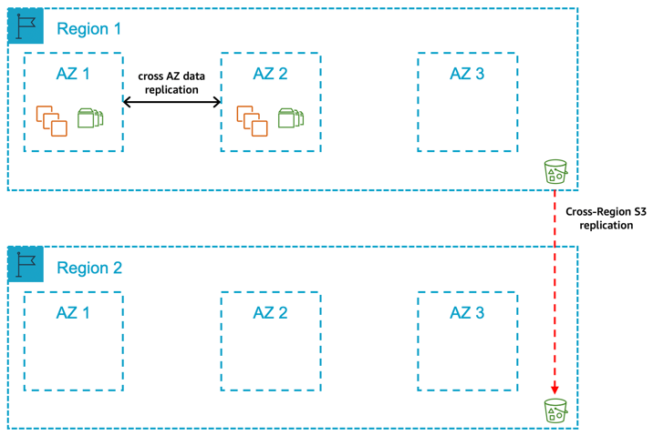
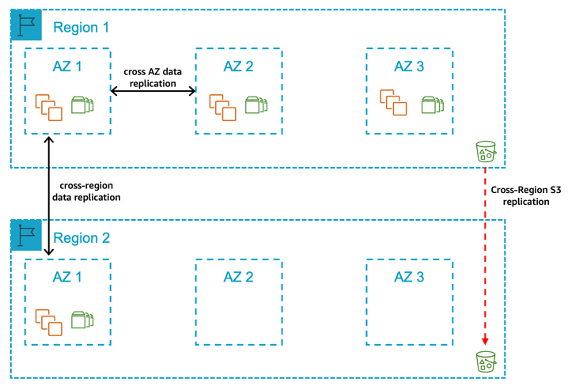
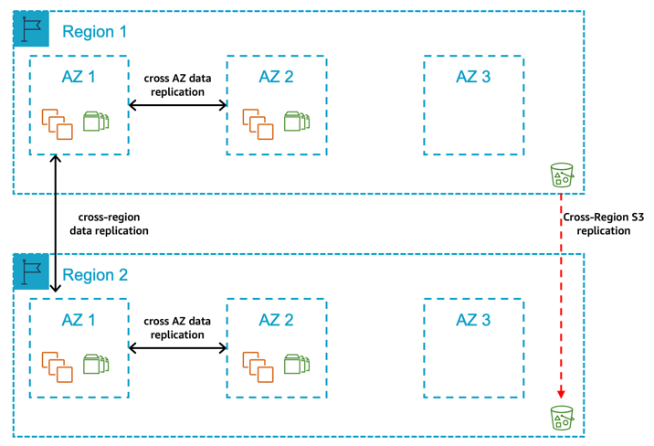
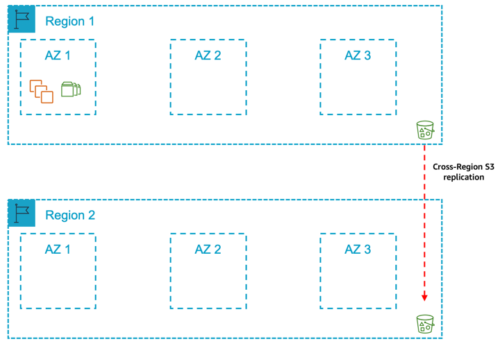

# Multi-Region Architecture Patterns

You should select a multi-Region architecture if you require the following:

- You require the data to reside in two specific geographical AWS Regions at all times.
- You can accept the potential network latency considerations associated with a multi-Region approach.
- You can accept the increased complexity associated with multi-Region approach.
- You can accept the cost implications / differences associated with a multi-Region approach including:
  - [AWS service pricing (e.g. Amazon EC2)](arch-guide-architecture-guidelines-and-decisions.md#arch-guide-selecting-the-aws-regions "arch-guide-architecture-guidelines-and-decisions.md#arch-guide-selecting-the-aws-regions") in different AWS Regions
  - [Cross-Region data transfer costs](arch-guide-architecture-guidelines-and-decisions.md#arch-guide-cross-regional-data-transfer "arch-guide-architecture-guidelines-and-decisions.md#arch-guide-cross-regional-data-transfer")

- Additional compute and/or storage costs in the second Region.

## Pattern 5: A primary Region with two AZs for production and a secondary Region containing a replica of backups/AMIs

**Figure 11: A primary Region with two Availability Zones for production and a secondary Region containing a replica of backups/AMIs**

In this pattern, you deploy your production system across two Availability Zones in the primary Region. The compute deployed for the production SAP database and central services tiers are the same size in both Availability Zones with automated fail over in the event of an Availability Zone failure. The compute required for the SAP application tier is split 50/50 between two Availability Zones. Additionally, the production database backups stored in Amazon S3, Amazon EBS Snapshots, and Amazon Machine Images are replicated on the secondary Region. In the event of a complete Region failure, the production systems would be restored from the last set of backups in the second Region.

**Select this pattern if:**

- You require a defined time window to complete recovery of production and assurance of the availability of compute capacity in another Availability Zone within the primary Region for the production SAP database and central services tiers.
- You can can accept the additional cost of deploying the required compute and storage for production SAP database and central services tiers across two Availability Zones within the primary Region.
- You can accept the cross-Availability Zone related data transfer costs for data replication.
- You can accept that automated fail over between Availability Zones requires a third-party cluster solution.
- You can allow for a period of time where there is only one set of computes deployed for the SAP database and central services in the event of an Availability Zone failure or significant Amazon EC2 failure.
- You can accept that data replication across Availability Zones requires either a database replication capability or a block level replication solution.
- You can accept the variable time duration required (including any delay in availability of the required compute capacity in the remaining Availability Zones) to return the application tier to 100% capacity.
- You can accept the variable time duration required to complete recovery of production in the event of a Region failure.
- You can accept the increased complexity and costs associated with multi-Region approach.
- You can accept that manual actions are required to restore production in the second Region.

**Key design principles**

- 100% compute capacity is deployed in Availability Zone 1 and Availability Zone 2 for production SAP database and central services tiers.
- Compute capacity is deployed in Availability Zone 1 and Availability Zone 2 for production SAP application tier (Active/Active) and needs to be scaled in the event of an Availability Zone failure or significant Amazon EC2 service degradation.
- [Amazon EC2 auto recovery](arch-guide-architecture-guidelines-and-decisions.md#arch-guide-ec2-auto-recovery "arch-guide-architecture-guidelines-and-decisions.md#arch-guide-ec2-auto-recovery") is configured for all instances to protect against underlying hardware failure with the exception of instances protected by a third-party cluster solution.
- The SAP database-related data on Amazon EBS is replicated between Availability Zones using either a database replication capability or a block level replication solution.
- Amazon EFS is used for the SAP Global File Systems and is replicated on the secondary Region.
- SAP Database data is backed up regularly to Amazon S3.
- Amazon Machine Image/Amazon EBS Snapshots are taken for all servers on a regular basis
- Amazon S3 Data (database backups), Amazon EBS Snapshots and Amazon Machine Images are replicated/copied to a secondary Region to protect [logical data loss](arch-guide-failure-scenarios.md#arch-guide-logical-data-loss "arch-guide-failure-scenarios.md#arch-guide-logical-data-loss").

**Benefits**

- Low Mean Time to Recovery (MTTR) in the event of Amazon EC2 or Availability Zone failure
- Predictable Return to Service (RTS) in the event of Amazon EC2 or Availability Zone failure
- Database-related data persisted on different sets of Amazon EBS volumes in two Availability Zones via database replication capability or a block level replication solution
- Required compute capacity deployed in two Availability Zones in primary Region
- No dependency on restoring data from Amazon S3 in the event of an Availability Zone failure in the primary Region
- Ability to protect against significant degradation or total Availability Zone failure through fail over to Availability Zone 2 of database and central services tiers
- Ability to protect against significant degradation or total Region failure through fail over to secondary Region

**Considerations**

- Well documented and tested processes are required for the automated fail over between Availability Zones.
- Well documented and tested processes are required for maintaining the automated fail over solution.
- Well documented and tested processes are required for scaling the AWS resources to return the application tier to full capacity in the event of an Availability Zone failure or significant Amazon EC2 service degradation.
- Well documented and tested processes are required for scaling the AWS resources, restoring the data, and moving production to the secondary Region.
- Higher network latency from your on-premises locations to the secondary AWS Region may impact end user performance.

## Pattern 6: A primary Region with two AZs for production and a secondary Region with compute and storage capacity deployed in a single AZ

**Figure 12: A primary Region with two Availability Zones for production and a secondary Region with compute and storage capacity deployed in a single Availability Zone**

In this pattern, you deploy all of your production systems across two Availability Zones in the primary Region. The compute deployed for the production SAP database and central services tiers are the same size in both Availability Zones with automated fail over in the event of Availability Zone failure. The compute required for the SAP application tier is split 50/50 between two Availability Zones. Your non-production systems are **not** an equivalent size to your production and are deployed in a different Availability Zone within the Region. Additionally, compute capacity is deployed in Availability Zone 1 in secondary Region for production SAP database and central services tiers. The production database is replicated to the secondary Region using a database replication capability or a block level replication solution.

The Production database backups stored in Amazon S3, Amazon EBS Snapshots, and Amazon Machine Images are replicated to the secondary Region. In the event of a complete Region failure, the production systems would be restored in the secondary Region using the replicated data for the database tier and the last set of backups for the SAP central services and application tiers.

**Select this pattern if:**

- You require a defined time window to complete recovery of production and assurance of the availability of compute capacity in another Availability Zone within the primary Region for the production SAP database and central services tiers.
- You can accept the additional cost of deploying the required compute and storage for production SAP database and central services tiers across two Availability Zones within the primary Region.
- You can accept the increased cost of deploying the required compute and storage for production SAP database and central services tiers across two Availability Zones in the primary Region.
- You can accept the cross-Availability Zone related data transfer costs for data replication.
- You can accept that automated fail over between Availability Zones requires a third-party cluster solution.
- You can allow for a period of time where there is only one set of computes deployed for the SAP database and central services in the event of an Availability Zone failure or significant Amazon EC2 failure.
- You can accept that data replication across Availability Zones of the database-related data requires either a database replication capability or a block level replication solution.
- You can accept the variable time duration required (including any delay in availability of the required compute capacity in the remaining Availability Zones) to return the application tier to 100% capacity.
- You require a defined time window to complete recovery of production in the event of a Region failure.
- You can accept the increased complexity and costs associated with multi-Region approach.
- You require assurance of availability of compute capacity in a single Availability Zone in the secondary Region for the production SAP database and central services tiers.
- You can accept the increased cost of deploying the required compute and storage for production SAP database and central services tiers across two Availability Zones in one Availability Zone in the secondary Region.
- You can accept that manual actions are required to fail over between Regions.

**Key design principles**

- 100% compute capacity is deployed in Availability Zone 1 and Availability Zone 2 for production SAP database and central services tiers.
- 100% compute capacity is deployed in Availability Zone 1 in the secondary Region for production SAP database and central services tiers.
- Compute capacity is deployed in Availability Zone 1 and Availability Zone 2 for production SAP application tier (Active/Active) and needs to be scaled in the event of an Availability Zone failure or significant Amazon EC2 service degradation.
- [Amazon EC2 auto recovery](arch-guide-architecture-guidelines-and-decisions.md#arch-guide-ec2-auto-recovery "arch-guide-architecture-guidelines-and-decisions.md#arch-guide-ec2-auto-recovery") is configured for all instances to protect against underlying hardware failure with the exception of those instances protected by a third-party cluster solution.
- The database-related data on Amazon EBS is replicated between Availability Zones using either a database replication capability or a block level replication solution.
- The SAP database-related data on Amazon EBS is replicated between Regions using either a database replication capability or a block level replication solution.
- Amazon EFS is used for the SAP Global File Systems and replicated to the secondary Region.
- SAP database data is backed up regularly to Amazon S3.
- Amazon Machine Image/Amazon EBS Snapshots are taken for all servers on a regular basis
- Amazon S3 data (database backups), Amazon EBS Snapshots, and Amazon Machine Images are replicated/copied to a secondary Region to protect [logical data loss](arch-guide-failure-scenarios.md#arch-guide-logical-data-loss "arch-guide-failure-scenarios.md#arch-guide-logical-data-loss").

**Benefits**

- Low Mean Time to Recovery (MTTR) in the event of an Amazon EC2, Availability Zone or Region failure
- Predictable Return to Service (RTS)
- Database-related data persisted on different sets of Amazon EBS volumes in two Availability Zones in primary Region and one set of volumes in an Availability Zone in secondary Region via database replication capability or a block level replication solution
- Required compute capacity deployed in two Availability Zones in primary Region and one Availability Zone in secondary Region
- No dependency on restoring data from Amazon S3 in the event of an Availability Zone failure or Region failure
- Ability to protect against significant degradation or total Availability Zone failure through fail over to Availability Zone 2 of database and central services tiers
- Ability to protect against significant degradation or total Region failure through fail over to secondary Region

**Considerations**

- Well documented and tested processes are required for the automated fail over between Availability Zones.
- Well documented and tested processes are required for maintaining the automated fail over solution.
- Well documented and tested processes are required for scaling the AWS resources to return the application tier to full capacity in the event of an Availability Zone failure or significant Amazon EC2 service degradation.
- Well documented and tested processes are required for moving production to the secondary Region.
- Higher network latency from your on-premises locations to the secondary AWS Region may impact end user performance.
- There is an overhead of maintaining the same software version and patch levels (OS, Database, SAP) across two different Regions.

## Pattern 7: A primary Region with two AZs for production and a secondary Region with compute and storage capacity deployed and data replication across two AZs

**Figure 13: A primary Region with two Availability Zones for production and a secondary Region with compute and storage capacity deployed and data replication across two Availability Zones**

In this pattern, you deploy all of your production systems across two Availability Zones in the primary Region. The compute deployed for the production SAP database and central services tiers are the same size in both Availability Zones with automated fail over in the event of Availability Zone failure. The compute required for the SAP application tier is split 50/50 between two Availability Zone. Additionally, you have compute capacity deployed in Availability Zone 1 and Availability Zone 2 in secondary Region for production SAP database and central services tiers and the production database is replicated to the secondary Region using either a database replication capability or a block level replication solution. The production database backups stored in Amazon S3, Amazon EBS Snapshots, and Amazon Machine Images are replicated on a secondary Region. In the event of a complete Region failure, the production systems would be moved over to the secondary Region manually.

**Select this pattern if:**

- You require a defined time window to complete recovery of production and assurance of the availability of compute capacity in another Availability Zone within the primary Region for the production SAP database and central services tiers.
- You can accept the additional cost of deploying the required compute and storage for production SAP database and central services tiers across two Availability Zones within the primary Region.
- You can allow for a period of time where there is only one set of computes deployed for the SAP database and central services in the event of an Availability Zone failure or significant Amazon EC2 failure.
- You can accept that data replication across Availability Zones of the database-related data requires either a database replication capability or a block level replication solution.
- You can accept the cross-Availability Zone related data transfer costs for data replication.
- You can accept that automated fail over between Availability Zones requires a third-party cluster solution.
- You can accept the variable time duration required (including any delay in availability of the required compute capacity in the remaining Availability Zones) to return the application tier to 100% capacity.
- You require a defined time window to complete recovery of production in the event of a Region failure.
- You require assurance of availability of compute capacity in two Availability Zones in the secondary Region for the production SAP database and central services tiers.
- You can accept the additional cost of deploying the required compute and storage for production SAP database and central services tiers across two Availability Zones in the secondary Region.
- You can accept the increased complexity and costs associated with multi-Region approach.
- You can accept that manual actions are required to fail over between Regions.

**Key design principles**

- 100% compute capacity is deployed in Availability Zone 1 and Availability Zone 2 in the primary Region for production SAP database and central services tiers.
- 100% compute capacity is deployed in Availability Zone 1 and Availability Zone 2 in the secondary Region for production SAP database and central services tiers.
- Compute capacity is deployed in Availability Zone 1 and Availability Zone 2 in the primary Region for production SAP application tier (Active/Active) and needs to be scaled in the event of an Availability Zone failure or significant Amazon EC2 service degradation.
- Amazon EC2 auto recovery is configured for all instances to protect against underlying hardware failure with the exception of instances protected by a third-party cluster solution.
- The SAP database-related data on Amazon EBS is replicated between Availability Zones using either a database replication capability or a block level replication solution.
- The SAP database-related data on Amazon EBS is replicated between Regions using either a database replication capability or a block level replication solution.
- Amazon EFS is used for the SAP Global File Systems and replicated on the secondary Region.
- SAP database data is backed up regularly on Amazon S3.
- Amazon Machine Image/Amazon EBS Snapshots for all servers are taken on a regular basis.
- Amazon S3 data (database backups), Amazon EBS Snapshots, and Amazon Machine Images are replicated/copied to a secondary Region to protect [logical data loss](arch-guide-failure-scenarios.md#arch-guide-logical-data-loss "arch-guide-failure-scenarios.md#arch-guide-logical-data-loss").

**Benefits**

- Low Mean Time to Recovery (MTTR) in the event of Amazon EC2, Availability Zone or Region failure
- Predictable Return to Service (RTS)
- Database-related data persisted on different sets of Amazon EBS volumes in two Availability Zones in the primary Region and different sets of Amazon EBS volumes in two Availability Zones in the secondary Region via database replication capability or a block level replication solution
- Required compute capacity deployed in two Availability Zones in primary Region and two Availability Zones in secondary Region
- No dependency on restoring data from Amazon S3 in the event of an Availability Zone or Region failure
- Ability to protect against significant degradation or total Availability Zone failure through fail over to Availability Zone 2 of database and central services tiers
- Ability to protect against significant degradation or total Region failure through fail over to secondary Region

**Considerations**

- Well documented and tested processes are required for the automated fail over between Availability Zones.
- Well documented and tested processes are required for maintaining the automated fail over solution.
- Well documented and tested processes are required for scaling the AWS resources to return the application tier to full capacity in the event of an Availability Zone failure or significant Amazon EC2 service degradation.
- Well documented and tested processes are required for moving production to the secondary Region.
- Higher network latency from your on-premises locations to the secondary AWS Region may impact end user performance.
- There is an overhead of maintaining the same software version and patch levels (OS, Database, SAP) across two different Regions.

## Pattern 8: A primary Region with one AZ for production and a secondary Region containing a replica of backups/AMIs

**Figure 14: A primary Region with one Availability Zone for production and a secondary Region containing a replica of backups/AMIs**

In this pattern, you deploy your production systems in the primary Region in one Availability Zone. Your non-production systems are **not** an equivalent size to your production and are deployed in the same Availability Zones or a different Availability Zone within the Region.

Additionally, the production database backups stored in Amazon S3, Amazon EBS Snapshots, and Amazon Machine Images are replicated to a secondary Region. In the event of a complete Region failure, the production systems would be restored from the last set of backups in the second Region.

**Select this pattern if:**

- In the event of an Availability Zone failure or significant Amazon EC2 service degradation, you can accept the risks related to the variable time duration required (including any delay in availability of the required compute capacity in the remaining Availability Zones) to re-create the AWS resources in a different Availability Zone and restore the persistent data to Amazon EBS.
- You can accept the risks related to variable time duration required to complete recovery of production in the event of a Region failure.
- You want to avoid the cost implications with a Multi-AZ approach and accept the related risks of downtime of your production SAP systems.
- You can accept the increased complexity and costs associated with multi-Region approach.
- You can accept that manual actions are required to restore production in the secondary Region.

**Key design principles**

- 100% compute capacity is deployed in Availability Zone 1 for production SAP database and central services tiers.
- 100% compute capacity is deployed in Availability Zone 1 for production SAP application tier.
- [Amazon EC2 auto recovery](arch-guide-architecture-guidelines-and-decisions.md#arch-guide-ec2-auto-recovery "arch-guide-architecture-guidelines-and-decisions.md#arch-guide-ec2-auto-recovery") is configured for all instances to protect against underlying hardware failure.
- Deployed non-production compute capacity is less than 100% of the compute capacity deployed for production SAP database and central services tiers.
- The SAP database is persisted on Amazon EBS in a single Availability Zone only and not replicated to another Availability Zone using either a database replication capability or a block level replication solution.
- Amazon EFS is used for the SAP global file systems.
- SAP database is backed up regularly to Amazon S3.
- Amazon S3 is configured to protect against [logical data loss](arch-guide-failure-scenarios.md#arch-guide-logical-data-loss "arch-guide-failure-scenarios.md#arch-guide-logical-data-loss").
- Amazon Machine Image/Amazon EBS Snapshots are taken for all servers on a regular basis.
- Amazon S3 data (database backups), Amazon EBS Snapshots, and Amazon Machine Images are replicated/copied to a secondary Region to protect [logical data loss](arch-guide-failure-scenarios.md#arch-guide-logical-data-loss "arch-guide-failure-scenarios.md#arch-guide-logical-data-loss").

**Benefits**

- Reduced cost compared to Multi-AZ
- Ability to protect against significant degradation or total Region failure through fail over to secondary Region

**Considerations**

- Well documented and tested processes are required for scaling the AWS resources to return the SAP application tier to full capacity in the event of an Availability Zone failure or significant Amazon EC2 service degradation.
- Well documented and tested processes are required for scaling the AWS resources, restoring the data, and moving production to the secondary Region.
- Higher network latency from your on-premises locations to the secondary AWS Region may impact end user performance.
- In the event of compute, Availability Zone or Region failure due to lack of high availability across two Availability Zones, there is an increased time required to recover production.
