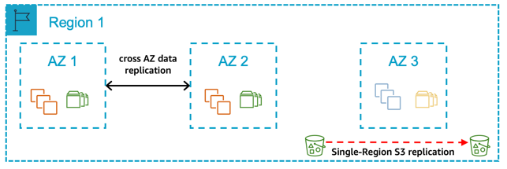
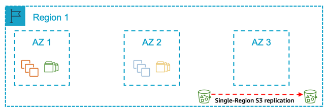
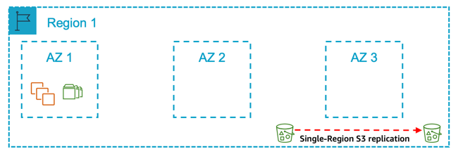

# Single Region architecture patterns

Select a single Region pattern if:

- You require the data to reside only in a specific geographical Region (AWS Region) at all times
- You want to avoid the [potential network latency](arch-guide-architecture-guidelines-and-decisions.md#arch-guide-multi-region-considerations "arch-guide-architecture-guidelines-and-decisions.md#arch-guide-multi-region-considerations") considerations associated with a Multi-Region approach
- You want to avoid the cost implications or differences associated with a Multi-Region approach including:
  - [AWS service pricing in different AWS Regions](arch-guide-architecture-guidelines-and-decisions.md#arch-guide-selecting-the-aws-regions "arch-guide-architecture-guidelines-and-decisions.md#arch-guide-selecting-the-aws-regions")
  - [Cross-Region data transfer costs](arch-guide-architecture-guidelines-and-decisions.md#arch-guide-cross-regional-data-transfer "arch-guide-architecture-guidelines-and-decisions.md#arch-guide-cross-regional-data-transfer")

## Pattern 1: A single Region with two AZs for production

**Figure 7: A single Region with two Availability Zones for production**

In this pattern, you deploy all your production systems across two Availability Zones. The compute deployed for the production SAP database and central services tiers are the same size in both Availability Zones, with automated fail over in the event of a zone failure. The compute required for the SAP application tier is split 50/50 between two zones. Your non-production systems are **not** an equivalent size to your production and are deployed in the same zones or a different Availability Zone within the Region.

**Select this pattern if:**

- You require a defined time window to complete recovery of production as well as assurance of the availability of compute capacity in another Availability Zone for the production SAP database and central services tiers.
- You can accept the additional cost of deploying the required compute and storage for production SAP database and central services tiers across two Availability Zones.
- Your non-production environment is not of equivalent size as production and therefore cannot be used as sacrificial capacity for production in the event of an Availability Zone failure or significant Amazon EC2 service degradation.
- You can accept data replication across Availability Zones (database replication capability or a block level replication solution required) and the associated cost.
- You can accept that automated fail over between Availability Zones requires a third-party cluster solution.
- You can accept the variable time duration required (including any delay in availability of the required compute capacity in the remaining Availability Zones) to return the application tier to 100% capacity in the event of a zone failure.

**Key design principles**

- 100% compute capacity deployed in Availability Zone 1 and Availability Zone 2 for production SAP database and central services tiers.
- Compute capacity is deployed in Availability Zone 1 and Availability Zone 2 for production application tier (Active/Active). In the event of an Availability Zone failure, the application tier needs to be scaled to return to 100% capacity within the remaining zone.
- The SAP Database is persisted on Amazon EBS in two Availability Zones using either a database replication capability or a block level replication solution.
- Amazon EC2 auto recovery is configured for all instances to protect against underlying hardware failure, with the exception of instances protected by a third-party cluster solution.
- Amazon EFS is used for the SAP Global File Systems.
- SAP Database is backed up regularly to Amazon S3.
- Amazon S3 [single-Region replication](arch-guide-architecture-guidelines-and-decisions.md#arch-guide-s3-replication "arch-guide-architecture-guidelines-and-decisions.md#arch-guide-s3-replication") is configured to protect [logical data loss](arch-guide-failure-scenarios.md#arch-guide-logical-data-loss "arch-guide-failure-scenarios.md#arch-guide-logical-data-loss").
- Amazon Machine Image/Amazon EBS Snapshots are taken for all servers on a regular basis.

**Benefits**

- Low Mean Time to Recovery (MTTR)
- Predictable Return to Service (RTS)
- Ability to protect against significant degradation or total Availability Zone failure through fail over of database and central services tiers to Availability Zone 2
- No requirement to restore data from Amazon S3 in the event of an Availability Zone or Amazon EBS failure

**Considerations**

- Well documented and tested processes are required for the automated fail over between Availability Zones.
- Well documented and tested processes are required for maintaining the automated fail over solution.
- Well documented and tested processes are required for scaling the AWS resources to return the application tier to required capacity in the event of an Availability Zone failure or significant Amazon EC2 service degradation.

## Pattern 2: A single Region with two AZs for production and production sized non-production in a third AZ

**Figure 8: A single Region with two Availability Zones for production and production sized non-production in a third Availability Zone**

In this pattern, you deploy all your production systems across two Availability Zones. The compute deployed for the production SAP database and central services tiers are the same size in both Availability Zones, with automated fail over in the event of a zone failure. The compute required for the SAP application tier is split 50/50 between two Availability Zones. Your non-production systems are an equivalent size to your production and deployed in a third Availability Zone. In the event of an Availability Zone failure where your production systems are deployed, the non-production capacity is reallocated to enable production to be returned to a Multi-AZ pattern.

**Select this pattern if:**

- You require the ability to continue to have a Multi-AZ configuration for production in the event of an Availability Zone failure within the Region.
- You require a defined time window to complete recovery of production and assurance of the availability of the compute capacity in another Availability Zone for the production SAP database and central services tiers.
- You can accept the additional cost of deploying the required compute and storage for production SAP database and central services tiers across two Availability Zones.
- You can accept data replication across Availability Zones (database replication capability or a block level replication solution required) and the associated cost.
- You can accept that automated fail over between Availability Zones requires a third-party cluster solution.
- You can accept the variable time duration required (including any delay in availability of the required compute capacity in the remaining Availability Zones) to return the application tier to 100% capacity in the event of an Availability Zone failure.

**Key design principles**

- 100% compute capacity is deployed in Availability Zone 1 and Availability Zone 2 for production SAP database and central services tiers.
- 100% production compute capacity (database and central services) is deployed in the third Availability Zone for use by non-production in normal operations.
- Compute capacity is deployed in Availability Zone 1 and Availability Zone 2 for production application tier (Active/Active). In the event of an Availability Zone failure, the application tier needs to be scaled to return to 100% capacity within the remaining zone.
- [Amazon EC2 auto recovery](arch-guide-architecture-guidelines-and-decisions.md#arch-guide-ec2-auto-recovery "arch-guide-architecture-guidelines-and-decisions.md#arch-guide-ec2-auto-recovery") is configured for all instances to protect against underlying hardware failure, with the exception of instances protected by a third-party cluster solution.
- The SAP Database is persisted on Amazon EBS in two Availability Zones using either a database replication capability or a block level replication solution.
- Amazon EFS is used for the SAP Global File Systems.
- SAP Database is backed up regularly to Amazon S3.
- Amazon S3 [single-Region replication](arch-guide-architecture-guidelines-and-decisions.md#arch-guide-s3-replication "arch-guide-architecture-guidelines-and-decisions.md#arch-guide-s3-replication") is configured to protect against [logical data loss](arch-guide-failure-scenarios.md#arch-guide-logical-data-loss "arch-guide-failure-scenarios.md#arch-guide-logical-data-loss").
- Amazon Machine Image/Amazon EBS Snapshots for all servers are taken on a regular basis.

**Benefits**

- Low Mean Time to Recovery (MTTR)
- Predictable Return to Service (RTS)
- Ability to protect against significant degradation or total Availability Zone failure through fail over of database and central services tiers to Availability Zone 2
- No requirement to restore data from Amazon S3 in the event of an Availability Zone failure or Amazon EBS failure
- Option for data to be persisted on Amazon EBS in three different Availability Zones, dependent on capabilities of database or block level replication solution
- Use of non-production compute capacity to return to production run across two Availability Zones in the event of a significant degradation or total Availability Zone failure

**Considerations**

- Well documented and tested processes are required for the automated fail over between Availability Zones.
- Well documented and tested processes are required for maintaining the automated fail over solution.
- Well documented and tested processes are required for scaling the AWS resources to return the application tier to required capacity in the event of an Availability Zone failure or significant Amazon EC2 service degradation.
- Well documented and tested processes are required for re-allocating the compute capacity from non-production to return production to run across two Availability Zones in the event of an Availability Zone failure impacting production.

## Pattern 3: A single Region with one AZ for production and another AZ for non-production

**Figure 9: A single Region with one Availability Zone for production and another Availability Zone for non-production**

In this pattern, you deploy all your production systems in one Availability Zone and all your non-production systems in another Availability Zone. Your non-production systems are an equivalent size to your production.

**Select this pattern if:**

- You require a defined time window to complete recovery of production and assurance of the availability of compute capacity in another Availability Zone for the SAP database and central services tiers.
- You can accept the additional time required to re-allocate compute capacity from non-production to production as part of the overall time window to recover production.
- You can accept the time required to restore data to Amazon EBS from Amazon S3 in another Availability Zone as part of the overall time window to recover production.
- You can accept the variable time duration required to return the application tier to 100% capacity following an Availability Zone failure (including any delay in availability of the required compute capacity in the remaining Availability Zones).
- You can accept a period of time where there is only one set of computes deployed for the production SAP database and central services tiers in the event of an Availability Zone failure or significant Amazon EC2 service degradation.

**Key design principles**

- 100% compute capacity is deployed in Availability Zone 1 for production SAP database and central services tiers.
- 100% compute capacity is deployed in Availability Zone 1 for production SAP application tier.
- 100% of production compute capacity (SAP database and central services) is deployed in Availability Zone 2 for use by non-production in normal operations.
- Amazon EC2 auto recovery is configured for all instances to protect against underlying hardware failure.
- The SAP database is persisted on Amazon EBS in a single Availability Zone only and not replicated on another Availability Zone.
- Amazon EFS is used for the SAP Global File Systems.
- SAP Database Data is backed up regularly to Amazon S3.
- Amazon S3 single-Region replication is configured to protect against logical data loss.
- Amazon Machine Image/Amazon EBS Snapshots are taken for all servers on a regular basis.

**Benefits**

- Cost optimized through use of non-production capacity in the event of production Availability Zone failure
- Required compute capacity deployed in two Availability Zones to allow a more predictable recovery time duration

**Considerations**

- Well documented and tested processes for re-allocating the required compute capacity from non-production to production and restoring the data in a different Availability Zone are required to ensure recoverability.
- There may be loss of non-production environments in the event of an Availability Zone failure impacting production.
- Due to the lack of high availability across two Availability Zones, the time required to recover production in the event of compute failure or Availability Zone failure increases.

## Pattern 4: A single Region with a single AZ for production

**Figure 10: A single Region with a single Availability Zone for production**

In this pattern, you deploy all your production systems in one Availability Zone and all your non-production systems in either the same Availability Zone or another Availability Zone. Your non-production systems are **not** a similar size to your production.**\***\*

**Select this pattern if:**

- In the event of an Availability Zone failure or significant Amazon EC2 service degradation, you can accept the risks related to the variable time duration required (including any delay in availability of the required compute capacity in the remaining Availability Zones) to re-create the AWS resources in a different Availability Zone and restore the persistent data to Amazon EBS.
- You want to avoid the cost implications with a Multi-AZ approach and accept the related risks of downtime of your production SAP systems.

**Key design principles**

- 100% compute capacity is deployed in Availability Zone 1 for production SAP database and central services tiers.
- 100% compute capacity is deployed in Availability Zone 1 for production SAP application tier.
- Amazon EC2 is configured for all instances to protect against underlying hardware failure.
- Deployed non-production compute capacity is less than 100% the compute capacity deployed for production SAP database and central services tiers.
- The SAP database is persisted on Amazon EBS in a single Availability Zone only and not replicated on another Availability Zone.
- Amazon EFS is used for the SAP Global File Systems.
- SAP Database is backed up regularly to Amazon S3.
- Amazon S3 single-Region replication is configured to protect against logical data loss.
- Amazon Machine Image/Amazon EBS Snapshots for all servers are taken on a regular basis.

**Benefits**

- Lowest cost
- Simplest design
- Simplest operation

**Considerations**

- Well documented and tested processes for scaling the AWS resources and restoring data in a different Availability Zone are required to ensure recoverability.
