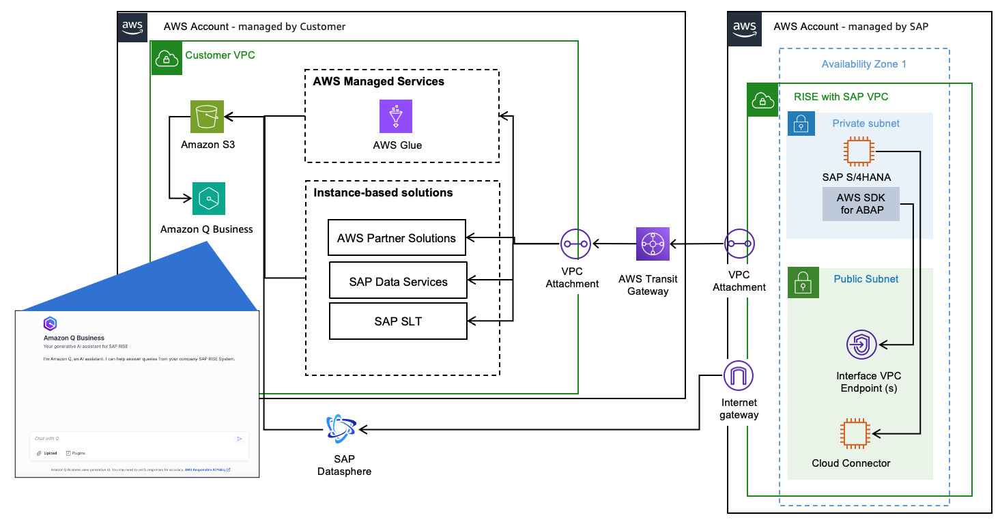
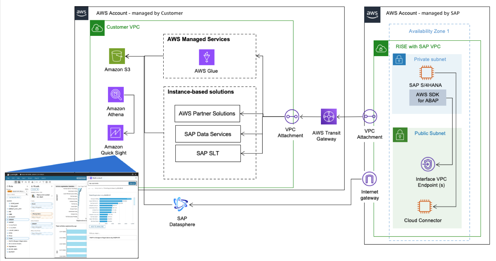

# Artificial Intelligence

**Generative AI for SAP on AWS**

Generative AI refers to intelligent systems capable of creating new content like text, images, audio, or code based on the data they have been trained on. These systems employ machine learning techniques, particularly deep learning and neural networks, to identify patterns and relationships within the training data, and then generate novel outputs that resemble the learned information.

As organizations embrace generative AI for their employees and customers, cybersecurity practitioners must rapidly assess the risks, governance, and controls associated with this evolving technology. As security leaders working with the largest, most complex customers at [Amazon Web Services (AWS)](https://aws.amazon.com/ "https://aws.amazon.com/"), we’re regularly consulted on trends, best practices, and the rapidly evolving landscape of generative AI and the associated security and privacy implications. Generative AI solutions cover multiple use cases that affect your security scope. To better understand the scope and corresponding key security disciplines, see the AWS blog post [Securing generative AI: An introduction to the Generative AI Security Scoping Matrix](https://aws.amazon.com/blogs/security/securing-generative-ai-an-introduction-to-the-generative-ai-security-scoping-matrix/ "https://aws.amazon.com/blogs/security/securing-generative-ai-an-introduction-to-the-generative-ai-security-scoping-matrix/").

SAP and AWS have co-innovated services which help customers to combine SAP’s AI innovations and enterprise expertise with Amazon’s cutting-edge AI capabilities and technological solutions, thereby unlocking significant opportunities for business enhancement. RISE customers can accelerate their AI adoption through [SAP Business Technology Platform (BTP)](https://www.sap.com/products/technology-platform.html "https://www.sap.com/products/technology-platform.html") AI services like Generative AI Hub and AWS enterprise GenAI services including [Amazon Bedrock](https://aws.amazon.com/bedrock/ "https://aws.amazon.com/bedrock/"), and [Amazon Q](https://aws.amazon.com/q/ "https://aws.amazon.com/q/") enabling secure, scalable AI solutions.

**SAP Data Integration and Management on AWS**

Data serves as the cornerstone for the success of any generative AI solution. The quality, quantity, and diversity of data are critical factors that directly influence the performance and efficacy of AI models. We recommend reviewing our [Guidance for SAP Data Integration and Management on AWS](https://aws.amazon.com/solutions/guidance/sap-data-integration-and-management-on-aws/ "https://aws.amazon.com/solutions/guidance/sap-data-integration-and-management-on-aws/"), which provides the essential data foundation for empowering customers to build AI solutions. It shows how to integrate data from SAP ERP source systems and AWS in real-time or batch mode, with change data capture, using AWS services, SAP products, and AWS Partner Solutions. This includes an overview reference architecture showing how to ingest SAP systems to AWS in addition to detailed architectural patterns that complement SAP-supported mechanisms using AWS services, SAP products, and AWS Partner Solutions.

**Ways to implement Generative AI Solutions for RISE on AWS**

This architectural guidance helps you build advanced AI solutions. It shows you how to effectively combine RISE with SAP and AWS's AI services to create powerful and innovative systems.

**Amazon Q for Business**

RISE customers can leverage [Amazon Q Business](https://aws.amazon.com/q/business/ "https://aws.amazon.com/q/business/") to answer questions, provide summaries, generate content, and complete tasks based on enterprise data. End users receive immediate, permission-aware responses from enterprise data sources with citations. Q Business is a fully managed generative-AI powered assistant with 40+ pre-built connectors to various enterprise applications and data sources.

Customers who choose to break data silos by creating data warehouse or data lake solutions can use SAP and other enterprise data as source for Q Business to :

- Create a unified search experience across systems and data thereby extracting key insights
- Create and share lightweight applications either to select users or add them to an organization’s application library
- Perform actions across popular business applications and platforms
- Create and automate complex business workflows

The diagram above illustrates a design framework for Q Business based search for RISE customers. It illustrates how SAP data can be extracted utilizing AWS services and using pre-built connectors from Q Business organizations can create a unified search experience.

Solution Flow:

1. Establish connectivity with RISE environment by creating AWS Glue connection for SAP OData
2. Ingest relevant SAP data by creating ETL jobs
3. Utilize pre-built connectors to various data sources and applications to connect with Q Business. Ingest the relevant content while inheriting the existing identities, roles and permissions.
4. End users can interact in natural language to derive business insights from data across multiple applications

**Amazon Quick Sight**

[Amazon Quick Sight](https://aws.amazon.com/quicksuite/quicksight/ "https://aws.amazon.com/quicksuite/quicksight/") revolutionizes SAP data analysis through its advanced 'Generative business intelligence' capabilities, empowering business users with intuitive self-service reporting tools. Using natural language prompts, RISE customers can effortlessly create sophisticated visual dashboards and data narratives without requiring SQL or programming expertise.

This democratization of data analysis dramatically reduces report generation time from days to hours, eliminating dependencies on specialized ABAP developers and/or analytics teams. The system’s AI-driven automation intelligently generates contextual titles, organized sections, coherent story flows, and actionable insights with specific recommendations. For RISE customers, this translates into accelerated decision-making processes, with deeper more accessible insights from their enterprise data.

The diagram illustrates a framework of Amazon Quick Sight with SAP Data.

Solution Flow:

1. SAP report to process business logic and upload data to [Amazon S3](https://aws.amazon.com/s3/ "https://aws.amazon.com/s3/").
2. With [AWS SDK for SAP ABAP](https://aws.amazon.com/sdk-for-sap-abap/ "https://aws.amazon.com/sdk-for-sap-abap/"), it will create an [Amazon Athena](https://aws.amazon.com/athena/ "https://aws.amazon.com/athena/") query linked to the SAP report data on S3.
3. Create an Quick Sight dataset and topic based on the Athena query.
4. Now using Q in Quick Sight, you can interact with the data generated by SAP reports using natural language and get insights of data, to build dashboard and generate stories.
