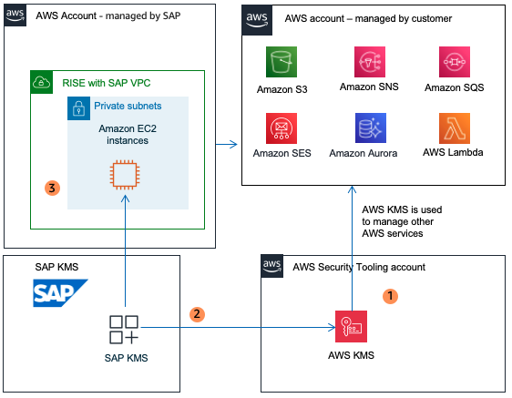

# Integrating SAP Data Custodian KMS with AWS KMS

SAP Data Custodian Key Management Service enables customer-managed encryption keys for data stored in SAP services. Please note that SAP Data Custodian Key Management Service is not the same as AWS Key Management Service (KMS).

Using AWS KMS as the keystore in [HYOK (Hold Your Own Key) scenario](https://help.sap.com/docs/sap-data-custodian/key-management-service/amazon-web-services-hyok?locale=en-US "https://help.sap.com/docs/sap-data-custodian/key-management-service/amazon-web-services-hyok?locale=en-US"), SAP Data Custodian Key Management Service provides a consistent and centralized approach to key management especially if AWS KMS is already employed for other AWS workloads, enabling seamless integration, streamlined key lifecycle management, and enhanced security through AWS robust encryption and access control mechanisms.

This integration allows customers to manage and control the encryption keys used to protect their sensitive data, ensuring greater security and compliance. SAP Data Custodian Key Management Service can be interfaced with AWS KMS in HYOK (Hold Your Own Key) scenario with the following supported key:

| Area                        | AWS KMS (HYOK Scenario) | Supported Key Types and Key Sizes             |
| --------------------------- | ----------------------- | --------------------------------------------- | ------------------------------------------------------------------------------------------------------------------------------------------------------------------------------------------------------------------------------------------------------------------------------------------------------------------------ |
| AES (256), RSA (3072, 4096) | Key Management          | Key is created and stored in AWS KMS keystore | Below is the SAP KMS integration with AWS KMS - HYOK  In the diagram above:  • Key is created in AWS KMS keystore  • Key is stored in AWS KMS and retrieved by SAP KMS when required  • SAP KMS encrypts SAP data at application level |
