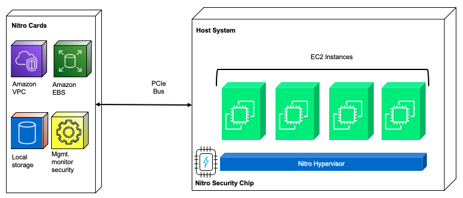
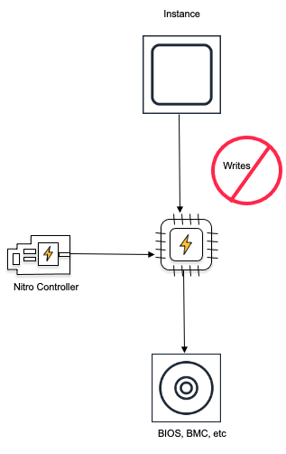

# How AWS Nitro helps secure RISE with SAP?

AWS Nitro System is the underlying technology used for [Amazon Elastic Compute Cloud](https://aws.amazon.com/ec2/ "https://aws.amazon.com/ec2/") (Amazon EC2) instances in RISE with SAP. AWS Nitro System offers a unique set of capabilities that support the most sensitive workloads in a multi-tenanted, hyper-scale cloud environment.

A traditional virtualization architecture consists of "hypervisor" or "Virtual Machine Monitor (VMM)" and what is commonly known as ['Dom0’](../../../whitepapers/latest/security-design-of-aws-nitro-system/traditional-virtualization-primer.md#:~:text=Xen%20Project%20calls%20the%20system%E2%80%99s%20dom0 "../../../whitepapers/latest/security-design-of-aws-nitro-system/traditional-virtualization-primer.md#:~:text=Xen%20Project%20calls%20the%20system%E2%80%99s%20dom0") in Xen project or ["parent partition"](https://learn.microsoft.com/en-us/virtualization/hyper-v-on-windows/reference/hyper-v-architecture "https://learn.microsoft.com/en-us/virtualization/hyper-v-on-windows/reference/hyper-v-architecture") in Hyper-V. More details on traditional virtualization architecture is available [here](../../../whitepapers/latest/security-design-of-aws-nitro-system/traditional-virtualization-primer.md "../../../whitepapers/latest/security-design-of-aws-nitro-system/traditional-virtualization-primer.md").

In Nitro System virtualization architecture, the management or control domain components (with privileged access to the hardware and device drivers) are fragmented into independent purpose-built service processor units (SoC - System on Chip) which are known as Nitro cards. While the "hypervisor" layer remains, the design has been minimized to include only those services and features which are strictly necessary for its task. Additionally, there is also a "Nitro Security Chip" introduced to enhance the security while ensuring there is no overhead on performance.

Below is the Nitro High Level Architecture

The resulting Nitro System has been divided into the following components:

**Nitro Cards**

Nitro Controller - This is the sole outward facing management interface between the physical server and the control planes for EC2, Amazon EBS, and Amazon VPC. It is implemented as passive API endpoints where each action is logged and all attempts to call an API are cryptographically authenticated and authorized using a fine-grained access control model.Nitro Controller also provides the hardware root of trust for the overall system and is responsible for managing all other components of the server system including the firmware loaded in the system. Firmware for the system is stored on an encrypted SSD that is attached directly to the Nitro Controller. The encryption key for the SSD is designed to be protected by the combination of a Trusted Platform Module (TPM) and the secure boot features of the SoC.Nitro Cards purpose-built for specific functions Nitro Cards purpose-built for specific functions:

Networking - The newer generation of Nitro cards for VPC transparently encrypt all VPC traffic to other EC2 instances running on hosts also equipped with encryption compatible Nitro Cards. It uses Authenticated Encryption with Associated Data (AEAD) algorithms, with 256-bit encryption. In RISE with SAP, depending on customer’s requirements, different families of compute instances are selected. While AWS provides secure and private connectivity between EC2 instances of all types, in-transit traffic encryption is available between the later generation instances only. Please check whether your RISE with SAP instances are supported for this feature [here](../../../AWSEC2/latest/UserGuide/data-protection.md#encryption-transit "../../../AWSEC2/latest/UserGuide/data-protection.md#encryption-transit").

EBS (SSD) storage - The Nitro Card for EBS provide encryption of remote EBS volumes without any practical impact on their performance.

Local instance storage (ephemeral) – Similar to Nitro Card for EBS, the Nitro Card for instance storage provides encryption to local instance storage. All EC2 instances do not have local instance storage and this would depend on the instance types chosen for your RISE with SAP workloads. Details can be found [here](../../../ec2/latest/instancetypes/ec2-instance-type-specifications.md "../../../ec2/latest/instancetypes/ec2-instance-type-specifications.md").

The encryption keys used for VPC, EBS and Instance Storage are only ever present on the system in plaintext within the protected memory of a Nitro Card.

**Nitro Security Chip**

While the Nitro Controller and other Nitro Cards operate as one domain, the system main board on which SAP workloads runs make up the second domain. While the Nitro Controller and its secure boot process provide the hardware root of trust between the Nitro System components, Nitro Security chip is used to extend that trust and control over the system main board. The Nitro Security Chip is the link between those two domains that extends the control of the Nitro Controller to the system main board, making it a subordinate component of the system, thus extending the Nitro Controller chain of trust to cover it. To maintain the root of trust, all write access to non-volatile storage is blocked in hardware.

Below is when Nitro blocked write access to non-volatile storage

**Nitro Hypervisor**

Unlike traditional hypervisors, Nitro Hypervisor is not a general-purpose system and does not have a shell nor any type of interactive access mode. Some of the key exclusions in the Nitro Hypervisor which enhances its security posture are networking stack, general purpose file system implementations, peripheral driver support, ssh server, shell etc. Primary functions of Nitro Hypervisor are restricted to:

1. Receive virtual machine management commands (start, stop and so on) sent from Nitro Controller
2. Partition memory and CPU resources by utilizing hardware virtualization features of the server processor
3. Assign SR-IOV virtual functions provided by Nitro hardware interfaces (NVMe block storage for EBS and instance storage, Elastic Network Adapter [ENA] for network, and so on) through PCIe to the appropriate VM
   This simplicity of the Nitro Hypervisor is a significant security benefit compared to conventional hypervisors.

**Key Benefits of AWS Nitro System**

- Nitro chips offload virtualization tasks from the main CPUs, reducing the attack surface and improving overall system security.
- AWS personnel do not have access to Your Content on AWS Nitro System EC2 instances. There are no technical means or APIs available to AWS personnel to access you content on an AWS Nitro System EC2 instance or encrypted-EBS volume attached to an AWS Nitro System EC2 instance. Access to AWS Nitro System EC2 instance APIs – which enable AWS personnel to operate the system without access to your content - is always logged, and requires authentication and authorization. Please find more information [here](https://aws.amazon.com/service-terms/ "https://aws.amazon.com/service-terms/").
- Tenancy protection and prevention of side channel attacks - The Nitro Hypervisor is directed by the Nitro Controller to allocate the full complement of physical cores and memory for the instance. These hardware resources are "pinned" to that particular instance. The CPU cores are not used to run other customer workloads, nor are any instance memory pages shared in any fashion across instances. No sharing of CPU cores means that instances never share CPU core-specific resources, including Level 1 or Level 2 caches thereby providing strong mitigation against side channel attacks. Please find more information [here](../../../whitepapers/latest/security-design-of-aws-nitro-system/the-ec2-approach-to-preventing-side-channels.md "../../../whitepapers/latest/security-design-of-aws-nitro-system/the-ec2-approach-to-preventing-side-channels.md").
- The Nitro architecture allows for secure boot and runtime integrity verification, ensuring the AWS infrastructure is running in a trusted and verified state.
- Both the Nitro Card firmware and the hypervisor are designed to be live-updatable (zero downtime for customer instances). This eliminates the need for carefully balanced tradeoffs around updates yielding improved security posture. Please find more information [here](https://d1.awsstatic.com/events/Summits/awsreinforce2023/DAP401_Security-design-of-the-AWS-Nitro-System.pdf "https://d1.awsstatic.com/events/Summits/awsreinforce2023/DAP401_Security-design-of-the-AWS-Nitro-System.pdf").
- Data encryption for both data at rest and in transit using hardware offload engines with secure key storage integrated in the SoC.
