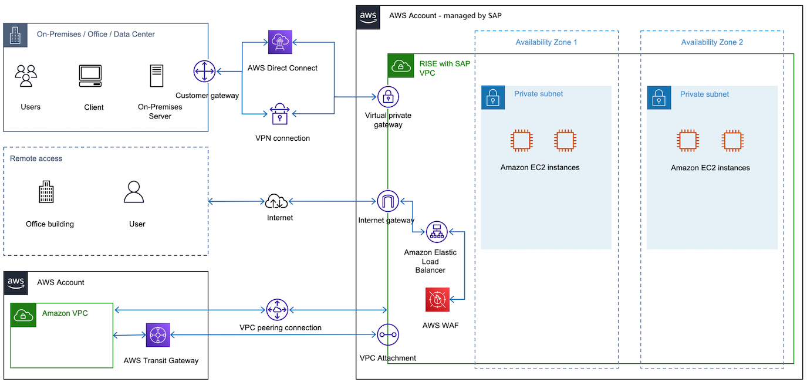

# Connectivity

You must establish connectivity between AWS cloud where your RISE with SAP solution is running and on-premises data centers. You also need a connection for direct data transfer (to avoid routing data via your on-premises locations) and communication between SAP systems and your applications running on AWS cloud. The following image provides an example overview of connectivity to RISE with SAP VPC.

See the following topics for further details:

###### Topics

- [Roles and responsibility for establishing connectivity](rise-responsibility.md "rise-responsibility.md")
- [Connecting to RISE from on-premises networks](rise-connection-on-premises.md "rise-connection-on-premises.md")
- [Connecting to RISE from your AWS account](rise-accounts.md "rise-accounts.md")
- [Connect to nearest Direct Connect POP (including Local Zone)](rise-local-zone.md "rise-local-zone.md")
- [Decision tree on connectivity to RISE](rise-decision-tree.md "rise-decision-tree.md")
- [Other considerations](other-considerations.md "other-considerations.md")
