# Installing DataProvider 4.3

The AWS Data Provider for SAP runs as a service that automatically starts at boot and collects, aggregates, and exposes metrics to the SAP host agent. Metrics are sourced from a variety of providers that pull metrics from the relevant areas of the platform. The AWS Data Provider for SAP is designed to continue operating, regardless of whether its providers have connectivity or permissions to access the AWS service metrics they are requesting. Providers that cannot reach the metrics they are harvesting return blank values.

For example, if your Amazon EC2 instance does not have an IAM role associated with it that grants explicit access to the Amazon CloudWatch **GetMetricStatistics** API, the CloudWatch provider will be unable to perform the **GetMetricStatistics** action on the Amazon EC2 instance and will return blank values.

The provider needs to be installed on each SAP production system in order to be eligible for SAP support. You can only install one instance of the provider at a time on a system.

The AWS Data Provider for SAP is designed to automatically update itself so that it can provide you with the most current metrics. When the AWS Data Provider for SAP starts up, a built-in update service retrieves the latest versions of its components and metric definitions from an AWS managed Amazon S3 bucket. If the AWS Data Provider for SAP cannot access the update service, it will continue to run as-is.

## Installing with an SSM distributor – DataProvider 4.3 (Recommended)

The DataProvider 4.3 version enables you to install the package through a SSM distributor. AWS recommends using this method for installation, you can install the DataProvider using a either a Linux or Windows platform.

### Prerequisites for installing the DataProvider using a SSM distributor

#### SSM-Agent

You must have the `ssm-agent` installed on your instance before you can use the SSM distributor to install the DataProvider Agent. Use the following AWS Systems Manager user guide to install the `ssm-agent` on your instances.

- RHEL: [Manually installing SSM Agent on Red Hat Enterprise Linux instances](../../../systems-manager/latest/userguide/agent-install-rhel.md "../../../systems-manager/latest/userguide/agent-install-rhel.md")
- SUSE: [Manually install SSM Agent on SUSE Linux Enterprise Server instances](../../../systems-manager/latest/userguide/agent-install-sles.md "../../../systems-manager/latest/userguide/agent-install-sles.md")
- Oracle : [Manually installing SSM Agent on Oracle Linux instances](../../../systems-manager/latest/userguide/agent-install-oracle.md "../../../systems-manager/latest/userguide/agent-install-oracle.md")
- Windows: [Manually installing SSM Agent on Amazon EC2 instances for Windows Server](../../../systems-manager/latest/userguide/sysman-install-win.md "../../../systems-manager/latest/userguide/sysman-install-win.md")

#### Java Runtime

The DataProvider is a java application that needs Java Runtime to be installed on the instance to run.

If your instance doesn’t already have Java Runtime installed, you can use OpenJDK provided by Amazon Corretto to install the Java Runtime.

With DataProvider 4.3, the following Java Runtime versions are supported:

- Amazon Corretto 8 or OpenJDK 8
- Amazon Corretto 11 or OpenJDK 11
- Amazon Corretto 17 or OpenJDK 17

For more information on how to download and install JDK on your Amazon EC2 instance, see [Amazon Corretto Documentation](../../../corretto/index.md "../../../corretto/index.md").

In the terminal, run the following commands to verify installation.

```
java -version
```

For example, expected output for Coretto-8.252.09.1 should be as follows:

```
openjdk version "1.8.0_252"OpenJDK Runtime Environment Corretto-8.252.09.1 (build 1.8.0_252-b09)OpenJDK 64-Bit Server VM Corretto-8.252.09.1 (build 25.252-b09, mixed mode)
```

#### GPG Key

If you are a SUSE user, you must download the DataProvider GPG key and import it before installation.

- GPG Key URL: [GPG Key](https://aws-sap-data-provider.s3.amazonaws.com/Installers/RPM-GPG-KEY-AWS "https://aws-sap-data-provider.s3.amazonaws.com/Installers/RPM-GPG-KEY-AWS")
- Sign in to your SUSE instance and run the following commands to import the key:

```
wget https//<url to GPG key>
```

```
rpm --import RPM-GPG-KEY-AWS
```

## Installing the DataProvider Agent using an SSM distributor

Use the following procedure to install DataProvider 4.3.

1. Open the [Systems Manager console](https://console.aws.amazon.com//systems-manager/ "https://console.aws.amazon.com//systems-manager/").
2. In the left navigation pane, under the Node Management section, choose **Distributor**.

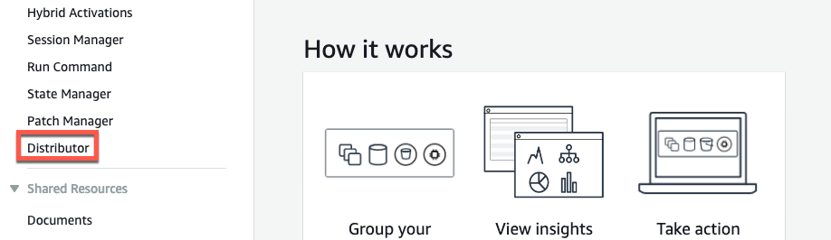 3. In the search bar, type **AWSSAPTools-DataProvider**, and choose the package.

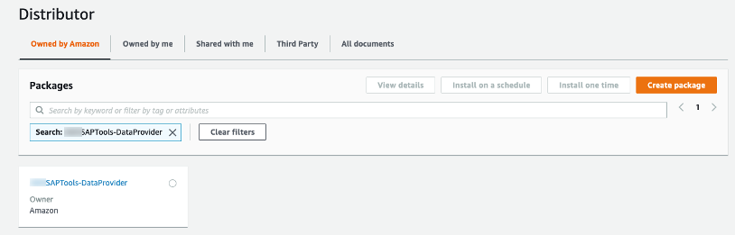 4. To receive auto updates for the DataProvider when there is a new release, choose **Install on a schedule**.

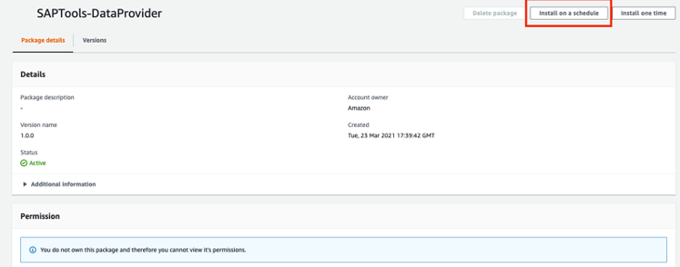 5. On the **Create Association** page, type a **Name** for your association.

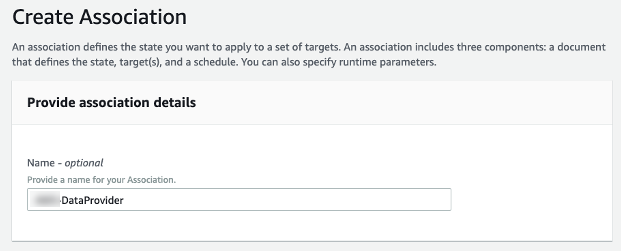 6. In the **Parameters** section, for **Action**, choose **Install**.

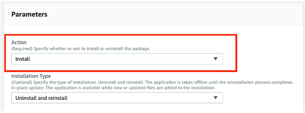 7. In the >**Targets** section, for **Target selection**, select **Choose instances manually**. Then, choose the instances where you want to install the DataProvider.

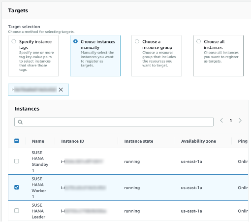 8. In the **Specify schedule** section, make the following selections:

    * Choose **On Schedule**
    * For **Specify with**, choose **Rate schedule builder**.
    * For **Associate runs**, choose **30 days**. (AWS recommends 30 days)


    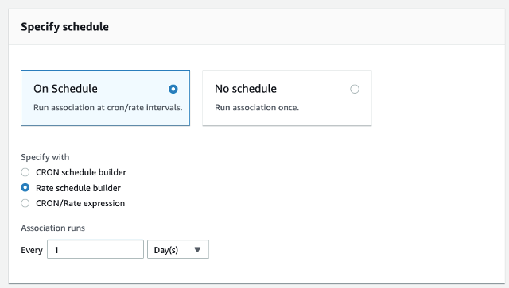

9. In the **Output options** section, choose **Create Association**.

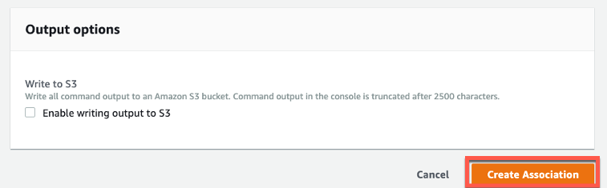 10. Once the association is created, choose the **Association ID**.

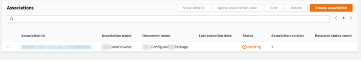 11. Choose the **Execution History** tab. Then, choose the Execution id.

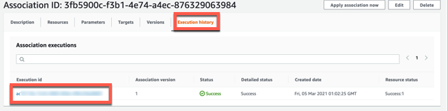 12. On the **Execution ID** page, choose **Output** to see the installation results.

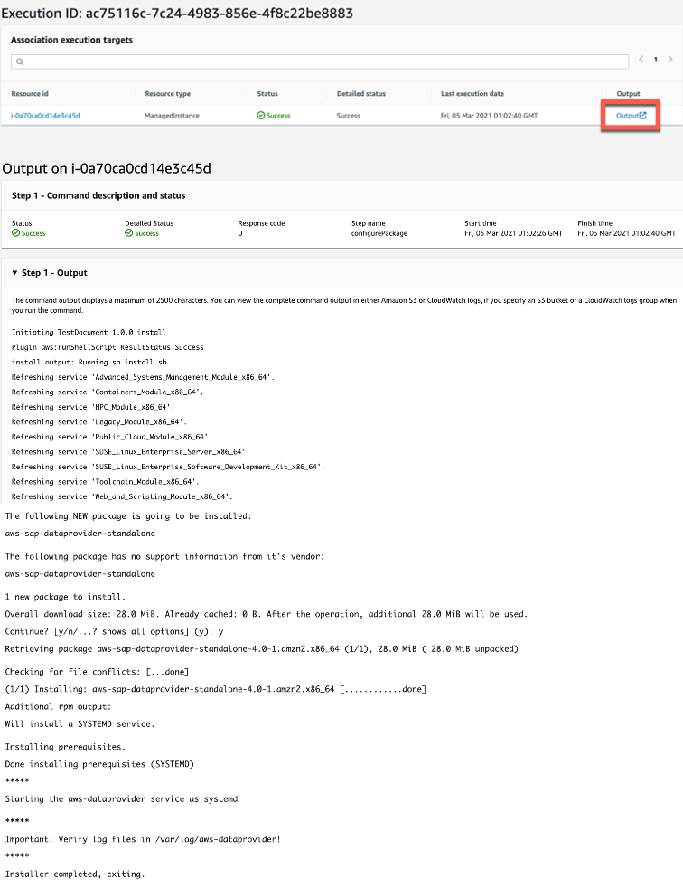 13. Once the installation is completed, log in to the instance, and [http://localhost:8888/vhostmd](http://localhost:8888/vhostmd "http://localhost:8888/vhostmd") [call the endpoint] to enable the DataProvider to fetch metrics.

    * Linux example


    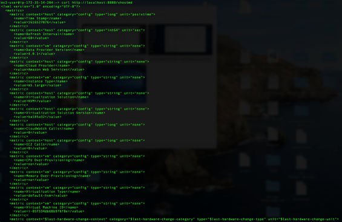
    * Windows example


    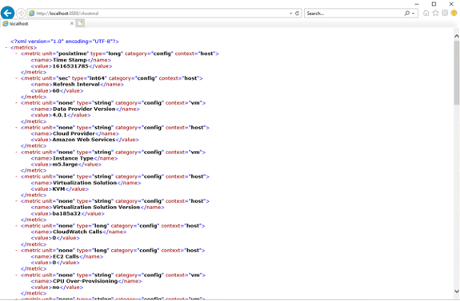

## Installing with Downloadable Installer – DataProvider 4.3

If you choose to not use SSM to install the DataProvider 4.3, you can manually install the DataProvider using the following procedure.

###### Note

Before beginning the manual installation you must install the items listed in the [Prerequisites](#prerequisites-ssm "#prerequisites-ssm") section. You don’t need to install the `SSM-Agent`. The downloadable DataProvider will not provide auto-updates, to get the latest versions, you must manually check for and download new releases manually.

Download the following file for your environment. By default the files will download in the us-east-1 region, change the default region before downloading if you want the files to download in a different region.

- **Red Hat**
  [https://aws-sap-dataprovider-us-east-1.s3.us-east-1.amazonaws.com/v4/installers/linux/RHEL/aws-sap-dataprovider-rhel-standalone.x86_64.rpm](https://aws-sap-dataprovider-us-east-1.s3.us-east-1.amazonaws.com/v4/installers/linux/RHEL/aws-sap-dataprovider-rhel-standalone.x86_64.rpm "https://aws-sap-dataprovider-us-east-1.s3.us-east-1.amazonaws.com/v4/installers/linux/RHEL/aws-sap-dataprovider-rhel-standalone.x86_64.rpm")
- **SUSE**
  [https://aws-sap-dataprovider-us-east-1.s3.us-east-1.amazonaws.com/v4/installers/linux/SUSE/aws-sap-dataprovider-sles-standalone.x86_64.rpm](https://aws-sap-dataprovider-us-east-1.s3.us-east-1.amazonaws.com/v4/installers/linux/SUSE/aws-sap-dataprovider-sles-standalone.x86_64.rpm "https://aws-sap-dataprovider-us-east-1.s3.us-east-1.amazonaws.com/v4/installers/linux/SUSE/aws-sap-dataprovider-sles-standalone.x86_64.rpm")
- **Oracle Linux**
  [https://aws-sap-dataprovider-us-east-1.s3.us-east-1.amazonaws.com/v4/installers/linux/ORACLE/aws-sap-dataprovider-oel-standalone.x86_64.rpm](https://aws-sap-dataprovider-us-east-1.s3.us-east-1.amazonaws.com/v4/installers/linux/ORACLE/aws-sap-dataprovider-oel-standalone.x86_64.rpm "https://aws-sap-dataprovider-us-east-1.s3.us-east-1.amazonaws.com/v4/installers/linux/ORACLE/aws-sap-dataprovider-oel-standalone.x86_64.rpm")
- **Windows**
  [https://aws-sap-dataprovider-us-east-1.s3.us-east-1.amazonaws.com/v4/installers/win/aws-data-provider-installer-win-x64-Standalone.exe](https://aws-sap-dataprovider-us-east-1.s3.us-east-1.amazonaws.com/v4/installers/win/aws-data-provider-installer-win-x64-Standalone.exe "https://aws-sap-dataprovider-us-east-1.s3.us-east-1.amazonaws.com/v4/installers/win/aws-data-provider-installer-win-x64-Standalone.exe")
- **GPG Key**
  [GPG Key: https://aws-sap-dataprovider-us-east-1.s3.us-east-1.amazonaws.com/v4/installers/RPM-GPG-KEY-AWS](https://aws-sap-dataprovider-us-east-1.s3.us-east-1.amazonaws.com/v4/installers/RPM-GPG-KEY-AWS "https://aws-sap-dataprovider-us-east-1.s3.us-east-1.amazonaws.com/v4/installers/RPM-GPG-KEY-AWS")

## Installing on Linux

On Linux the data provider is delivered as an RPM package.

### SUSE Linux Enterprise Server

To install the AWS Data Provider for SAP on SUSE Linux Enterprise Server (SLES) download the following files:

- **Standard:**
  [aws-sap-dataprovider-sles.x86_64.rpm](https://aws-sap-dataprovider-us-east-1.s3.us-east-1.amazonaws.com/v4/installers/linux/SUSE/aws-sap-dataprovider-sles-standalone.x86_64.rpm "https://aws-sap-dataprovider-us-east-1.s3.us-east-1.amazonaws.com/v4/installers/linux/SUSE/aws-sap-dataprovider-sles-standalone.x86_64.rpm") and [GPG Key](https://aws-sap-dataprovider-us-east-1.s3.us-east-1.amazonaws.com/v4/installers/RPM-GPG-KEY-AWS "https://aws-sap-dataprovider-us-east-1.s3.us-east-1.amazonaws.com/v4/installers/RPM-GPG-KEY-AWS")
- **China:**
  [aws-sap-dataprovider-sles.x86_64.rpm](https://aws-sap-dataprovider-cn-north-1.s3.cn-north-1.amazonaws.cn/v4/installers/linux/SUSE/aws-sap-dataprovider-sles-standalone.x86_64.rpm "https://aws-sap-dataprovider-cn-north-1.s3.cn-north-1.amazonaws.cn/v4/installers/linux/SUSE/aws-sap-dataprovider-sles-standalone.x86_64.rpm") and [GPG Key](https://aws-sap-dataprovider-cn-north-1.s3.cn-north-1.amazonaws.cn/v4/installers/RPM-GPG-KEY-AWS "https://aws-sap-dataprovider-cn-north-1.s3.cn-north-1.amazonaws.cn/v4/installers/RPM-GPG-KEY-AWS")

The files are identical but AWS offers these two location options due to possible connectivity issues when working from China.

To install the data provider run the following commands:

```
wget https://<url to rpm package>
wget https://<url to GPG key>
rpm ––import RPM-GPG-KEY-AWS
zypper install -y <rpm package>
```

Example:

```
wget https://aws-sap-dataprovider-us-east-1.s3.us-east-1.amazonaws.com/v4/installers/linux/SUSE/aws-sap-dataprovider-sles-standalone.x86_64.rpm
wget https://aws-sap-dataprovider-us-east-1.s3.us-east-1.amazonaws.com/v4/installers/RPM-GPG-KEY-AWS
rpm ––import RPM-GPG-KEY-AWS
zypper install -y aws-sap-dataprovider-sles-standalone.x86_64.rpm
```

When the RPM package is installed, the agent starts as a daemon, as seen in the following image.

**RPM package installation**

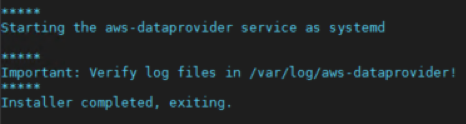

Verify that the service is running by calling `netstat -ant` to determine if the listener is running on localhost port 8888.

**Verifying installation on Linux**

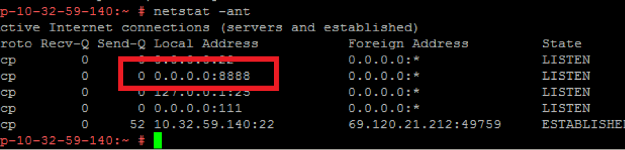

You should also view the log files at `/var/log/aws-dataprovider/messages.0` to ensure the daemon has the appropriate connectivity and authorization to access the required metrics.

**Verifying connectivity and authorization on Linux**

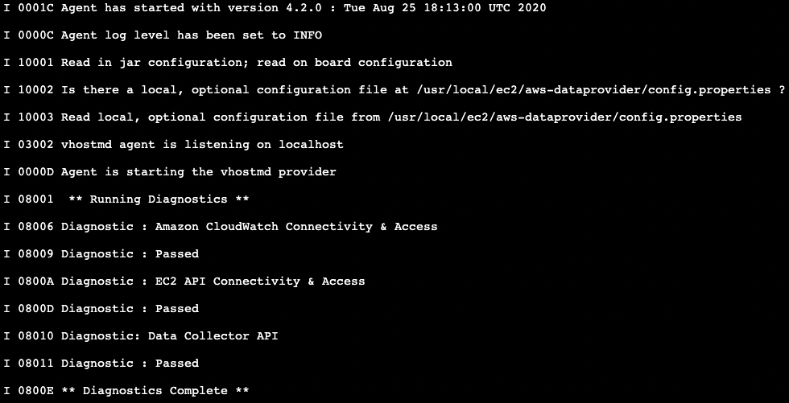

At startup, the monitoring agent runs three sets of diagnostics:

- The AWS connectivity diagnostic ensures network connectivity to Amazon S3 for obtaining automatic updates to the AWS Data Provider for SAP.
- The second diagnostic tests for authorization to access CloudWatch. This authorization requires assigning an IAM role to the Amazon EC2 instance you are running on with an IAM policy that allows access to CloudWatch. For details, see [IAM Roles](data-provider-req.md#data-provider-iam-roles "data-provider-req.md#data-provider-iam-roles"), earlier in this guide.
- The third diagnostic tests for authorization to access Amazon EC2, which also requires an IAM role associated with the Amazon EC2 instance.

The AWS Data Provider for SAP is designed to run with or without connectivity, but you can’t obtain updates without connectivity. Amazon CloudWatch and Amazon EC2 will return blank values if you don’t have the proper authorizations in place.

You can also call the AWS Data Provider for SAP directly to view the metrics. Calling `wget http://localhost:8888/vhostmd` returns a file of metrics. You can look inside the file to see the metrics that were returned, as shown here.

**Viewing metrics on Linux**

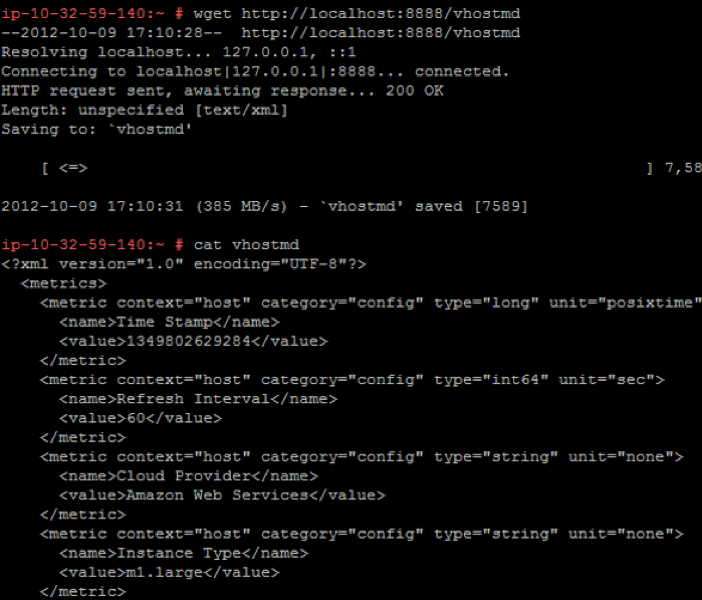

The AWS Data Provider for SAP now starts automatically each time the operating system starts. You can also manually stop and restart the AWS Data Provider for SAP with the following command, which depends on your operating system version:

- SLES 11, Oracle Linux 6, and Red Hat Linux 6:

```
service aws-dataprovider [start|stop]
```

- SLES 12, SLES 15, Oracle Linux 7, Oracle Linux 8, Red Hat Linux 7, and Red Hat Linux 8.

```
systemctl [start|stop] aws-dataprovider
```

You can configure AWS Data Provider to use proxies if you do not have transparent HTTP/HTTPS access to the internet.

1. Stop AWS Data Provider for SAP.
2. Enter proxy information in the file (as seen below) located at `/usr/local/ec2/aws-dataprovider/proxy.properties`.

```
#proxy.properties
#used to set web proxy settings for the {aws} Data Provider for SAP
#Https is the only supported proxy method
#Blank values for everything means no proxy set

https.proxyHost=
https.proxyPort=
https.proxyDomain=
https.proxyUsername=
https.proxyPassword=
```

3. Start AWS Data Provider for SAP.

## Installing on Red Hat and Oracle Enterprise Linux

For Red Hat and Oracle Enterprise Linux, the installation steps are the same as described for SLES above but the RPM file and command to install the RPM package differs.

- **Red Hat**

**Default:**
[aws-sap-dataprovider-rhel.x86_64.rpm](https://aws-sap-dataprovider-us-east-1.s3.us-east-1.amazonaws.com/v4/installers/linux/RHEL/aws-sap-dataprovider-rhel-standalone.x86_64.rpm "https://aws-sap-dataprovider-us-east-1.s3.us-east-1.amazonaws.com/v4/installers/linux/RHEL/aws-sap-dataprovider-rhel-standalone.x86_64.rpm")

- **Oracle Enterprise Linux**

**Default:**
[aws-sap-dataprovider-oel.x86_64.rpm](https://aws-sap-dataprovider-us-east-1.s3.us-east-1.amazonaws.com/v4/installers/linux/ORACLE/aws-sap-dataprovider-oel-standalone.x86_64.rpm "https://aws-sap-dataprovider-us-east-1.s3.us-east-1.amazonaws.com/v4/installers/linux/ORACLE/aws-sap-dataprovider-oel-standalone.x86_64.rpm")

To install the data provider run the following commands:

```
wget https://<url to rpm package>
yum -y install <rpm package>
```

Example:

```
wget https://aws-sap-data-provider.s3.amazonaws.com/Installers/aws-sap-dataprovider-rhel.x86_64.rpm
yum -y install aws-sap-dataprovider-rhel.x86_64.rpm
```

## Installing on Windows

On Windows, the installer is delivered in the form of an NSIS (Nullsoft Scriptable Install System) executable.

1. Open a web browser and download the installer:
   - **Default:**
     [aws-data-provider-installer-win-x64.exe](https://aws-sap-dataprovider-us-east-1.s3.us-east-1.amazonaws.com/v4/installers/win/aws-data-provider-installer-win-x64-Standalone.exe "https://aws-sap-dataprovider-us-east-1.s3.us-east-1.amazonaws.com/v4/installers/win/aws-data-provider-installer-win-x64-Standalone.exe")

2. Run the downloaded **exe** file.
3. Verify the installation.
   - Once the installation is complete, you can see the file in `C:\Program Files\Amazon\DataProvider` directory.
   - The installation also creates and starts a Windows service called **AWS Data Provider for SAP**.
   - Verify that the service is running by entering [http://localhost:8888/vhostmd](http://localhost:8888/vhostmd "http://localhost:8888/vhostmd") in a web browser. The page returns metrics from AWS Data Provider for SAP if your installation is successful.

4. You can configure AWS Data Provider to use proxies if you do not have transparent HTTP/HTTPS access to the internet.
   1. Stop AWS Data Provider for SAP.
   2. Enter proxy information in the file (as seen below) located at `C:\Program Files\Amazon\DataProvider\proxy.properties`.

   ```
   #proxy.properties
   #used to set web proxy settings for the {aws} Data Provider for SAP
   #Https is the only supported proxy method
   #Blank values for everything means no proxy set

   https.proxyHost=
   https.proxyPort=
   https.proxyDomain=
   https.proxyUsername=
   https.proxyPassword=
   ```

   3. Start AWS Data Provider for SAP.

5. Verify that the service is running by calling `netstat -ant` from a command window or from a Windows PowerShell script to determine if the listener is running on localhost port 8888.

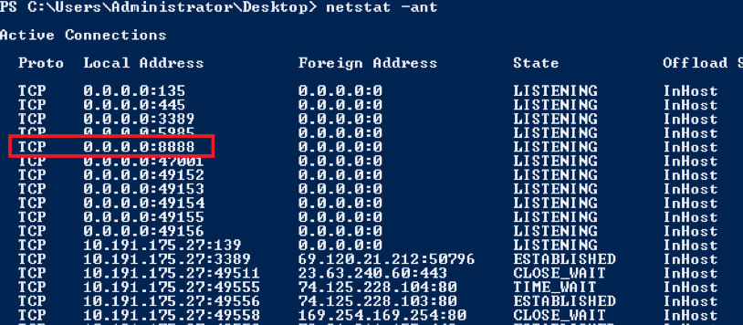

**Verifying the installation on Windows** 6. Navigate to the Windows event log, and find the application log for startup events from the AWS Data Provider for SAP. Check the diagnostics.

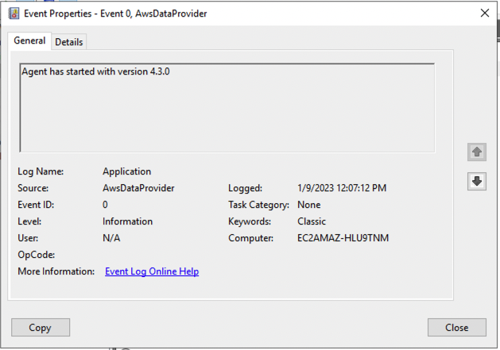

**Checking diagnostics on Windows**

At startup, the monitoring agent runs three sets of diagnostics:

- The AWS connectivity diagnostic ensures network connectivity to Amazon S3 for obtaining automatic updates to the AWS Data Provider for SAP.
- The second diagnostic tests for authorization to access CloudWatch, which requires assigning an IAM role to the EC2 instance you are running on with an IAM policy that allows access to CloudWatch. For details, see [IAM Roles](data-provider-req.md#data-provider-iam-roles "data-provider-req.md#data-provider-iam-roles"), earlier in this guide.
- The third diagnostic tests for authorization to access Amazon EC2, which also requires an IAM role associated with the Amazon EC2 instance.

The AWS Data Provider for SAP is designed to run with or without connectivity, but you can’t obtain updates without connectivity. If you don’t have the proper authorizations in place, Amazon CloudWatch and Amazon EC2 return blank values.

You can also call the AWS Data Provider for SAP directly from your web browser to view metrics, as shown in the figure.

**Viewing metrics on Windows**

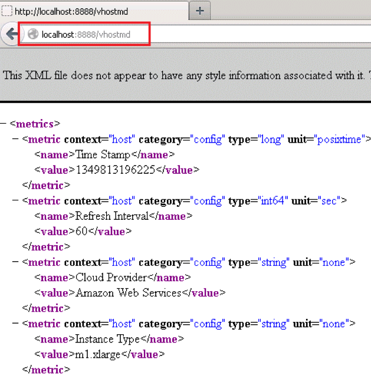

AWS Data Provider for SAP now starts automatically each time the operating system starts. You can also manually stop and restart the AWS Data Provider for SAP, just as you would stop and restart any other Windows service.

**Stopping and restarting the AWS Data Provider for SAP on Windows**

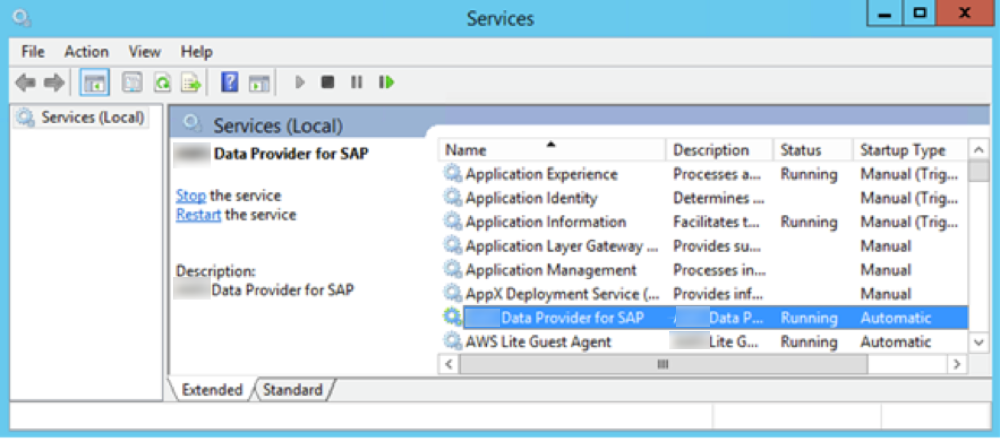

In order to configure proxy settings, you can place a customized `proxy.properties` file in Window’s temp directory, which is designated by the windows system variable %TEMP%.

## Subscribe to AWS Data Provider Agent for notifications

Amazon Simple Notification Service can notify you when new versions of AWS Data Provider Agent are released. Use the following steps to setup this subscription.

1. Open [https://console.aws.amazon.com/sns/v3/home](https://console.aws.amazon.com/sns/v3/home "https://console.aws.amazon.com/sns/v3/home").
2. Ensure that you are in **US East N. Virginia** (us-east-1) Region.
3. In the left navigation pane, select **Subscriptions** > **Create subscription**.
4. Add a **Topic ARN** based on the AWS Region in which you are using AWS Data Provider Agent.

| Region                                            | ARN                                                                         |
| ------------------------------------------------- | --------------------------------------------------------------------------- |
| Default                                           | `arn:aws:sns:us-east-1:804845276281:AWS-DataProvider-SAP-Update`            |
| AWS GovCloud (US-West) and AWS GovCloud (US-East) | `arn:aws-us-gov:sns:us-gov-west-1:140982767562:AWS-DataProvider-SAP-Update` |
| China (Beijing) Region and China (Ningxia) Region | `arn:aws-cn:sns:cn-north-1:001645243879:AWS-DataProvider-SAP-Update`        |

5. **Protocol** – choose Email or SMS.
   - **Email** – enter an email address where you would like to receive the notification in the **Endpoint** field.

   ###### Note

   To enable email notifications, you must confirm your email subscription by following the instructions you receive on the provided email address.
   - **SMS** – enter a phone number where you would like to receive the notification in the **Endpoint** field.

6. Choose **Create subscription**. You can now receive notifications whenever a new version of AWS Data Provider Agent is released.

To unsubscribe from notifications, use the following steps.

1. Open [https://console.aws.amazon.com/sns/v3/home](https://console.aws.amazon.com/sns/v3/home "https://console.aws.amazon.com/sns/v3/home").
2. In the left navigation pane, select **Subscriptions**.
3. Select the subscription from your list of subscriptions and choose **Delete**.
