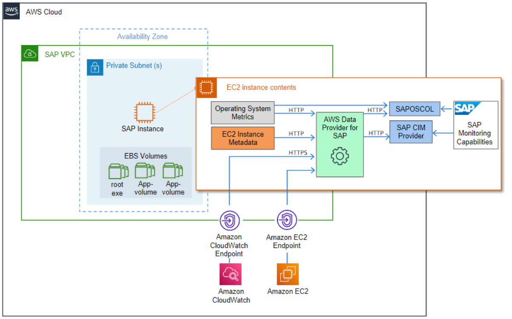

# Introduction

Many organizations of all sizes are choosing to host key SAP systems in the Amazon Web Services Cloud. With AWS, you can quickly provision an SAP environment. Additionally, the elastic nature of the AWS Cloud enables you to scale computing resources up and down as needed. As a result, your business can dedicate more resources (both people and funds) to innovation.

Many SAP systems operate daily business transactions and are critical to business functions. As an SAP customer, you need the ability to track and troubleshoot the performance of these transactions. The AWS Data Provider for SAP is a tool that collects key performance data on an [Amazon Elastic Compute Cloud](https://aws.amazon.com/ec2 "https://aws.amazon.com/ec2") (Amazon EC2) instance that SAP applications can use to monitor transactions built by SAP. The data is collected from a variety of sources within your AWS Cloud operating environment, including Amazon EC2 and [Amazon CloudWatch](https://aws.amazon.com/cloudwatch "https://aws.amazon.com/cloudwatch"). This data includes information about the operating system, network, and storage that is relevant to your SAP infrastructure. Data from the AWS Data Provider for SAP is read by the SAP Operating System Collector (SAPOSCOL) and the SAP CIM Provider.

The diagram provides a high-level illustration of the AWS Data Provider for SAP, its data sources, and its outputs.

**Data sources for the AWS Data Provider for SAP**

The purpose of this guide is to help you:

- Understand the technical requirements and components necessary to install and operate the AWS Data Provider for SAP.
- Install the AWS Data Provider for SAP.
- Understand the update process for the AWS Data Provider for SAP.
- Troubleshoot installation issues.

## Pricing

The DataProvider agent is provided free of charge. However, there are indirect costs associated with running the agent due to SAP requiring monitoring data to be delivered at specific intervals. This causes the DataProvider to do frequent **GetMetric** calls to Amazon CloudWatch and the Amazon EC2 API to retrieve the metric data. The expected costs for these calls ranges approximately from **$20.00 to $40.00** per month per system and will vary based on how many disks are attached to the Amazon EC2 instance.

Example: Costs per month for using the DataProvider agent in the US East (N. Virginia) Region.

**Fixed:**

- Running the 2 required Amazon VPC endpoints (monitoring, Amazon EC2) is approximately **$14.00 + $0.01** per processed GB of data.

###### Note

These endpoints only need to be created once and are shared by the entire landscape. If you are already using these endpoints, you do not need to create them again.

**Per System:**

- You should expect around 70,000 API calls a day per instance (with 6 disks attached. At **$0.01** per 1,000 calls, it is approximately **$21.00** per month. The API call number increases or decreases based on the number of disks that are attached.
