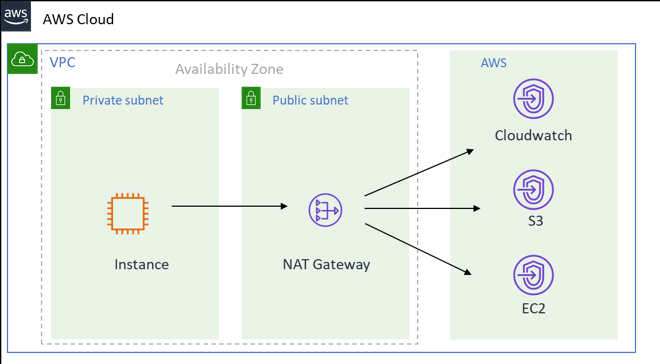
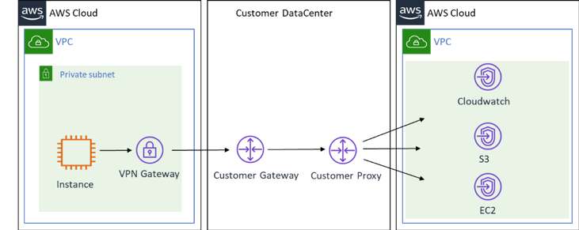

# Technical Requirements

Before creating an SAP instance, ensure that the following technical requirements are met.

###### Topics

- [Amazon VPC Network Topologies](#data-provider-vpc-network-topology "#data-provider-vpc-network-topology")
- [Amazon VPC Endpoints](#vpc-endpoints "#vpc-endpoints")
- [IAM Roles](#data-provider-iam-roles "#data-provider-iam-roles")

## Amazon VPC Network Topologies

You need to deploy SAP systems that receive information from the AWS Data Provider for SAP within an [Amazon Virtual Private Cloud](https://aws.amazon.com/vpc "https://aws.amazon.com/vpc") (Amazon VPC). You can use one of the following network topologies to enable routing to internet-based endpoints:

- The first topology configures routes and traffic directly to the AWS Cloud through a NAT gateway within an Amazon VPC. For more information about internet gateways, see the [AWS documentation](../../../AmazonVPC/latest/UserGuide/VPC_Internet_Gateway.md "../../../AmazonVPC/latest/UserGuide/VPC_Internet_Gateway.md").

**Connection to the AWS Cloud via an internet gateway**



- A second topology routes traffic from the Amazon VPC, through your organization’s on-premises data center, and back to AWS Cloud. For more information about this topology, see the [What is AWS Site-to-Site VPN?](../../../AmazonVPC/latest/UserGuide/VPC_VPN.md "../../../AmazonVPC/latest/UserGuide/VPC_VPN.md")

**Connection to the Amazon Web Services Cloud via an on-premises data center**



## Amazon VPC Endpoints

Create endpoints for the following services that the DataProvider uses:

- Monitoring
- Amazon EC2

To create data endpoints in the AWS console, use the following procedure for each of the two endpoints:

1. Sign in to the [Amazon VPC console](https://console.aws.amazon.com/vpc "https://console.aws.amazon.com/vpc"), navigate to **Endpoints**, and select **Create Endpoint**.
2. On the next screen, search for the service name, then select the appropriate VPC and route table, and select **Create Endpoint**.
3. After creating all three endpoints you should see them in your list of endpoints as shown below:

## IAM Roles

You need to grant the AWS Data Provider for SAP read-only access to the Amazon CloudWatch, Amazon Simple Storage Service (Amazon S3), and Amazon EC2 services so that you can use their APIs. You can do this by creating an AWS Identity and Access Management (IAM) role for your Amazon EC2 instance and attaching a permissions policy.

Use the following procedure to create an IAM role and grant permissions to your Amazon EC2 instance:

1. Sign in to the [AWS Management Console](https://aws.amazon.com/console/ "https://aws.amazon.com/console/") and open the [IAM console](https://console.aws.amazon.com/iam "https://console.aws.amazon.com/iam").
2. In the navigation pane, select **Roles**, and select **Create role**.
3. Choose the **AWS service** role type, and select **EC2**.
4. Select **EC2** as the use case, and select **Next Permissions**.
5. Select **Create Policy**, and select **JSON**.
6. Copy and paste the following policy into the input field, replace all existing text, and select **Review Policy**.

###### Note

If your Amazon EC2 instances are running in Beijing and Ningxia, you must update the **Resource line** with the correct region.

See the following example policies based on your AWS Region.

**AWS Regions (except AWS GovCloud (US-East), AWS GovCloud (US-West), Beijing and Ningxia)**

```
{
    "Version":"2012-10-17",
    "Statement": [
        {
            "Sid": "VisualEditor0",
            "Effect": "Allow",
            "Action": [
                "EC2:DescribeInstances",
                "cloudwatch:GetMetricStatistics",
                "EC2:DescribeVolumes"
            ],
            "Resource": "*"
        },
        {
         "Sid": "VisualEditor1",
         "Effect": "Allow",
         "Action": "s3:GetObject",
         "Resource": [
          "arn:aws:s3:::aws-sap-dataprovider-us-east-1/config.properties"
            ]
        }
    ]
}
```

**Beijing and Ningxia**

```
{
    "Version":"2012-10-17",
    "Statement": [
        {
            "Sid": "VisualEditor0",
            "Effect": "Allow",
            "Action": [
                "EC2:DescribeInstances",
                "cloudwatch:GetMetricStatistics",
                "EC2:DescribeVolumes"
            ],
            "Resource": "*"
        },
        {
         "Sid": "VisualEditor1",
         "Effect": "Allow",
         "Action": "s3:GetObject",
         "Resource": [
          "arn:aws-cn:s3:::aws-sap-dataprovider-cn-north-1/config.properties"
            ]
        }
    ]
}
```

**AWS GovCloud (US-East) and AWS GovCloud (US-West)**

```
{
    "Version":"2012-10-17",
    "Statement": [
        {
            "Sid": "VisualEditor0",
            "Effect": "Allow",
            "Action": [
                "EC2:DescribeInstances",
                "cloudwatch:GetMetricStatistics",
                "EC2:DescribeVolumes"
            ],
            "Resource": "*"
        },
        {
         "Sid": "VisualEditor1",
         "Effect": "Allow",
         "Action": "s3:GetObject",
         "Resource": [
          "arn:aws-us-gov:s3:::aws-sap-dataprovider-us-gov-west-1/config.properties"
            ]
        }
    ]
}
```

7. Provide a **Name** and **Description** for the role, and select **Create Policy**.
8. Select **Create Policy**. The IAM console confirms the new policy with a message similar to the following.
9. Navigate to the **Create Role** page, refresh the screen, search for the newly created role, and select the policy.
10. Select **Next:Tags**.
11. Add any tags if needed, otherwise select **Next:Review**.
12. Provide a name for the Role and select **Create Role**.
