# Troubleshooting

This section provides help to analyze installation problems.

## Troubleshooting on Linux

### Problem: The installation failed, and I’m not sure if my files are in a consistent state.

Stop and remove the Data Provider with the following command.

SLES:

```
zypper remove -y aws-sap-dataprovider
```

RHEL / OEL:

```
yum -y erase aws-sap-dataprovider
```

### Problem: The AWS Data Provider for SAP failed to start at the end of the installation process.

Check the log files in `/var/log/aws-dataprovider` for hints on what is not going as expected. If needed, uninstall and reinstall the Data Provider. If reinstalling the AWS Data Provider for SAP doesn’t solve the problem, you can gather debug information about the AWS Data Provider for SAP by editing the `/usr/local/ec2/aws-dataprovider/bin/aws-dataprovider` file.

**Debugging the installation on Linux**

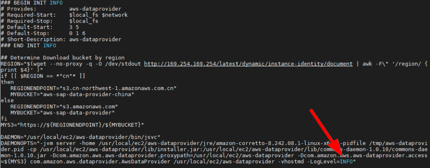

Now if you run service `aws-dataprovider-start` or `systemctl start aws-dataprovider`, you will get a lot of debugging output that might help you diagnose the root cause of the problem.

**Debugging information on Linux**

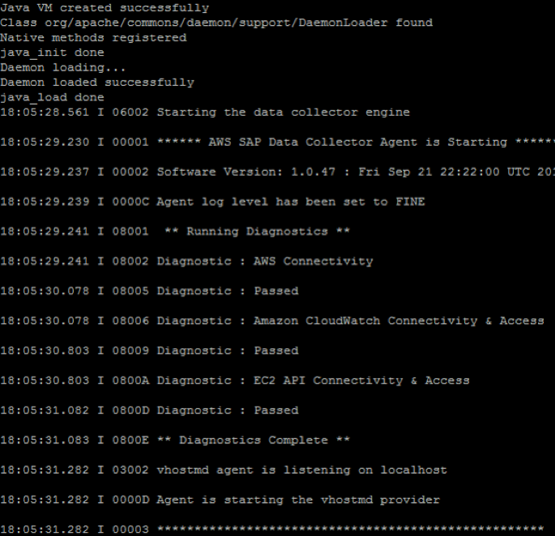

### Problem: When I looked at my logs I noticed that my installation failed all diagnostics.

**Symptoms of internet connectivity problems on Linux**

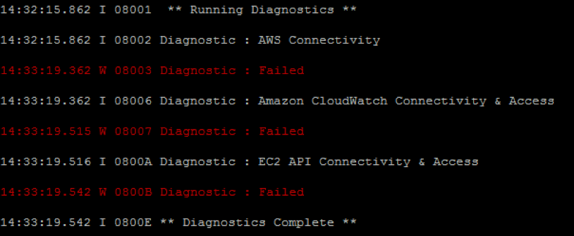

Failing _all_ diagnostics indicates that there’s a problem with your outbound connection to the internet. You can confirm this by pinging a well-known internet location, like [www.amazon.com.](http://www.amazon.com/ "http://www.amazon.com/") The most common cause of routing issues is in the VPC network configuration, which needs to have either an internet gateway in place or a VPN connection to your data center with a route to the internet. For details, see [Amazon VPC Network Topologies](data-provider-req.md#data-provider-vpc-network-topology "data-provider-req.md#data-provider-vpc-network-topology"), earlier in this guide.

### Problem: When I looked at my logs I noticed that I don’t have access to CloudWatch and Amazon EC2, but I did pass the first diagnostic for AWS connectivity.

**Symptoms of authorization issues on Linux**

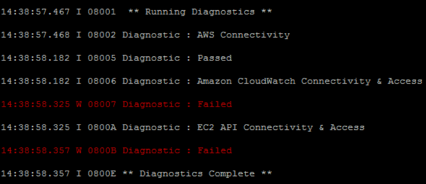

This is a clear indicator that you have an authorization issue when trying to access CloudWatch and Amazon EC2. The common cause for this problem is not having an IAM role associated with your instance that contains the IAM policy, as specified in [IAM Roles](data-provider-req.md#data-provider-iam-roles "data-provider-req.md#data-provider-iam-roles"), earlier in this guide. You can quickly diagnose this issue by looking at the Amazon EC2 instance in question in the Amazon EC2 console and verifying the IAM role.

**Verifying the IAM role for an EC2 instance**

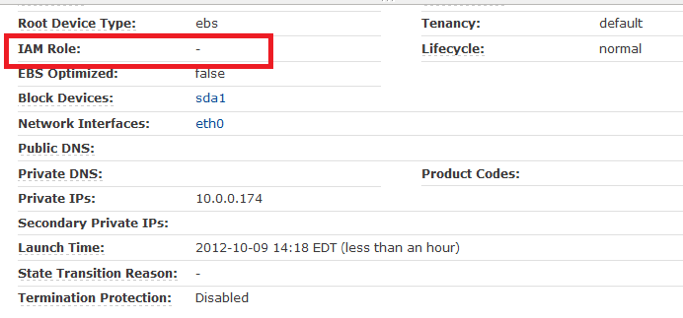

If the IAM role doesn’t exist, then create it as specified in IAM Roles, which is described earlier in this guide.

If you do have an IAM role assigned to the instance, go to the IAM console, select the IAM role name, and then expand the policy. Verify that you have the required policy that is specified in [IAM Roles](data-provider-req.md#data-provider-iam-roles "data-provider-req.md#data-provider-iam-roles"), earlier in this guide.

**Verifying the policy for the IAM role**

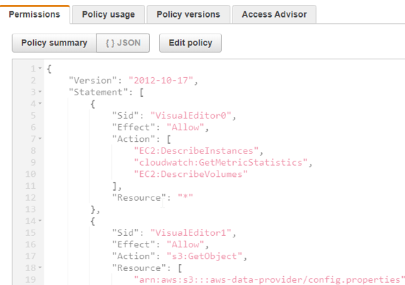

### Problem: I want to configure/update `JAVA_HOME` for Data Provider.

Open the `/usr/local/ec2/aws-dataprovider/env` file and update the `JAVA_HOME` variable. Restart Data Provider after the update, with the following command.

```
sudo systemctl daemon-reload
sudo systemctl start aws-dataprovider
```

## Troubleshooting on Windows

### Problem: The installation failed, and I’m not sure if my files are in a consistent state.

Based on the DataProvider version on your system, follow the procedure in [Updating to DataProvider 4.3](data-provider-update.md "data-provider-update.md") or [Uninstalling older versions](uninstall-older-dp.md "uninstall-older-dp.md").

### Problem: The AWS Data Provider for SAP failed to start at the end of the installation process.

If reinstalling the AWS Data Provider for SAP doesn’t solve the problem, you can gather debugging information about the AWS Data Provider for SAP by reviewing the log files in the `C:\Program Files\Amazon\DataProvider` directory.

These log files include an installation log, a log of the service installation, and the output of the AWS Data Provider for SAP itself.

**Log files on Windows**

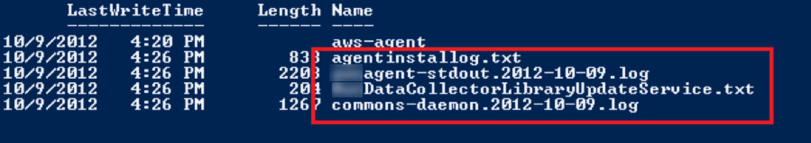

### Problem: I want to get more detailed log information from the data provider.

Start by stopping the data provider service.

**Stop Service on Windows**

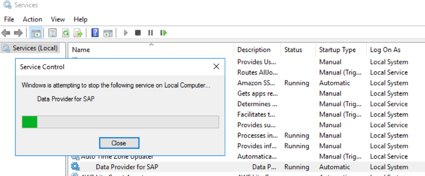

Open the registry editor by clicking on the Windows logo in the bottom left and typing `regedit` and then clicking the option that is shown on screen:

**Start `**regedit**`**

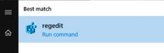

In the registry, navigate to the key:

```
HKEY_LOCAL_MACHINE\SOFTWARE\WOW6432Node\Apache Software Foundation\Procrun 2.0\awsDataProvider\Start
```

**Logging setting**

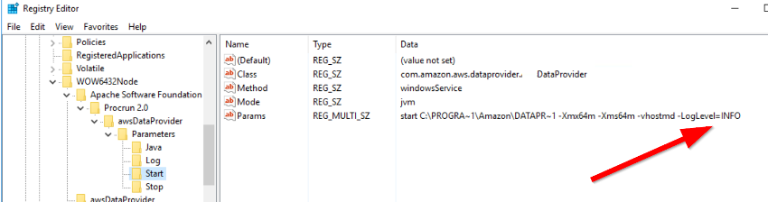

The data provider accepts two log levels: INFO and FINE. FINE will generate more detailed logging which can be useful when debugging a problem. The recommendation is to set it back to INFO when you have finished troubleshooting to avoid the logs consuming unnecessary disk space.

### Problem: I want to reinstall the AWS Data Provider for SAP from scratch.

Based on the DataProvider version on your system, follow the procedure in [Updating to DataProvider 4.3](data-provider-update.md "data-provider-update.md") or [Uninstalling older versions](uninstall-older-dp.md "uninstall-older-dp.md").

### Problem: When I looked at my logs, I noticed that my installation failed all diagnostics.

**Symptoms of internet connectivity problems on Windows**


Failing _all_ diagnostics indicates that there’s a problem with your outbound connection to the internet. You can confirm this by pinging a well-known internet location, like [www.amazon.com.](http://www.amazon.com/ "http://www.amazon.com/") The most common cause of routing issues is in the VPC network configuration, which needs to have either an internet gateway in place or a VPN connection to your data center with a route to the internet.

### Problem: When I looked at my logs, I noticed that I don’t have access to CloudWatch and Amazon EC2, but I did pass the first diagnostic for AWS connectivity.

**Symptoms of authorization issues on Windows**


This is a clear indicator that you have an authorization issue when trying to access Amazon CloudWatch and Amazon EC2. The common cause for this problem is not having an IAM role associated with your instance that contains the IAM policy, as specified in [IAM Roles](data-provider-req.md#data-provider-iam-roles "data-provider-req.md#data-provider-iam-roles") earlier in this guide. You can quickly diagnose this issue by looking at the specific EC2 instance in the Amazon EC2 console and verifying the IAM role.

**Verifying the IAM role for an EC2 instance**

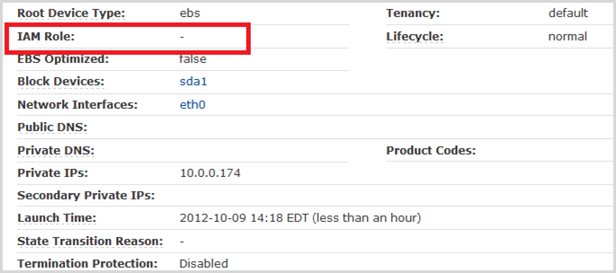

If the IAM role doesn’t exist, then create is as specified in IAM Roles, described earlier in this guide.

If you do have an IAM role assigned to the instance, go to the IAM console, select the IAM role name, and then choose **Show**. Verify that you have the required policy that is specified in [IAM Roles](data-provider-req.md#data-provider-iam-roles "data-provider-req.md#data-provider-iam-roles").

**Verifying the policy for the IAM role**

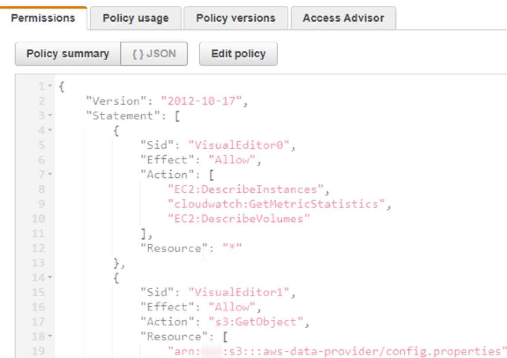
