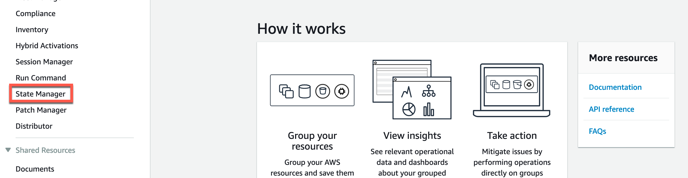
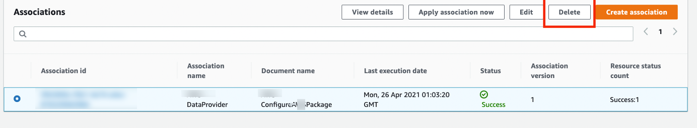
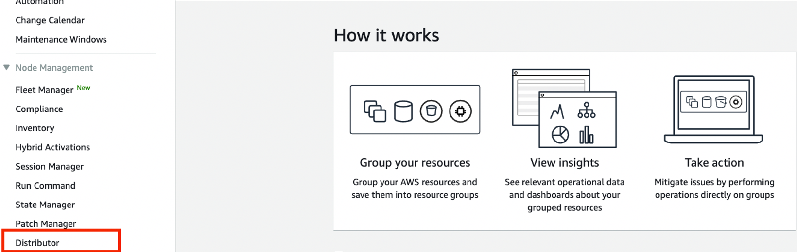
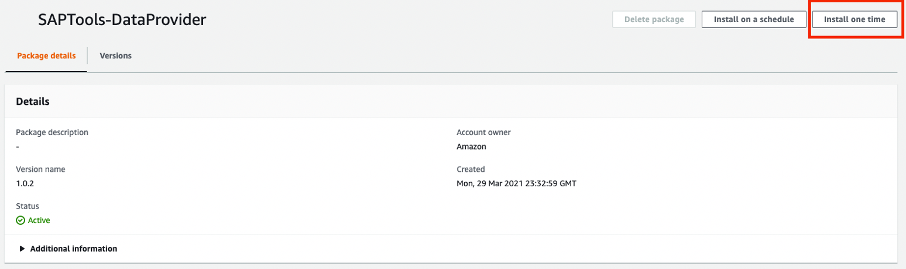
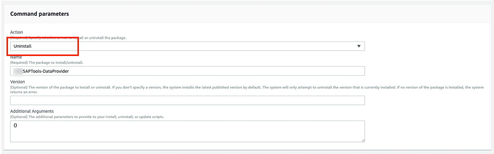
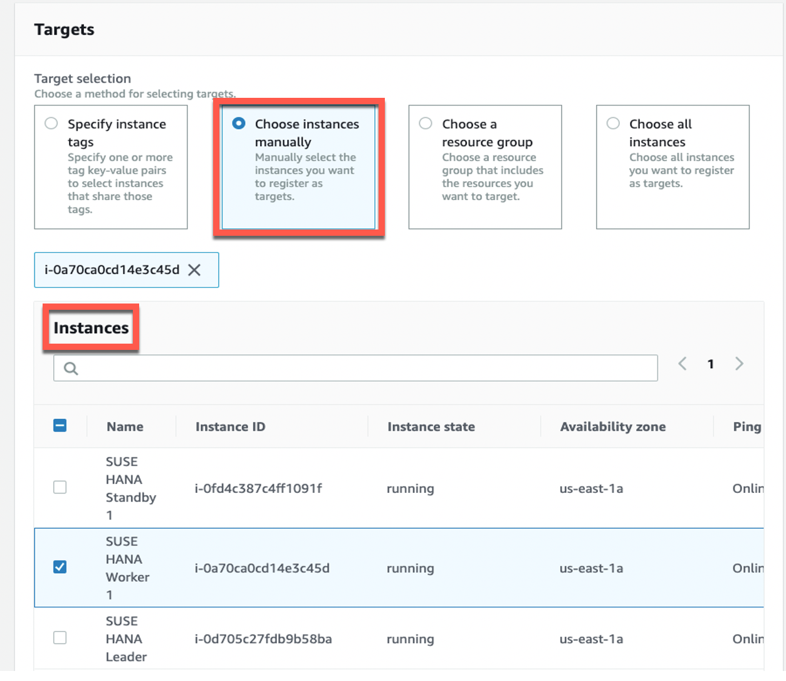
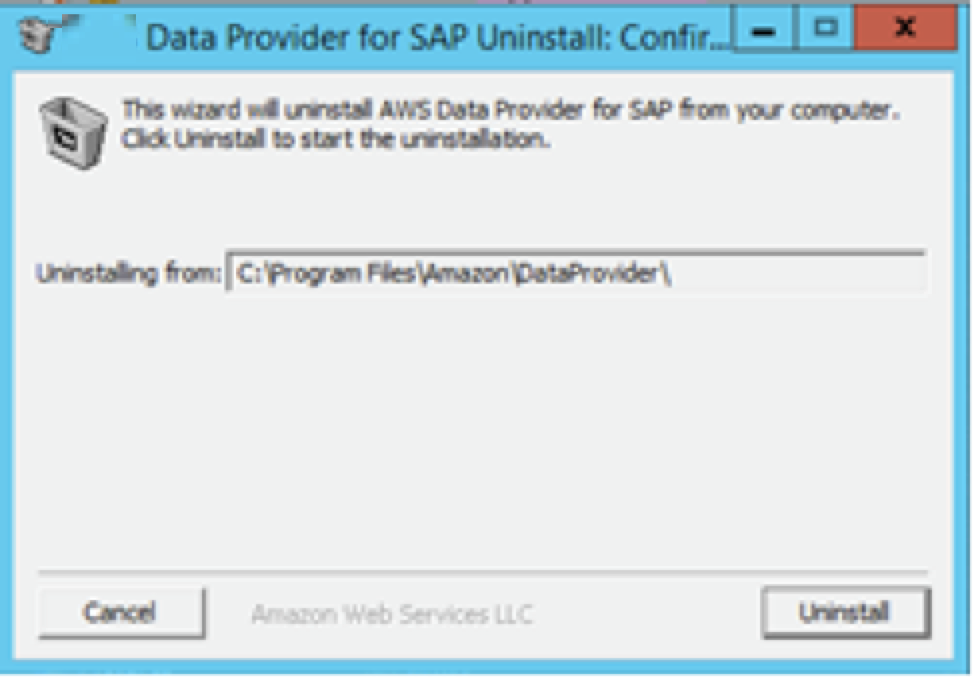

# Updating to DataProvider 4.3

If you have previously installed DataProvider 2.0 or 3.0 and want to update to DataProvider 4.3, you need to uninstall the running version first, and then install DataProvider 4.3.

## Updating to DataProvider 4.3 using the SSM Distributor package

When you install DataProvider 4.3 through the SSM distributor, it will auto-update the installed package on a new version release. For more information, see [Install or update packages](../../../systems-manager/latest/userguide/distributor-working-with-packages-deploy.md "../../../systems-manager/latest/userguide/distributor-working-with-packages-deploy.md").

To update the DataProvider 4.3 manually, you must first uninstall the running version and then install the updated version.

**DataProvider 4.3 does _not_ support the following actions:**

- Manual update of the RPM package if the DataProvider has been installed using the SSM distributor.
- Automatic update through the SSM distributor if the DataProvider has been manually installed using RPM.
- Manual update of the RPM package in any scenario.

## Uninstall DataProvider 4.3 using the SSM distributor

1. Open the [AWS Systems Manager](https://console.aws.amazon.com/systems-manager/ "https://console.aws.amazon.com/systems-manager/") console, on the left navigation pane, choose **State Manager**.

 2. On the **Associations** page, and choose the **Association id**. Then, choose **Delete**.

After the delete is successful, the auto-update stops.

 3. On the main page, in the left navigation page, choose **Distributor**.

 4. Choose the **AWSSAPTools-DataProvider** distributor package, and choose **Install one time**.

 5. In the **Command parameters** section, choose **Uninstall**.

 6. In the **Targets** section, select **Choose instances manually**. Then choose the **instance** to uninstall the DataProvider.

 7. Choose **Run** to begin the uninstall.

## Uninstall DataProvider 4.3 manually

**RedHat**

```
yum erase aws-dataprovider-standalone
```

**SUSE**

```
zypper rm aws-dataprovider-standalone
```

**Windows**

1. Run the uninstaller.

```
C:\Program Files\AmazonA\DataProvider\uninstall.exe
```

2. When prompted, choose **Uninstall**.

**Uninstalling the AWS Data Provider for SAP on Windows**


