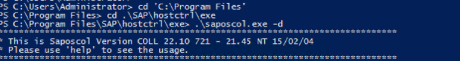
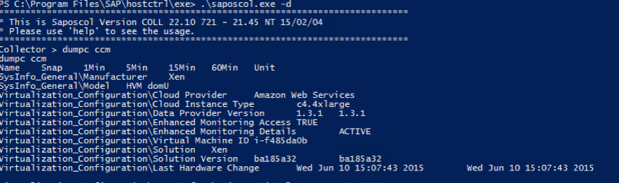
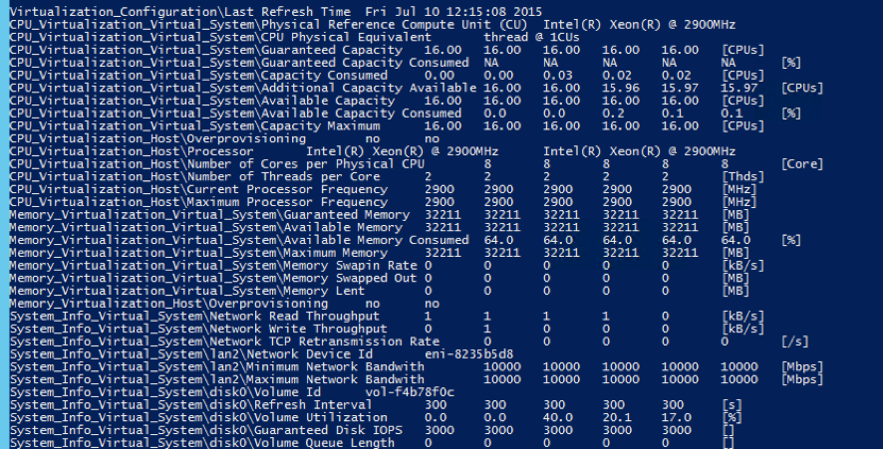
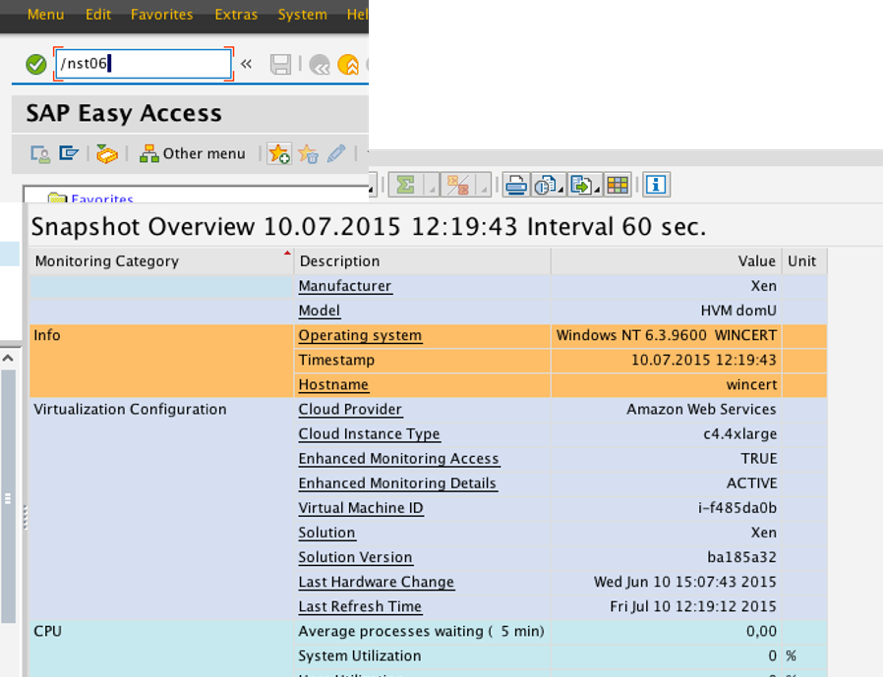
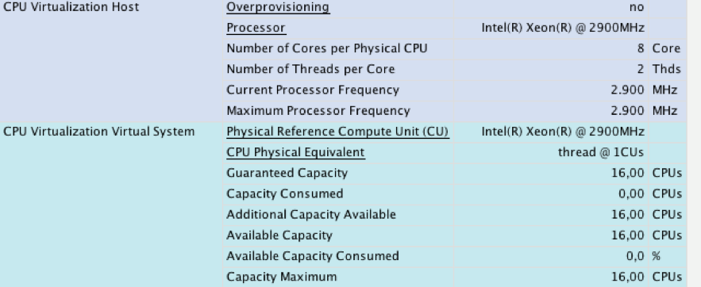
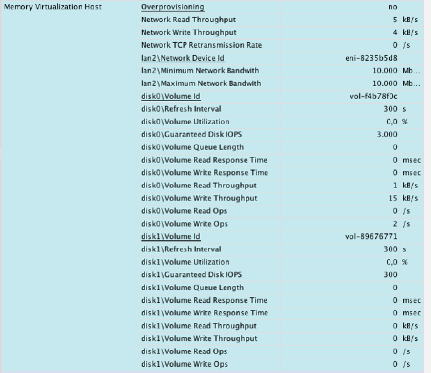

# Verification of AWS Data Provider for SAP in SAP system monitoring

The AWS Data Provider for SAP exposes AWS-specific metrics through an XML page at [http://localhost:8888/vhostmd](http://localhost:8888/vhostmd "http://localhost:8888/vhostmd") of the given system.

This section explains which metrics get exposed to the SAP system and how you can access them for SAP system monitoring.

## Checking Metrics with the SAP Operating System Collector (SAPOSCOL)

The information provided by the AWS Data Provider for SAP is read by the SAP Operating System Collector ([SAPOSCOL](https://help.sap.com/saphelp_nw70/helpdata/en/c4/3a6bff505211d189550000e829fbbd/frameset.htm "https://help.sap.com/saphelp_nw70/helpdata/en/c4/3a6bff505211d189550000e829fbbd/frameset.htm")). You can use the interactive mode of SAPOSCOL to verify that the two tools are working together correctly. The following example shows a lookup under Windows. A lookup under Linux is very similar.

1. Open a Windows command shell and direct the shell to the directory `C:\Program Files\SAP\hostctrl\exe`. Start `saposcol.exe` with the `-d` option.

**Starting SAPOSCOL**

 2. SAPOSCOL is now in interactive mode. Type `dump ccm` and press **Enter** to list all values gathered. SAPOSCOL will display a lengthy list of metrics, as shown here.

**Metrics from SAPOSCOL**

The following two metrics indicate that SAPOSCOL is collaborating successfully with the AWS Data Provider for SAP:

    * Enhanced Monitoring Access TRUE
    * Enhanced Monitoring Details ACTIVE

The AWS-specific metrics start with the following strings:

-     * Virtualization\_Configuration
      * CPU\_Virtualization\_Virtual\_System
      * Memory\_Virtualization\_Virtual\_System
      * System\_Info\_Virtualization\_System

  **AWS-specific metrics**

## Checking Metrics with the SAP CCMS Transactions

SAPOSCOL hands the AWS-enhanced statistics with other operating system-specific metrics to the SAP system. You can also check the AWS-enhanced statistics in the SAP CCMS. You can enter the transaction _st06_ (or _/nst06_) in the upper-left transaction field of the SAP GUI for quick access to this data.

###### Note

You will need the appropriate authorizations to look up this information.

**Statistics in the SAP CCMS (standard view)**

On this screen, you can verify core AWS information such as:

- Cloud provider
- Instance type
- Status of enhanced monitoring access (must be TRUE)
- Status of enhanced monitoring details (must be ACTIVE)
- Virtual machine identifier

###### Important

The enhanced AWS metrics aren’t shown in standard view.

To view enhanced AWS statistics, choose the **Standard View** button in the upper-left corner. It changes to **Expert View** and displays the enhanced AWS statistics. The list that appears is comprehensive. It shows the processor details.

**Enhanced AWS statistics (expert view)**

It also shows details about the memory subsystem (main memory and disks) and network interfaces.

**Memory and networking statistics (expert view)**

###### Note

The screen illustrations in Figures 37–39 were taken from SAP NetWeaver 7.4 SP08. This version shows the enhanced AWS statistics in the **Memory Virtualization** section. This problem has been fixed by SAP in later versions of NetWeaver.
