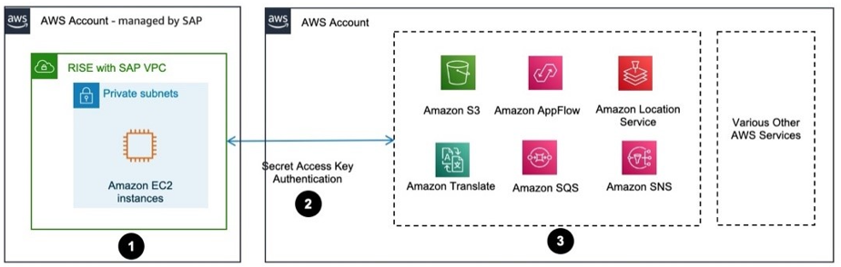

# Development and extension

## AWS SDK for SAP ABAP

Deploy AWS SDK for SAP ABAP on RISE with SAP VPC to avail AWS services using the ABAP language. For more information, see [What is AWS SDK for SAP ABAP?](../../../sdk-for-sapabap/latest/developer-guide/home.md "../../../sdk-for-sapabap/latest/developer-guide/home.md")

You can authenticate AWS SDK for SAP ABAP with IAM access key. The following image shows this scenario.

Data flow

1. AWS SDK for SAP ABAP is installed via a set of transports in SAP S/4HANA within RISE with SAP VPC.
2. SAP S/4HANA is configured with IAM access key for authenticating access to AWS services. For more information, see [Managing access keys for IAM users](../../../IAM/latest/UserGuide/id_credentials_access-keys.md "../../../IAM/latest/UserGuide/id_credentials_access-keys.md").
3. Access to AWS services with AWS SDK for SAP ABAP has been established.

## Compatibility packs and alternatives

Compatibility packs (CP) are temporary use rights to classic functionality within S/4HANA, created in 2016. It is part of every SAP S/4HANA contract either on-premises and private cloud. This was done with the goal of ensuring a smooth transition for SAP installed-base customers and gaining time to finalize the new simplified application architecture.

During the transition from SAP Business Suite to S/4HANA, business functions moved through these paths in the process. You can find out more from [presentation by Michael Deller (SAP) and Roland Hamm (SAP)](https://assets.dm.ux.sap.com/webinars/sap-user-groups-k4u/pdfs/230927_call_to_action_for_saps4hana_customers_compatibility_packs.pdf "https://assets.dm.ux.sap.com/webinars/sap-user-groups-k4u/pdfs/230927_call_to_action_for_saps4hana_customers_compatibility_packs.pdf").

In [SAP Note 2269324](https://me.sap.com/notes/2269324 "https://me.sap.com/notes/2269324"), SAP defines categories to help organizations plan their strategy for compatibility packs. These categories guide decisions for transitioning away from SAP business suite to SAP S/4HANA.

- Alternative Exists
- Alternative Exists with Roadmap - Alternative exists providing core functionality; comprehensive coverage is on roadmap
- Alternative Planned - Planning of development scope and timeline is work in progress
- No Alternative Planned - No intention or plan to provide an alternative beyond 2025
- Clarification - Clarification of strategy in progress

**How can AWS helps customers to find alternatives ?**

Organizations should evaluate their current SAP landscape and plan their transition strategy considering both SAP compatibility pack expiration dates and available alternatives. When compatibility packs lack alternatives, you can leverage combined AWS and SAP services. This approach aligns with the [AWS Refactor and re-architect](../../../prescriptive-guidance/latest/large-migration-guide/migration-strategies.md#refactor "../../../prescriptive-guidance/latest/large-migration-guide/migration-strategies.md#refactor") migration strategy, which focuses on reimagining applications and processes. Here are the details

- [SAP and AWS joint reference architecture](https://community.sap.com/t5/technology-blogs-by-sap/sap-and-aws-joint-reference-architectures-to-maximize-utilization-and/ba-p/13549809 "https://community.sap.com/t5/technology-blogs-by-sap/sap-and-aws-joint-reference-architectures-to-maximize-utilization-and/ba-p/13549809") was developed to address common questions from joint customers and partners on how to utilize SAP BTP and/or AWS services for different business solution scenarios. Refer also to this [blog](https://aws.amazon.com/blogs/awsforsap/amplify-the-value-of-your-sap-investment-with-aws-and-sap-joint-reference-architecture/ "https://aws.amazon.com/blogs/awsforsap/amplify-the-value-of-your-sap-investment-with-aws-and-sap-joint-reference-architecture/") for more details.
- [The AWS SDK for SAP ABAP](https://aws.amazon.com/sdk-for-sap-abap/ "https://aws.amazon.com/sdk-for-sap-abap/") simplifies the use of 200 plus AWS services alongside SAP applications with a client library of modules that are consistent and familiar to ABAP developers.
- [SAP Products and AWS Partner Solutions](https://aws.amazon.com/marketplace/search/results?searchTerms=SAP "https://aws.amazon.com/marketplace/search/results?searchTerms=SAP") on AWS Marketplace
- [You can contact our SAP on AWS expert team](https://aws.amazon.com/sap/ "https://aws.amazon.com/sap/") to help you guide if needed.

One example “SAP Tax Classification and Reporting” has been tagged as “No Alternative Planned” in the [SAP Note 2269324](https://me.sap.com/notes/2269324 "https://me.sap.com/notes/2269324") (refer to S4HANA CompScope – Way Forward – Info – 06032025.xlsx), in this case, you can explore alternative such as the [Thomson Reuters ONESource Indirect Tax Determination](https://aws.amazon.com/marketplace/seller-profile?id=14aa4071-a059-43f9-a854-968597951447 "https://aws.amazon.com/marketplace/seller-profile?id=14aa4071-a059-43f9-a854-968597951447") at AWS Marketplace.
