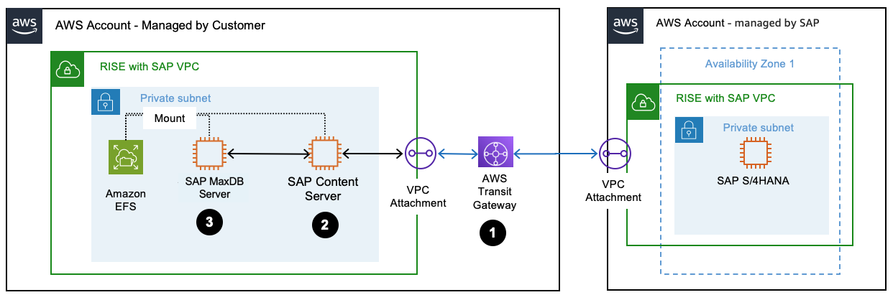
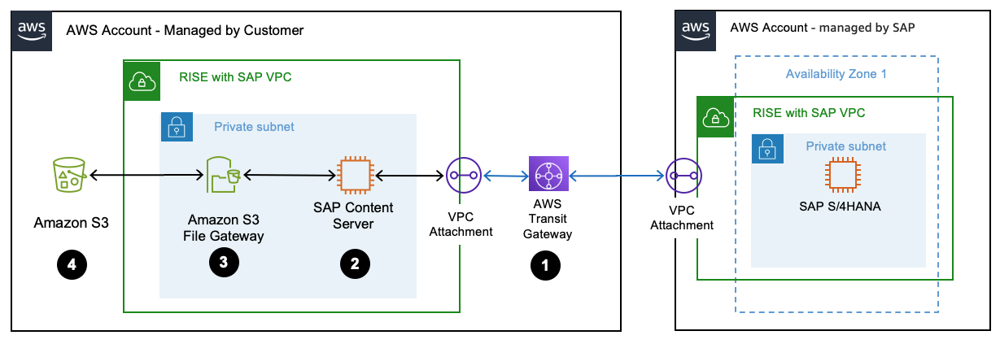
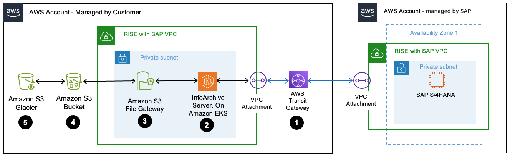

# Archiving and Document Management

SAP Data Archiving and Document Management System (DMS) plays a crucial role both before and after migrating to RISE with SAP. It helps businesses effectively manage database growth and optimize overall costs. Before migrating to S/4HANA, archiving reduces migration expenses, minimizes downtime, and lowers risk by decreasing data volume. After moving to S/4HANA, it helps control operational costs and ensures optimal system performance. Additionally, businesses can decommission legacy SAP ECC systems, eliminating unnecessary expenses while retaining access to historical data

Data archiving for structured data. Data archiving is about moving closed business transactions data from a live SAP systems to an offline or secondary storage. The key aspect of data archiving is to set a process and strategy to reduce manual efforts while ensuring compliance with legal data retention requirements.

Document management for unstructured data. The difference between data and document archiving is the type of data that you are archiving. Document archiving relates to unstructured data likes invoices, sales orders, delivery notes, and others, which usually come in the format such as pdf, words, excels. This archiving occurs in real-time and it can be stored on any content server and linked to the related SAP transactions.

We shall discuss on the available options for your data archiving and document management systems within SAP.

**Option 1 : SAP Content Server running on MaxDB**

Many customers migrating to RISE with SAP choose to keep their SAP Content Server on AWS until they transition to [SAP BTP Document Management System](https://help.sap.com/docs/document-management-service?locale=en-US "https://help.sap.com/docs/document-management-service?locale=en-US") or [OpenText Archiving solution](https://www.sap.com/documents/2015/08/5217be37-427c-0010-82c7-eda71af511fa.html "https://www.sap.com/documents/2015/08/5217be37-427c-0010-82c7-eda71af511fa.html"). [SAP Content Server](https://help.sap.com/docs/document-management-service/sap-document-management-service/content-server "https://help.sap.com/docs/document-management-service/sap-document-management-service/content-server") is a standalone component designed to store large volumes of electronic documents in various formats. These documents can be securely saved in one or more SAP MaxDB instances or within the file system. Common examples of documents stored in SAP Content Server include sales invoices, purchase orders, salary slips, emails, agreements, and others. This approach ensures seamless document management integrated into SAP business processes while maintaining accessibility and compliance.

Architecture Description

1. RISE with SAP VPC is connected to an AWS account which you managed via AWS Transit Gateway.
2. [SAP Content Server](https://help.sap.com/docs/SLTOOLSET/31c5526375554d1b9f4b339fc9012685/2548be9ba8fd4e8eb55ae6ae53b76782.html?version=CURRENT_VERSION "https://help.sap.com/docs/SLTOOLSET/31c5526375554d1b9f4b339fc9012685/2548be9ba8fd4e8eb55ae6ae53b76782.html?version=CURRENT_VERSION") is setup in your AWS account and [configured](https://help.sap.com/doc/saphelp_nw73ehp1/7.31.19/en-US/4d/002cc784ed5c4be10000000a42189e/content.htm?no_cache=true "https://help.sap.com/doc/saphelp_nw73ehp1/7.31.19/en-US/4d/002cc784ed5c4be10000000a42189e/content.htm?no_cache=true") to serve as the destination for data archiving.
3. SAP MaxDB is setup in your AWS account and [configured](https://help.sap.com/doc/saphelp_nw73ehp1/7.31.19/en-US/4d/002cc784ed5c4be10000000a42189e/content.htm?no_cache=true "https://help.sap.com/doc/saphelp_nw73ehp1/7.31.19/en-US/4d/002cc784ed5c4be10000000a42189e/content.htm?no_cache=true") to run on AWS EC2 instance.
4. [SAP Content Server High Availability](https://aws.amazon.com/blogs/awsforsap/sap-content-server-high-availability-using-amazon-efs-and-suse/ "https://aws.amazon.com/blogs/awsforsap/sap-content-server-high-availability-using-amazon-efs-and-suse/") using Amazon EFS. You can consider [EFS Infrequent Access](https://aws.amazon.com/efs/features/infrequent-access/ "https://aws.amazon.com/efs/features/infrequent-access/") for documents which are not frequently accessed.

**Option 2: SAP Content Server on Amazon S3**
SAP Content Server, along with [Amazon S3](https://aws.amazon.com/s3/ "https://aws.amazon.com/s3/") can both meet SAP Data Archiving needs by providing scalable and secure storage for archived data. They offer features like versioning, access control, immutability, and integration with SAP systems. This section is relevant for customers experiencing SAP database growth, seeking performance improvements, aiming to reduce storage costs, or needing to meet compliance requirements for long-term data retention in their SAP environment.

The following image shows an SAP Content Server integrated with Amazon S3.

Architecture Description

1. RISE with SAP VPC is connected to an AWS account which you managed via AWS Transit Gateway.
2. [SAP Content Server](https://help.sap.com/docs/SLTOOLSET/31c5526375554d1b9f4b339fc9012685/2548be9ba8fd4e8eb55ae6ae53b76782.html?version=CURRENT_VERSION "https://help.sap.com/docs/SLTOOLSET/31c5526375554d1b9f4b339fc9012685/2548be9ba8fd4e8eb55ae6ae53b76782.html?version=CURRENT_VERSION") is setup in your AWS account and [configured](https://help.sap.com/doc/saphelp_nw73ehp1/7.31.19/en-US/4d/002cc784ed5c4be10000000a42189e/content.htm?no_cache=true "https://help.sap.com/doc/saphelp_nw73ehp1/7.31.19/en-US/4d/002cc784ed5c4be10000000a42189e/content.htm?no_cache=true") to serve as the destination for data archiving.
3. The SAP Content Server integrates with [Amazon S3 File Gateway](https://aws.amazon.com/storagegateway/file/s3/ "https://aws.amazon.com/storagegateway/file/s3/"), which acts as a storage gateway to facilitate file-based storage. [S3 File Gateway](https://aws.amazon.com/storagegateway/file/s3/ "https://aws.amazon.com/storagegateway/file/s3/") enables mounting of [Amazon S3](../../../filegateway/latest/files3/GettingStartedAccessFileShare.md "../../../filegateway/latest/files3/GettingStartedAccessFileShare.md") as Network File System (NFS).
4. An Amazon S3 bucket stores the necessary archive files. You can use [S3 Lifecycle configuration](../../../AmazonS3/latest/userguide/object-lifecycle-mgmt.md "../../../AmazonS3/latest/userguide/object-lifecycle-mgmt.md") to manage lifecycle of the objects. For enhanced data protection or regulatory compliance, you can implement [retention policies using S3 Object Lock](../../../AmazonS3/latest/userguide/object-lock.md "../../../AmazonS3/latest/userguide/object-lock.md"). You can move files to different S3 storage classes using automated Lifecycle Management. For more information, see [Using Amazon S3 storage classes](../../../AmazonS3/latest/userguide/storage-class-intro.md "../../../AmazonS3/latest/userguide/storage-class-intro.md").
   SAP Content Server, in conjunction with Amazon S3, provides a mechanism for transferring archived data to long-term S3 storage such as [Amazon S3 Glacier](https://aws.amazon.com/s3/storage-classes/glacier/ "https://aws.amazon.com/s3/storage-classes/glacier/"). This archived data can then be accessed using SAP’s standard archive read programs.

However, if you require more extensive integration with SAP, third-party solutions like [Syntax CxLink](https://www.syntax.com/software/cxlink/ "https://www.syntax.com/software/cxlink/") or [OpenText](https://www.sap.com/documents/2015/08/5217be37-427c-0010-82c7-eda71af511fa.html "https://www.sap.com/documents/2015/08/5217be37-427c-0010-82c7-eda71af511fa.html") offer additional libraries. These enhance the integration capabilities, providing more advanced functionalities for managing and accessing archived data directly within the SAP environment. For organizations employing SAP Information Lifecycle Management (ILM) to manage data retention and governance, see how [Syntax Cxlink for ILM](https://aws.amazon.com/blogs/apn/syntax-cxlink-for-ilm-simplify-sap-data-lifecycle-management-on-aws/ "https://aws.amazon.com/blogs/apn/syntax-cxlink-for-ilm-simplify-sap-data-lifecycle-management-on-aws/") can enhance your ILM strategy by using Amazon S3 as a secondary storage solution for SAP ILM. This approach leverages the scalability and cost-effectiveness of cloud storage while maintaining the robust data management capabilities of SAP ILM.

**Option 3: SAP OpenText Archiving in RISE**

SAP OpenText Archiving is enabling secure document storage, compliance, and cost-efficient data management for RISE with SAP. SAP OpenText Archiving is a cloud-based document management and archiving solution that integrates with SAP to store, retrieve, and manage unstructured content (e.g., invoices, contracts, purchase orders). It ensures compliance with regulatory requirements, reduces database footprint, and optimizes SAP S/4HANA performance. Within RISE with SAP, OpenText is included as an optional component in the RISE BOM.

**Option 4: OpenText infoArchive for RISE**

OpenText InfoArchive is a modern archive solution and cloud-based service for compliant archiving of both structured and unstructured information that is highly-accessible, scalable, and economical. It’s a centralized platform which enables flexible storage options for unstructured content, including storage on [Amazon Simple Storage Service (Amazon S3)](https://aws.amazon.com/s3/ "https://aws.amazon.com/s3/").
InfoArchive Cloud Edition on AWS is offered as [customer-deployed](https://aws.amazon.com/blogs/apn/manage-your-business-complete-data-with-opentext-infoarchive-and-aws/ "https://aws.amazon.com/blogs/apn/manage-your-business-complete-data-with-opentext-infoarchive-and-aws/") or as a managed solution by OpenText running on AWS.

OpenText infoArchive is a general-purpose archiving platform designed to retire legacy SAP applications and store structured and unstructured data from multiple systems. This beyond supports SAP ECC, CRM, HR, and industry-specific systems (Healthcare, Banking, etc.) OpenText infoArchive can be used to Archive inactive data and decommission retired SAP legacy applications. This comes with pre-built SAP views.

Key Features

1. Application Decommissioning – Retires legacy applications while keeping data accessible.
2. Structured and Unstructured Data Archiving – Stores documents, emails, records, and databases.
3. Multi-System Support – Works with SAP, Oracle, Salesforce, Microsoft, and custom applications.
4. Advanced Search & Analytics – Uses AI/ML for insights into archived data.
5. Regulatory Compliance – HIPAA, GDPR, SEC 17a-4, etc.
   You can deploy an OpenText infoArchive Server integrated with Amazon S3 for SAP data decommissioning. The following image shows this scenario with AWS services. OpenText InfoArchive on AWS is deployed on [Amazon Elastic Kubernetes Service](https://aws.amazon.com/eks/ "https://aws.amazon.com/eks/") (EKS) for hosting its web application, OpenText Directory Service for authentication and authorization, and the InfoArchive server. Customers can also procure it through [AWS marketplace](https://aws.amazon.com/marketplace/pp/prodview-srfvrykqva2zo?sr=0-1&ref_=beagle&applicationId=AWSMPContessa "https://aws.amazon.com/marketplace/pp/prodview-srfvrykqva2zo?sr=0-1&ref_=beagle&applicationId=AWSMPContessa").

Architecture Description

1. RISE with SAP VPC is connected to your AWS account via AWS Transit Gateway.
2. OpenText InfoArchive on AWS is deployed on [Amazon Elastic Kubernetes Service (Amazon EKS)](https://aws.amazon.com/eks/ "https://aws.amazon.com/eks/") in your AWS account and [configured](https://help.sap.com/doc/saphelp_nw73ehp1/7.31.19/en-US/4d/002cc784ed5c4be10000000a42189e/content.htm?no_cache=true "https://help.sap.com/doc/saphelp_nw73ehp1/7.31.19/en-US/4d/002cc784ed5c4be10000000a42189e/content.htm?no_cache=true") to serve as the destination for data archiving.
3. OpenText InfoArchive integrates with [Amazon S3 File Gateway](https://aws.amazon.com/storagegateway/file/s3/ "https://aws.amazon.com/storagegateway/file/s3/"), which acts as a storage gateway to facilitate file-based storage. [S3 File Gateway](https://aws.amazon.com/storagegateway/file/s3/ "https://aws.amazon.com/storagegateway/file/s3/") enables mounting of [Amazon S3](../../../filegateway/latest/files3/GettingStartedAccessFileShare.md "../../../filegateway/latest/files3/GettingStartedAccessFileShare.md") as Network File System (NFS).
4. An Amazon S3 bucket stores the necessary archive files. You can use [S3 Lifecycle configuration](../../../AmazonS3/latest/userguide/object-lifecycle-mgmt.md "../../../AmazonS3/latest/userguide/object-lifecycle-mgmt.md") to manage lifecycle of the objects. For enhanced data protection or regulatory compliance, you can implement [retention policies using S3 Object Lock](../../../AmazonS3/latest/userguide/object-lock.md "../../../AmazonS3/latest/userguide/object-lock.md").
5. Older documents can be moved to [Amazon S3 Glacier](https://aws.amazon.com/s3/storage-classes/glacier/ "https://aws.amazon.com/s3/storage-classes/glacier/") for long-term archival.
6. You can move files to different Amazon S3 storage classes using automated Lifecycle Management. For more information, see Using [Amazon S3 storage classes](../../../AmazonS3/latest/userguide/storage-class-intro.md "../../../AmazonS3/latest/userguide/storage-class-intro.md").
