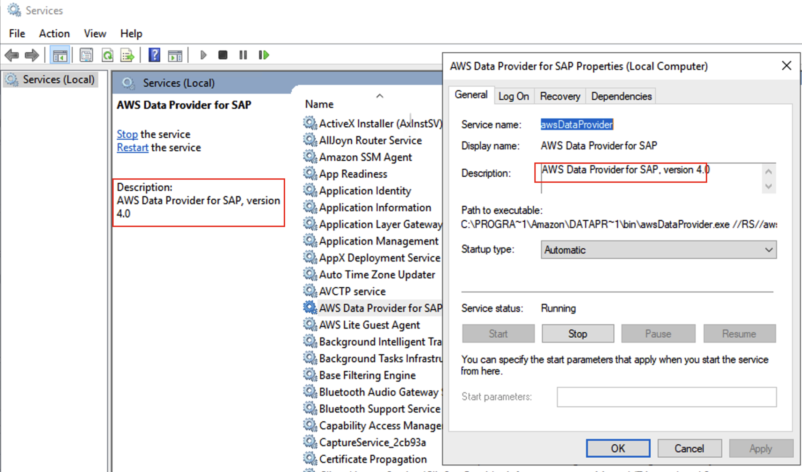

# DataProvider 4.3

If you are new to AWS Data Provider for SAP, see [Installing DataProvider 4.3](data-provider-installation.md "data-provider-installation.md").

If you need to update or uninstall DataProvider 4.3, see [Updating to DataProvider 4.3](data-provider-update.md "data-provider-update.md").

If you have an older version on your system, see [Uninstalling older versions](uninstall-older-dp.md "uninstall-older-dp.md").

###### Important

All the previous versions (v1, v2, v3) of the DataProvider have been deprecated and will no longer receive updates. For new DataProvider installations, you must install DataProvider 4.3 using an SSM distributor.

**Run the following command to check the current version of DataProvider on your system.**

```
rpm -qa | grep aws-sap
```

To check the current version of DataProvider on **Windows**, go to **Services(Local)**, select **AWS Data Provider for SAP**, and open **Properties**. You can see the current version in the Description field.


