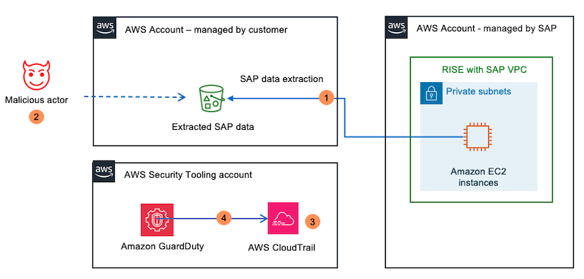
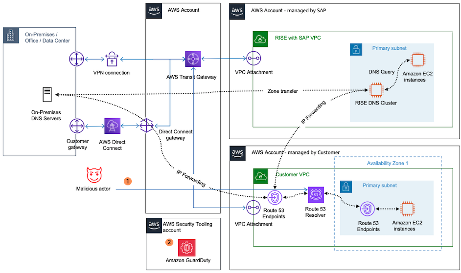
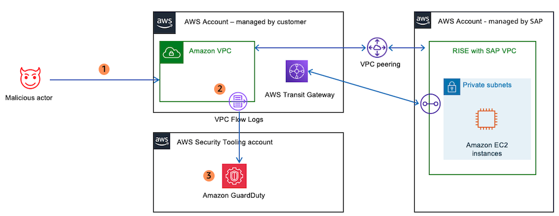

# Amazon GuardDuty

Amazon GuardDuty is a threat detection service that continuously monitors for malicious activity and unauthorized behaviour within an AWS environment. It combines machine learning, anomaly detection, and integrated threat intelligence to identify potential threats and protect AWS account linked to RISE with SAP environments, workloads, and data.

Amazon GuardDuty monitors the following:

- AWS CloudTrail Logs: Amazon GuardDuty monitors API activity across AWS account to detect suspicious API calls, unauthorized deployments, and unauthorized access attempts to resources. Amazon GuardDuty identifies attempts to access AWS services from unauthorized IP addresses or regions. Amazon GuardDuty detects unusual behaviour in Identity and Access Management (IAM) users, roles, and policies, such as privilege escalation.
- VPC Flow Logs. Amazon GuardDuty analyses network traffic within a Virtual Private Cloud (VPC) to detect unexpected traffic patterns, data exfiltration attempts, or unauthorized access alongside identifying communications between AWS resources and known malicious IP addresses or domains. In the context of RISE with SAP on AWS, the inspection takes places on a VPC fronting the RISE SAP-managed account;
- DNS Logs. Amazon GuardDuty monitors DNS queries made by an AWS resource to detect attempts to connect to malicious domains or unusual DNS request patterns. Amazon GuardDuty also detects the use of Domain Generation Algorithms (DGA) for generating domain names associated with Command and Control servers.
  In the context of RISE with SAP, Amazon GuardDuty can be leveraged for the following:

- Intrusion Detection: GuardDuty enables early detection of intrusion attempts into an RISE environment fronted by a customer-managed AWS account by identifying malicious activities such as unauthorized API calls, network reconnaissance, and access attempts from known malicious IP addresses;
- Compliance Validation: For organizations with stringent compliance requirements, GuardDuty helps ensure adherence by continuously monitoring for policy violations and unauthorized access attempts, providing detailed logs and reports for audit purposes. This can be achieved when the SAP RISE environment is accessed from a customer-managed AWS account. See [Compliance Validation](../../../guardduty/latest/ug/compliance-validation.md "../../../guardduty/latest/ug/compliance-validation.md") for more details
- Automated Incident Response. GuardDuty can be integrated with AWS Lambda and AWS Security Hub to automate incident response workflows. Upon detecting a threat, these services can trigger automated remediation actions, such as isolating compromised resources or notifying security teams.
  Below is example architecture of GuardDuty monitoring CloudTrail trails of a RISE with SAP deployment on AWS

In the diagram above

1. Data is written to S3 bucket for data lake/compliance reporting purposes.
2. A malicious actor changes IAM rules and IAM permissions on S3 bucket to obtain access.
3. IAM changes are intercepted by AWS CloudTrail.
4. GuardDuty detects suspicious activity and alerts administrators.
   Below is example architecture of GuardDuty monitoring DNS logs of a RISE with SAP deployment on AWS

In the diagram above

1. A malicious actor introduces rogue DNS redirecting users to makeshift SAP systems.
2. The rogue DNS entries are detected by GuardDuty and reported to administrators.
   Below is example architecture of GuardDuty monitoring VPC Flow Logs of RISE with SAP VPC

In the diagram above

1. A malicious actor attempts to access SAP systems from VPC managed by customer peered to RISE VPC or scan ports.
2. The connection attempt from malicious actor IP logged in VPC Flow Logs.
3. The suspicious connection attempt is detected by Amazon GuardDuty and reported to administrators.
   For instructions to configure Amazon GuardDuty, see [Getting Started](../../../guardduty/latest/ug/guardduty_settingup.md "../../../guardduty/latest/ug/guardduty_settingup.md").
