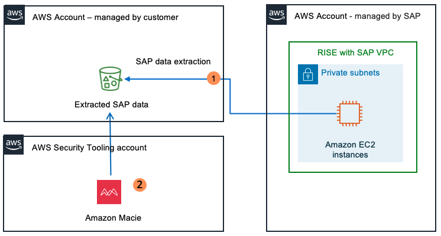

# Amazon Macie

Amazon Macie is a data security service that helps customers discover, classify, and protect sensitive data stored in Amazon S3 buckets by continuously monitoring and alerting on potential data risks and unauthorized access attempts.

In the context of RISE with SAP, Amazon Macie can protect Amazon S3 buckets in customer-managed AWS account fed by a RISE with SAP environment, for instance:

- as a RISE customer, backups can be copied from the SAP-managed AWS account to a customer-managed environment and S3 bucket.
- SAP data can be extracted from or a RISE environment (see [Architecture Options for extracting SAP Data with AWS Services](https://aws.amazon.com/blogs/awsforsap/architecture-options-for-extracting-sap-data-with-aws-services/ "https://aws.amazon.com/blogs/awsforsap/architecture-options-for-extracting-sap-data-with-aws-services/")) to a customer-managed S3 bucket, to enable advanced analytics, machine learning, and business intelligence using other AWS services like Amazon Athena, AWS Glue, and Amazon Sagemaker;
- Certain industries and regulations, such as GDPR, HIPAA, or PCI-DSS, may require long-term storage and preservation of sensitive data. Exporting this data to a customer-managed S3 can help meet these compliance requirements, as S3 provides robust security and durability features.
- Centralized Policy Management. AWS Network Firewall allows to define and manage firewall policies centrally, which can then be easily deployed across multiple VPCs including non-SAP VPCs and VPCs associated with the SAP-managed RISE VPC, ensuring consistent security enforcement.
- Customers can also consume security event logs out of their RISE environment, so ingest in their own S3 buckets or SIEM systems.
  Below is example architecture of Amazon Macie continuously scanning an S3 bucket with SAP data extracted from RISE

In the diagram above

1. Data is written to S3 bucket for data lake/compliance reporting purposes.
2. Amazon Macie continuously analyzes bucket to detect Privately Indentifiable Information.
   For instructions to configure Amazon Macie, see [What is Macie ?](../../../macie/latest/user/what-is-macie.md "../../../macie/latest/user/what-is-macie.md").
