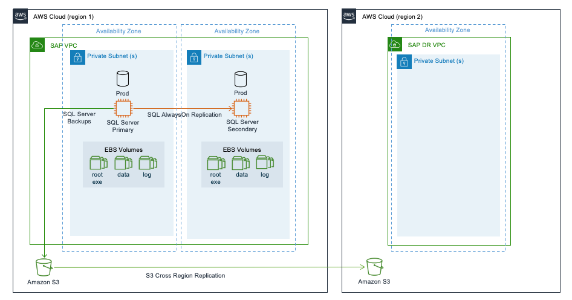
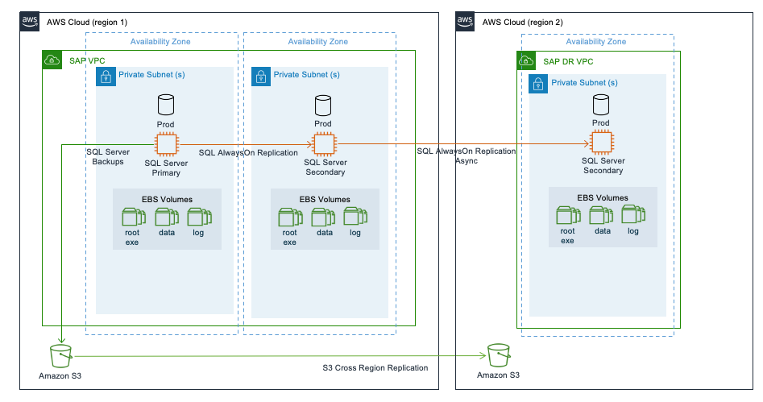
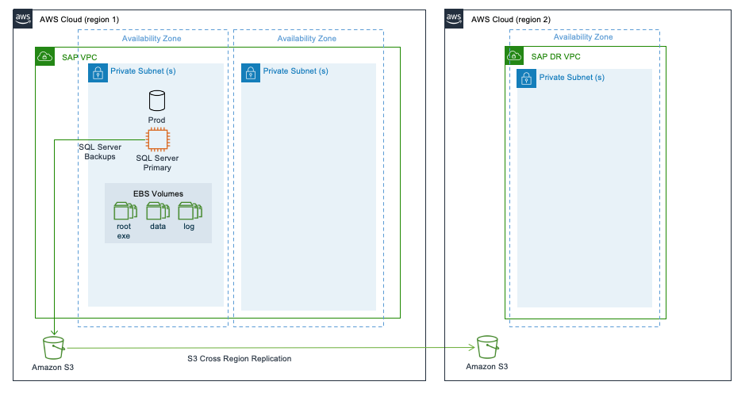
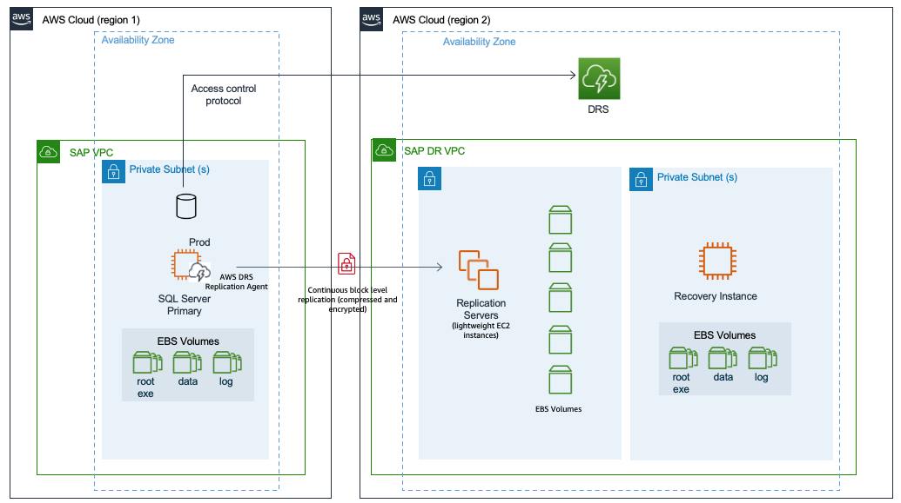

# Multi-Region patterns for Microsoft SQL server

AWS Global Infrastructure spans across multiple Regions around the world and this footprint is constantly increasing. For the latest updates, see [AWS Global Infrastructure](https://aws.amazon.com/about-aws/global-infrastructure/ "https://aws.amazon.com/about-aws/global-infrastructure/"). If you are looking for your SAP data to reside in multiple regions at any given point to ensure increased availability and minimal downtime in the event of failure, you should opt for multi-Region architecture patterns.

When deploying a multi-Region pattern, you can benefit from using an automated approach such as, cluster solution, for fail over between Availability Zones to minimize the overall downtime and remove the need for human intervention. Multi-Region patterns not only provide high availability but also disaster recovery, thereby lowering overall costs. Distance between the chosen regions have direct impact on latency and hence, in a multi-Region pattern, this has to be considered into the overall design.

There are additional cost implications from cross-Region replication or data transfer that also need to be factored into the overall solution pricing. The pricing varies between Regions.

The following are the four multi-Region architecture patterns.

###### Patterns

- [Pattern 3: Primary Region with two Availability Zones for production and secondary Region with a replica of backups/AMIs](#pattern3 "#pattern3")
- [Pattern 4: Primary Region with two Availability Zones for production and secondary Region with compute and storage capacity deployed in a single Availability Zone](#pattern4 "#pattern4")
- [Pattern 5: Primary Region with one Availability Zone for production and a secondary Region with a replica of backups/AMIs](#pattern5 "#pattern5")
- [Pattern 6: Primary Region with one Availability Zone for production and a secondary Region replicated at block level using AWS Elastic Disaster Recovery](#pattern6 "#pattern6")

## Pattern 3: Primary Region with two Availability Zones for production and secondary Region with a replica of backups/AMIs

This pattern is similar to pattern 1 where your Microsoft SQL server is highly available. You deploy your production instance across two Availability Zones in the primary Region using AlwaysOn. You can restore your SQL database in a secondary Region with a replica of backups stores in Amazon S3, Amazon EBS, and Amazon Machine Images (AMIs).

With cross-Region replication of files stored in Amazon S3, the data stored in a bucket is automatically (asynchronously) copied to the target Region. Amazon EBS snapshots can be copied between Regions. For more information, see [Copy an Amazon EBS snapshot](../../../AWSEC2/latest/UserGuide/ebs-copy-snapshot.md "../../../AWSEC2/latest/UserGuide/ebs-copy-snapshot.md"). You can copy an AMI within or across Regions using AWS CLI, AWS Management Console, AWS SDKs or Amazon EC2 APIs. For more information, see [Copy an AMI](../../../AWSEC2/latest/UserGuide/CopyingAMIs.md "../../../AWSEC2/latest/UserGuide/CopyingAMIs.md"). You can also use AWS Backup to schedule and run snapshots and replications across Regions.

In the event of a complete Region failure, the production SQL server needs to be built in the secondary Region using AMI. You can use AWS CloudFormation templates to automate the launch of a new SQL server. Once your instance is launched, you can then download the last set of backup from Amazon S3 to restore your SQL server to a point-in-time before the disaster event. After restoring and recovering your SQL server in the secondary Region, you can redirect your client traffic to the new instance using DNS.

This architecture provides you with the advantage of implementing your SQL server across multiple Availability Zones with the ability to failover instantly in the event of a failure. For disaster recovery that is outside the primary Region, recovery point objective is constrained by how often you store your SQL backup files in your Amazon S3 bucket, and the time it takes to replicate your Amazon S3 bucket to the target Region. You can use Amazon S3 replication time control for a time-bound replication. For more information, see [Enabling Amazon S3 Replication Time Control](../../../AmazonS3/latest/userguide/replication-time-control.md#enabling-replication-time-control "../../../AmazonS3/latest/userguide/replication-time-control.md#enabling-replication-time-control").

Your recovery time objective depends on the time it takes to build the system in the secondary Region and restore operations from backup files. The amount of time will vary depending on the size of the database. Also, the time required to get the compute capacity for restore procedures may be more in the absence of a reserved instance capacity. This pattern is suitable when you need the lowest possible recovery time and point objectives within a Region and high recovery point and time objectives for disaster recovery outside the primary Region.

## Pattern 4: Primary Region with two Availability Zones for production and secondary Region with compute and storage capacity deployed in a single Availability Zone

In addition to the architecture of pattern 3, this pattern has SQL AlwaysOn setup between the SQL server in the primary Region and an identical third instance in one of the Availability Zones in the secondary Region. We recommend using the asynchronous (async) mode for SQL AlwaysOn when replicating between AWS Regions due to increased latency.

In the event of a failure in the primary Region, the production workloads are failed over to the secondary Region manually. This pattern ensures that your SAP systems are highly available and are disaster-tolerant. This pattern provides a quicker failover and continuity of business operations with continuous data replication.

There is an increased cost of deploying the required compute and storage for the production SQL server in the secondary Region and of data transfers between Regions. This pattern is suitable when you require disaster recovery outside of the primary Region with low recovery point and time objectives.

This pattern can be deployed in a multi-tier as well as multi-target replication configuration.

The following diagram shows a multi-tier replication where the replication is configured in a chained fashion.

## Pattern 5: Primary Region with one Availability Zone for production and a secondary Region with a replica of backups/AMIs

This pattern is similar to pattern 2 with additional disaster recovery in a secondary Region containing replicas of the SQL server backups stored in Amazon S3, Amazon EBS snapshots, and AMIs. In this pattern, the SQL server is deployed as a standalone installation in the primary Region in one Availability Zone with no target SQL systems to replicate data.

With this pattern, your SQL server is not highly available. In the event of a complete Region failure, the production SQL server needs to be built in the secondary Region using AMI. You can use AWS CloudFormation templates to automate the launch of a new SQL server. Once your instance is launched, you can then download the last set of backup from Amazon S3 to restore your SQL server to a point-in-time before the disaster event. You can then redirect your client traffic to the new instance in the secondary Region using DNS.

For disaster recovery that is outside the primary Region, recovery point objective is constrained by how often you store your SQL backup files in your Amazon S3 bucket and the time it takes to replicate your Amazon S3 bucket to the target Region. Your recovery time objective depends on the time it takes to build the system in the secondary Region and restore operations from backup files. The amount of time will vary depending on the size of the database. This pattern is suitable for non-production or non-critical production systems that can tolerate a downtime required to restore normal operations.

## Pattern 6: Primary Region with one Availability Zone for production and a secondary Region replicated at block level using AWS Elastic Disaster Recovery

AWS Elastic Disaster Recovery provides organizations with a modern approach to protecting Microsoft SQL server environments by enabling cloud-based disaster recovery on AWS Cloud. For more information, see [What is Elastic Disaster Recovery](../../../drs/latest/userguide/what-is-drs.md "../../../drs/latest/userguide/what-is-drs.md")?

Elastic Disaster Recovery uses block level replication and replicates the operating system, databases, application, and system files for supported Windows and Linux operating system versions. To learn more, see [Supported operating systems](../../../drs/latest/userguide/Supported-Operating-Systems.md "../../../drs/latest/userguide/Supported-Operating-Systems.md"). An initial setup of the AWS Replication Agent is required on the source systems for Elastic Disaster Recovery to initiate secure data replication. The agent runs in memory and recognizes write operations to locally attached disks. These writes are captured and asynchronously replicated into a staging area in your AWS account. During this ongoing replication process, Elastic Disaster Recovery maintains the write order among all disks in the same source server. The replicated Amazon EC2 instances can be run in a _test mode_ to perform drills in a segregated environment.

Elastic Disaster Recovery allows you to monitor the data replication status of your recovery instances, view recovery instance details, add recovery instances to Elastic Disaster Recovery, edit recovery instance failback settings, and terminate recovery instances.

With Elastic Disaster Recovery, you can perform a failover by launching recovery instances on AWS Cloud. Once the recovery instance is launched, you must redirect the traffic from your primary site to the recovery site.

AWS Elastic Disaster Recovery uses Amazon EBS snapshots to take point-in-time snapshots of data held within the staging area. To learn more, see [Amazon EBS snapshots](../../../AWSEC2/latest/UserGuide/EBSSnapshots.md "../../../AWSEC2/latest/UserGuide/EBSSnapshots.md"). It then provides crash consistent point-in-time recovery options that can be used in the event of a disaster or drill. Elastic Disaster Recovery can protect individual nodes of the SQL Server Always On availability group. During disaster recovery, the group is launched as individual SQL server instances on AWS. This solution works for both the SQL Server Standard edition and SQL Server Enterprise edition for any supported version of the SQL server.

