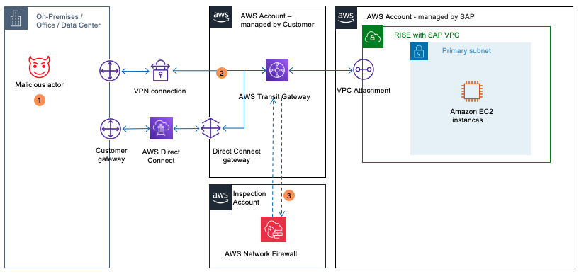

# AWS Network Firewall

AWS Network Firewall is a managed firewall service that provides essential network protection for Amazon Virtual Private Cloud (VPC) environments. AWS Network Firewall acts as a first line of defence, filtering and inspecting all network traffic to and from RISE resources, effectively creating a protective perimeter around a RISE environment.

Key features of AWS Network Firewall include:

- Stateful Firewall Capabilities. AWS Network Firewall offers advanced stateful firewall features to monitor and control network traffic. It can inspect the complete context of a network connection, including source, destination, ports, and protocols, to detect and block malicious or unauthorized traffic.
- Threat Signature Matching. AWS Network Firewall comes pre-loaded with a comprehensive set of threat detection rules and signatures, continuously updated by AWS, to identify and mitigate known threats, malware, and other malicious activity targeting RISE deployments.
- Custom Rule Definition. In addition to the pre-defined threat signatures, customers can create and deploy custom firewall rules to address specific security requirements or policies unique to connections hitting SAP systems in the RISE environment.
- Centralized Policy Management. AWS Network Firewall allows to define and manage firewall policies centrally, which can then be easily deployed across multiple VPCs including non-SAP VPCs and VPCs associated with the SAP-managed RISE VPC, ensuring consistent security enforcement.
- Scalability and High Availability. As a fully managed service, AWS Network Firewall automatically scales to handle changes in network traffic volume and patterns, ensuring RISE environment remains protected without the need for complex infrastructure management.
  In the context of RISE with SAP, AWS Network Firewall can be leveraged for the following:

- Centralized Firewall Management. AWS Network Firewall provides a centralized, managed firewall service to control and monitor network traffic travelling to and from the SAP-managed RISE VPC.
- Stateful Packet Inspection. AWS Network Firewall performs stateful packet inspection, allowing it to detect and mitigate advanced threats by analysing the context of network connections to/from SAP systems within the RISE VPC.
- Regulatory Compliance. AWS Network Firewall helps organizations meet compliance requirements by enforcing security policies and providing logging/auditing capabilities for the RISE with SAP landscape.
  Below is example architecture of AWS Network Firewall inspecting network traffic before it reaches RISE with SAP

In the diagram above

1. A malicious actor exploits network misconfiguration to get access to SAP system on RISE.
2. Traffic is first routed through AWS Transit Gateway.
3. Packet inspection by AWS Network Firewall catches abnormal connection attempts..
   It is worth noting that AWS Network Firewall can be also used by customers who want to consume SAP BTP services hosted by AWS connecting first to an AWS Transit Gateway with AWS Direct Connect, so that their end-to-end stay on the AWS backbone.

For instructions to configure AWS Network Firewall, see [Getting started with AWS Network Firewall](../../../network-firewall/latest/developerguide/getting-started.md "../../../network-firewall/latest/developerguide/getting-started.md").
