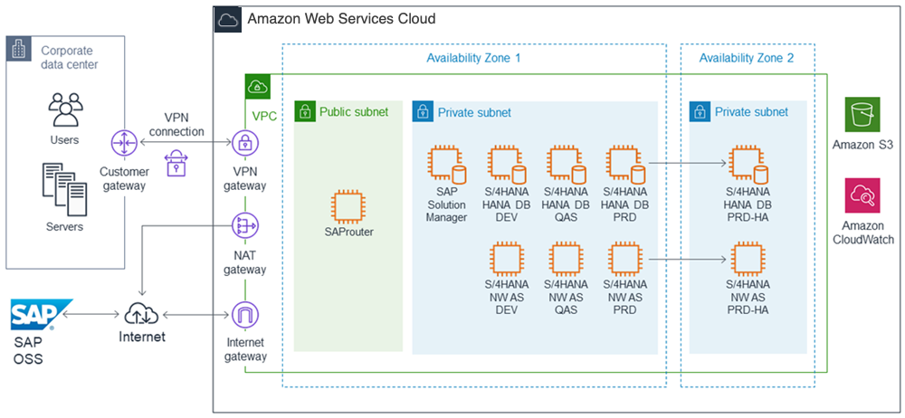
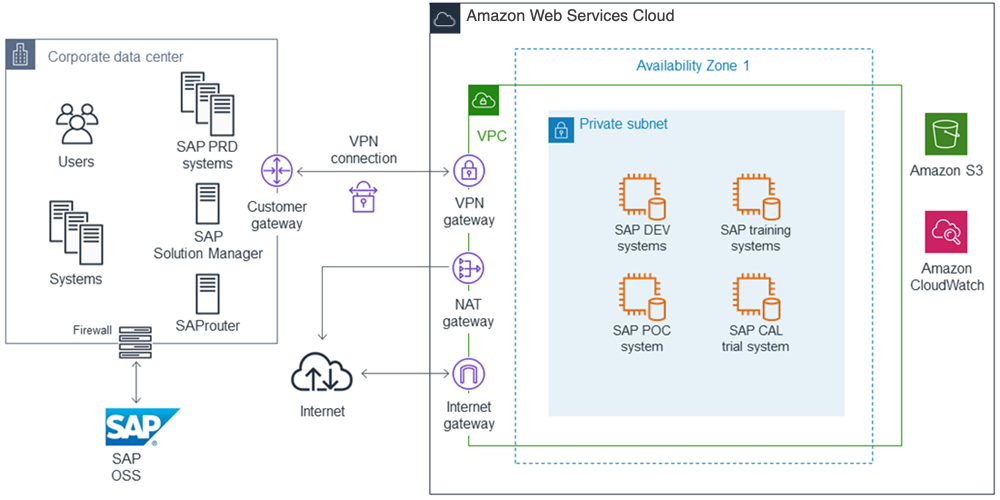

# SAP on AWS Planning

If you are an experienced SAP Basis or SAP NetWeaver administrator, there are a number of AWS-specific considerations relating to compute configurations, storage, security, management, and monitoring that will help you get the most out of your SAP environment on AWS. This section provides guidelines for achieving optimal performance, availability, and reliability, and lower total cost of ownership (TCO) while running SAP solutions on AWS.

## SAP Notes

Before migrating or implementing an SAP environment on AWS, you should read and follow the relevant SAP notes. Start from [SAP Note 1656099](https://launchpad.support.sap.com/#/notes/1656099 "https://launchpad.support.sap.com/#/notes/1656099") for general information and follow the links to other relevant SAP notes (SAP One Support Launchpad access required).

## SAP on AWS Architectures

This section describes the two primary architectural patterns for SAP on AWS: all systems on AWS and hybrid.

### All-on-AWS Architecture

With the SAP All-on-AWS architecture, all systems and components of your SAP environment are hosted on AWS. Example scenarios of such an architecture include:

- Implementation of a complete, new SAP environment on AWS
- Migration of a complete, existing SAP environment to AWS

Figure 3 depicts an SAP all-on-AWS architecture. The SAP environment running on AWS is integrated with on-premises systems and users via a VPN connection or a dedicated network connection via AWS Directs Connect. SAProuter is deployed in a public subnet and assigned a public IP address that is reachable from the internet to enable integration with the SAP OSS network via a secure network communications (SNC) connection. A [network address translation (NAT) gateway](../../../AmazonVPC/latest/UserGuide/vpc-nat-gateway.md "../../../AmazonVPC/latest/UserGuide/vpc-nat-gateway.md") enables instances in the private subnet to connect to the internet or other AWS services, but prevents instances from receiving inbound traffic that is initiated by someone on the internet. For additional information, see the [Configuring Network and Connectivity](#overview-network-connectivity "#overview-network-connectivity") section.

### Figure 3: SAP all-on-AWS architecture

### Hybrid AWS Architecture

With an SAP hybrid AWS architecture, some SAP systems and components are hosted on your on-premises infrastructure and others are hosted on the AWS infrastructure. Example scenarios of such an architecture include:

- Running SAP test, trial, training, proof-of-concept (PoC), and similar systems on AWS
- Running non-production SAP landscapes (for example, DEV and QAS) on AWS, integrated with an SAP production landscape running on premises
- Implementing a new SAP application on AWS and integrating it with an existing SAP on-premises environment

Figure 4 depicts an SAP hybrid AWS architecture with SAP DEV and QAS landscapes and SAP test, training, and PoC systems running on AWS. These systems are integrated with SAP systems and users on the corporate network. Connectivity between the VPC and the corporate network is provided with either a VPN connection or an AWS Directs Connect connection. The existing SAProuter and SAP Solution Manager running on the corporate network are used to manage the SAP systems running within the VPC.

### Figure 4: SAP hybrid AWS architecture

## Choosing an AWS Region and Availability Zone

See the [AWS Global Infrastructure](overview-aws.md#overview-global-infrastructure "overview-aws.md#overview-global-infrastructure") section of this guide for information about AWS Regions and Availability Zones.

### Choosing a Region

When choosing the AWS Region to deploy your SAP environment in, consider the following factors:

- Proximity to your on-premises data center(s), systems, and end users to minimize network latency.
- Data residency and regulatory compliance requirements.
- Availability of the AWS products and services you plan to use in the region. For a detailed list of AWS products and services by region, see the [Region Table](https://aws.amazon.com/about-aws/global-infrastructure/regional-product-services/ "https://aws.amazon.com/about-aws/global-infrastructure/regional-product-services/") on the AWS website.
- Availability of the EC2 instance types you plan to use in the region. To view AWS Region availability for a specific instance type, see the [Amazon EC2 Instance Types for SAP](https://aws.amazon.com/sap/instance-types/ "https://aws.amazon.com/sap/instance-types/") webpage.

### Choosing an Availability Zone

No special considerations are required when choosing an Availability Zone for your SAP deployment on AWS. All SAP applications (SAP ERP, CRM, SRM, and so on) and systems (SAP database system, SAP Central Services system, and SAP application servers) should be deployed in the same Availability Zone. If high availability (HA) is a requirement, use multiple Availability Zones. For more information, see [Architecture guidance for availability and reliability of SAP on AWS](architecture-guidance-of-sap-on-aws.md "architecture-guidance-of-sap-on-aws.md").

## Network and Connectivity

### Amazon VPC

Amazon VPC enables you to define a virtual network in your own, logically isolated area within the AWS Cloud. You can launch your AWS resources, such as instances, into your VPC. Your VPC closely resembles a traditional network that you might operate in your own data center, with the benefits of using the AWS scalable infrastructure. You can configure your VPC; you can select its IP address range, create subnets, and configure route tables, network gateways, and security settings. You can connect instances in your VPC to the internet. You can connect your VPC to your own corporate data center, and make the AWS Cloud an extension of your data center. To protect the resources in each subnet, you can use multiple layers of security, including security groups and network access control lists. For more information, see the [Amazon VPC User Guide](../../../vpc/latest/userguide/what-is-amazon-vpc.md "../../../vpc/latest/userguide/what-is-amazon-vpc.md").

For detailed instructions for setting up and configuring a VPC, and connectivity between your network and VPC, see the [Amazon VPC documentation](../../../vpc/latest/userguide/what-is-amazon-vpc.md "../../../vpc/latest/userguide/what-is-amazon-vpc.md").

### Network Connectivity Options

Multiple options are available to provide network connectivity between your on-premises users and systems with your SAP systems running on AWS, including a direct internet connection, hardware VPN, and private network connection.

#### Private Network Connection

[AWS Directs Connect](https://aws.amazon.com/directconnect "https://aws.amazon.com/directconnect") makes it easy to establish a dedicated network connection from your premises to AWS. Using AWS Directs Connect, you can establish private connectivity between AWS and your data center, office, or co-location environment. In many cases, this can reduce your network costs, increase bandwidth throughput, and provide a more consistent network experience than internet-based connections. For additional information, see the [AWS Directs Connect User Guide](../../../directconnect/latest/UserGuide/Welcome.md "../../../directconnect/latest/UserGuide/Welcome.md").

Use cases: Recommended for customers who require greater bandwidth and lower latency than possible with a hardware VPN.

For more information, see [Amazon Virtual Compute Cloud Connectivity Options](../../../whitepapers/latest/aws-vpc-connectivity-options/welcome.md "../../../whitepapers/latest/aws-vpc-connectivity-options/welcome.md").

#### Direct Internet Connection

The quickest and simplest way to connect to your SAP systems running on AWS involves using a VPC with a single public subnet and an internet gateway to enable communication over the internet. For additional information, see [Scenario 1: VPC with a Public Subnet Only](../../../AmazonVPC/latest/UserGuide/VPC_Scenario1.md "../../../AmazonVPC/latest/UserGuide/VPC_Scenario1.md") in the _Amazon VPC User Guide_.

Use cases: Most suitable for SAP demo, training, and test type systems that do not contain sensitive data.

#### Site-to-Site / Hardware VPN

[AWS Site-to-Site VPN](https://aws.amazon.com/vpn "https://aws.amazon.com/vpn") extends your data center or branch office to the cloud via Internet Protocol security (IPsec) tunnels, and supports connecting to both virtual private gateways and AWS Transit Gateway. You can optionally run Border Gateway Protocol (BGP) over the IPsec tunnel for a highly available solution. For additional information, see [Adding a Hardware Virtual Private Gateway to your VPC](../../../AmazonVPC/latest/UserGuide/VPC_VPN.md "../../../AmazonVPC/latest/UserGuide/VPC_VPN.md") in the _Amazon VPC User Guide_.

Use cases: Recommended for any SAP environments on AWS that require integration with on-premises users and systems.

#### Client VPN

[AWS Client VPN](https://aws.amazon.com/vpn "https://aws.amazon.com/vpn") provides a fully-managed VPN solution that can be accessed from anywhere with an internet connection and an OpenVPN-compatible client. It is elastic, automatically scales to meet your demand, and enables your users to connect to both AWS and on-premises networks. AWS Client VPN seamlessly integrates with your existing AWS infrastructure, including Amazon VPC and AWS Directory Service, so you don’t have to change your network topology.

Use cases: Provides quick and easy connectivity to your remote workforce and business partners.

## Following Security Best Practices

In order to provide end-to-end security and end-to-end privacy, AWS builds services in accordance with security best practices, provides appropriate security features in those services, and documents how to use those features. In addition, AWS customers must use those features and best practices to architect an appropriately secure application environment. Enabling customers to ensure the confidentiality, integrity, and availability of their data is of the utmost importance to AWS, as is maintaining trust and confidence.

### Shared Responsibility Environment

There is a shared responsibility model between you as the customer and AWS. AWS operates, manages, and controls the components from the host operating system and virtualization layer down to the physical security of the facilities in which the services operate. In turn, you assume responsibility and management of the guest operating system (including updates and security patches), other associated application software, Amazon VPC setup and configuration, as well as the configuration of the AWS-provided security group firewall. For additional information on AWS security, visit the [AWS Cloud Security](https://aws.amazon.com/security "https://aws.amazon.com/security") page and review the various [Security Resources](https://aws.amazon.com/security/security-resources "https://aws.amazon.com/security/security-resources") available there.

### Amazon VPC

The foundation for security of an SAP environment on AWS is the use of Amazon VPC for providing the overall isolation. Amazon VPC includes security details that you must set up to enable proper access and restrictions for your resources. Amazon VPC provides features that you can use to help increase and monitor the security for your VPC:

- **Security groups** act as a firewall for associated EC2 instances, controlling both inbound and outbound traffic at the instance level.
- **Network access control lists (ACLs)** act as a firewall for associated subnets, controlling both inbound and outbound traffic at the subnet level.
- **Route tables** consist of a set of rules, called routes, that determine where network traffic is directed. Each subnet in your VPC must be associated with a route table; the table controls the routing for the subnet.
- **Flow logs** capture information about the IP traffic going to and from network interfaces in your VPC.

For detailed documentation about how to set up and manage security within a VPC, see the [Security](../../../AmazonVPC/latest/UserGuide/VPC_Security.md "../../../AmazonVPC/latest/UserGuide/VPC_Security.md") section of the _Amazon VPC User Guide_.

## EC2 Instance Types for SAP

Amazon EC2 provides a wide selection of instance types optimized to fit different use cases. Instance types comprise varying combinations of CPU, memory, storage, and networking capacity and give you the flexibility to choose the appropriate mix of resources for your applications. Each instance type includes one or more instance sizes, allowing you to scale your resources to the requirements of your target workload.

SAP systems deployed on AWS that will require support from SAP must be run on an EC2 instance type that has been certified with SAP. This section describes where you can find details about the EC2 instance types that have been certified with SAP and additional information for specific SAP solutions.

### SAP NetWeaver-based Solutions

SAP solutions based on the SAP NetWeaver platform and that use [SAP Application Performance Standard (SAPS)](https://www.sap.com/about/benchmark.html "https://www.sap.com/about/benchmark.html") for sizing must be run on a specific subset of EC2 instance types in order to receive support from SAP Support. For details, see:

- [SAP Note 1656099](https://launchpad.support.sap.com/#/notes/1656099 "https://launchpad.support.sap.com/#/notes/1656099")
- [Amazon EC2 Types for SAP](https://aws.amazon.com/sap/instance-types "https://aws.amazon.com/sap/instance-types")

### SAP HANA

The SAP HANA platform and SAP solutions that run on top of an SAP HANA database—​for example, SAP Suite on HANA, SAP S/4HANA, SAP Business Warehouse (BW) on HANA, SAP BW/4HANA-- require specific EC2 instance types that have been certified for SAP HANA. For more information, see [Amazon EC2 instance types for SAP on AWS](ec2-instance-types-sap.md "ec2-instance-types-sap.md").

### SAP Business One, version for SAP HANA

For information about the EC2 instance types that are certified for SAP Business One, version for SAP HANA, see:

- [SAP Note 2058870](https://launchpad.support.sap.com/#/notes/2058870 "https://launchpad.support.sap.com/#/notes/2058870")
- [SAP Business One on AWS](https://aws.amazon.com/sap/solutions/business-one "https://aws.amazon.com/sap/solutions/business-one")

## Operating Systems

### Supported Operating Systems

EC2 instances run on 64-bit virtual processors based on the Intel x86 instruction set. The following 64-bit operating systems and versions are available and supported for SAP solutions on AWS.

- [SUSE Linux Enterprise Server (SLES)](https://aws.amazon.com/partners/suse "https://aws.amazon.com/partners/suse")
- [SUSE Linux Enterprise Server for SAP Applications (SLES for SAP)](https://aws.amazon.com/partners/suse "https://aws.amazon.com/partners/suse")
- [Red Hat Enterprise Linux (RHEL)](https://aws.amazon.com/partners/redhat "https://aws.amazon.com/partners/redhat")
- [Red Hat Enterprise Linux for SAP Solutions (RHEL for SAP)](https://aws.amazon.com/partners/redhat "https://aws.amazon.com/partners/redhat")
- [Microsoft Windows Server](https://aws.amazon.com/windows "https://aws.amazon.com/windows")
- [Oracle Enterprise Linux](https://aws.amazon.com/oracle "https://aws.amazon.com/oracle")

For additional information regarding SAP-supported operating systems on AWS, see [SAP Note 1656250](https://launchpad.support.sap.com/#/notes/1656250 "https://launchpad.support.sap.com/#/notes/1656250").

#### SLES for SAP and RHEL for SAP

SUSE and Red Hat offer SAP-specific versions of their operating systems that provide the following benefits:

- Configuration and tuning for SAP
- Extended release support
- High availability extension for SAP
- Dedicated support channel

###### Note

Because of these benefits, we strongly recommend using SLES for SAP or RHEL for SAP with High Availability (HA) and Update Services (US) for your SAP on AWS deployments.

To learn more about SUSE’s and Red Hat’s operating system versions for SAP, see the following information on the SLES and Red Hat websites.

SLES for SAP

- [General information](https://www.suse.com/products/sles-for-sap/features/ "https://www.suse.com/products/sles-for-sap/features/")
- [SUSE on AWS for SAP Applications](https://www.suse.com/promo/cloud/public/aws/sap-hana/ "https://www.suse.com/promo/cloud/public/aws/sap-hana/")

RHEL for SAP

- [General information](https://www.redhat.com/en/resources/red-hat-enterprise-linux-for-sap-solutions-datasheet "https://www.redhat.com/en/resources/red-hat-enterprise-linux-for-sap-solutions-datasheet")
- [Red Hat in the Public Cloud](https://access.redhat.com/public-cloud "https://access.redhat.com/public-cloud")
- [Red Hat Cloud Access](https://www.redhat.com/en/technologies/cloud-computing/cloud-access "https://www.redhat.com/en/technologies/cloud-computing/cloud-access")
- [How to Locate Red Hat Cloud Access Gold Images on Amazon EC2](https://access.redhat.com/articles/2962171 "https://access.redhat.com/articles/2962171")
- [What is the Difference between Red Hat Cloud Access and Red Hat Enterprise Linux On-Demand Subscriptions in the public cloud?](https://access.redhat.com/articles/2041283 "https://access.redhat.com/articles/2041283")

### Operating System Licenses

These operating system licensing options are available for SAP systems on AWS:

- **On-demand** – The operating system software and license are bundled in an Amazon Machine Images (AMI). The fee for the operating system license is included in the On-Demand Instance hourly fee or Reserved Instance fee for the instance type.
- **Bring Your Own License/Subscription (BYOL)** – Bring your existing operating system license or subscription to the AWS Cloud.
- **AWS Marketplace** – Purchase operating system licenses and subscriptions from AWS Marketplace.

The following table lists the licensing options available for each operating system and version. To learn more about each option, follow the link in the table.

| Operating system                | License/subscription options                                                                                                                                                                                 |
| ------------------------------- | ------------------------------------------------------------------------------------------------------------------------------------------------------------------------------------------------------------ | --------------------------------------------------------------------------------------------------------------------- |
| **SLES**                        | On-demand                                                                                                                                                                                                    | [BYOL](https://www.suse.com/promo/cloud/public/aws/ "https://www.suse.com/promo/cloud/public/aws/")                   |
| **SLES for SAP**                | [AWS Marketplace](https://aws.amazon.com/marketplace/search/results?x=0&y=0&searchTerms=SUSE+SAP+Applications "https://aws.amazon.com/marketplace/search/results?x=0&y=0&searchTerms=SUSE+SAP+Applications") | [BYOL](https://www.suse.com/promo/cloud/public/aws/sap-hana/ "https://www.suse.com/promo/cloud/public/aws/sap-hana/") |
| **RHEL**                        | On-demand                                                                                                                                                                                                    | [BYOL](https://aws.amazon.com/partners/redhat "https://aws.amazon.com/partners/redhat")                               |
| **RHEL for SAP with HA and US** | [AWS Marketplace](https://aws.amazon.com/marketplace/pp/prodview-puvcki5kgypyy "https://aws.amazon.com/marketplace/pp/prodview-puvcki5kgypyy")                                                               | BYOL                                                                                                                  |
| **Windows**                     | On-demand                                                                                                                                                                                                    | [BYOL](https://aws.amazon.com/windows/resources/licensing "https://aws.amazon.com/windows/resources/licensing")       |
| **Oracle Linux**                | [BYOL](https://aws.amazon.com/oracle "https://aws.amazon.com/oracle")                                                                                                                                        |

## Databases

### Supported Databases

All the database platforms and versions supported by SAP for an on-premises infrastructure are also supported by SAP on AWS. For details about the databases supported with specific SAP solutions on AWS, see [SAP Note 1656099](https://launchpad.support.sap.com/#/notes/1656099 "https://launchpad.support.sap.com/#/notes/1656099").

### Database Installation and Administration

#### Customer-Managed Database on Amazon EC2

The majority of SAP solutions use a customer-managed model on Amazon EC2. Installation, configuration, administration, and backup and recovery of the database are done by either the customer or a partner.

The following SAP solutions use a self-managed database model on Amazon EC2:

- SAP Business Suite and SAP NetWeaver-based applications
- SAP HANA
- SAP S/4HANA
- SAP BW/4HANA
- SAP BusinessObjects BI
- SAP Business One

#### Amazon RDS

[Amazon Relational Database Service (Amazon RDS)](https://aws.amazon.com/rds "https://aws.amazon.com/rds") is a managed service that makes it easy to set up, operate, and scale a relational database in the cloud. It provides cost-efficient and resizable capacity, while managing time-consuming database administration tasks, freeing you up to focus on your applications and business. Amazon RDS is currently supported for the following SAP solutions:

- SAP BusinessObjects BI
- SAP Commerce (previously known as SAP Hybris Commerce)

#### Amazon Aurora

[Amazon Aurora (Aurora)](https://aws.amazon.com/rds "https://aws.amazon.com/rds") is a MySQL and PostgreSQL-compatible relational database built for the cloud. It combines the performance and availability of traditional enterprise databases with the simplicity and cost-effectiveness of open source databases. Aurora MySQL is currently supported for the following SAP solution:

- SAP Commerce (previously known as SAP Hybris Commerce)

### Database Licenses

These database licensing options are available for SAP systems on AWS:

- **On-demand** – The database software and license are bundled in an Amazon Machine Image (AMI). The fee for the database license is included in the On-Demand Instance hourly fee or Reserved Instance fee for the instance type.
- **Bring Your Own License (BYOL)** – Bring your existing database licenses to the AWS Cloud.
- **AWS Marketplace** – Purchase database software and licenses from AWS Marketplace.

The following table lists the licensing options available on AWS for each database. For additional information, follow the links in the _Licensing options_ column.

| Database                                           | Licensing options                                                                                                                                                                             |
| -------------------------------------------------- | --------------------------------------------------------------------------------------------------------------------------------------------------------------------------------------------- |
| **SAP HANA**                                       | [BYOL](https://aws.amazon.com/sap/solutions/saphana "https://aws.amazon.com/sap/solutions/saphana")                                                                                           |
| **SAP Adaptive Server Enterprise (ASE) (SAP ASE)** | [BYOL](https://aws.amazon.com/marketplace/seller-profile?id=0454efec-e5ad-4b7b-a23f-766e9e910dbc "https://aws.amazon.com/marketplace/seller-profile?id=0454efec-e5ad-4b7b-a23f-766e9e910dbc") |
| **Microsoft SQL Server**                           | [BYOL](https://aws.amazon.com/windows/resources/licensing "https://aws.amazon.com/windows/resources/licensing")\*                                                                             |
| **IBM DB2**                                        | [BYOL](https://aws.amazon.com/ibm "https://aws.amazon.com/ibm")                                                                                                                               |
| **Oracle**                                         | [BYOL](https://aws.amazon.com/oracle "https://aws.amazon.com/oracle")                                                                                                                         |
| **Amazon Aurora**                                  | [On-demand](https://aws.amazon.com/rds/aurora "https://aws.amazon.com/rds/aurora")                                                                                                            |

- SQL Server runtime licenses purchased from SAP require either Microsoft Software Assurance or Amazon EC2 Dedicated Hosts to bring these licenses to AWS. For additional information, see:
- [SAP Note 2139358 - Effect of changes in licensing terms of SQL Server](https://launchpad.support.sap.com/services/pdf/notes/2139358/E "https://launchpad.support.sap.com/services/pdf/notes/2139358/E")
- [Microsoft Licensing on AWS](https://aws.amazon.com/windows/resources/licensing "https://aws.amazon.com/windows/resources/licensing")

## SAP Installation Media

The majority of SAP solutions on AWS use a bring-your-own-software model. There are two primary options for copying SAP installation media to AWS:

- **Download from the SAP Software Download Center to Amazon EC2.** From your EC2 instance, connect to the [SAP Software Download Center](https://support.sap.com/en/my-support/software-downloads.html "https://support.sap.com/en/my-support/software-downloads.html") and download the required installation media. This option will most likely be the fastest method for getting SAP installation media to AWS, because EC2 instances have very fast connections to the internet. You can create a dedicated Amazon EBS volume to store installation media, and then attach the volume to different instances as needed. You can also create a snapshot of the Amazon EBS volume and create multiple volumes that you can attach to multiple instances in parallel.
- **Copy from your network to Amazon EC2.** If you already have the required SAP installation media downloaded to a location on your network, you can copy the media from your network directly to an EC2 instance.
