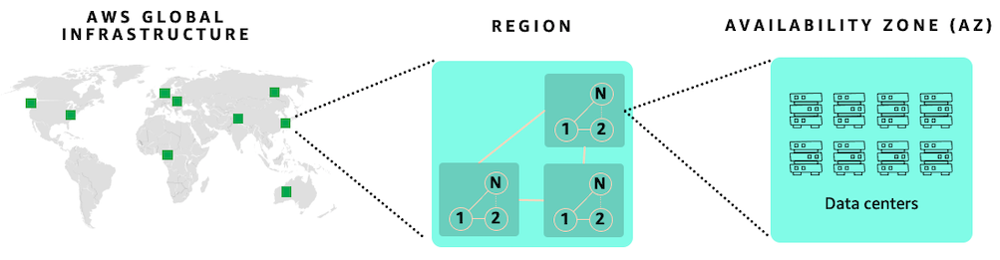
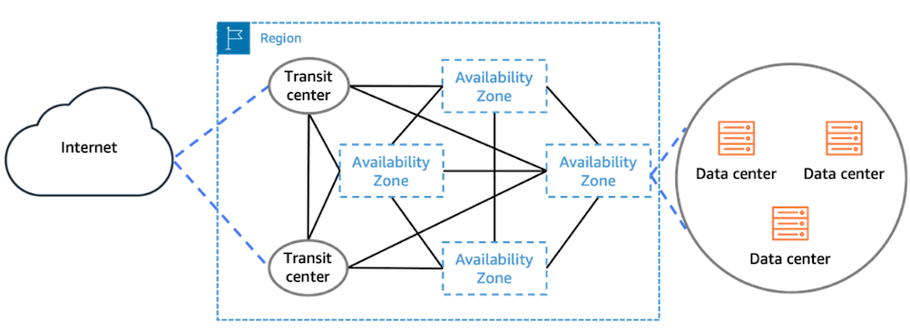

# Reliability

Reliability is one of the six pillars of SAP Lens - AWS Well-Architected Framework. For more information, see [Reliability](../../../wellarchitected/latest/sap-lens/reliability.md "../../../wellarchitected/latest/sap-lens/reliability.md").

AWS cloud offers reliability with multiple Availability Zones within an AWS Region. This enables your SAP applications on AWS to be more resilient. Each Region is further isolated from other Regions, providing the greatest possible fault tolerance and stability. Within each AWS Region, there are a minimum of three, isolated, physically separate Availability Zones. For more information, see [Regions and Availability Zones](https://aws.amazon.com/about-aws/global-infrastructure/regions_az/ "https://aws.amazon.com/about-aws/global-infrastructure/regions_az/").

Availability Zones enable you to operate production applications and databases that are more highly available than would be possible from a single data center. Distributing your applications across multiple Availability Zones provides the ability to remain resilient in the face of most failure modes, including natural disasters or system failures.

Each Availability Zone can be multiple data centers. At full scale, it can contain hundreds of thousands of servers. They are fully isolated partitions of AWS Global Infrastructure. An Availability Zone is physically separated from any other zones with its own separate power and networking resources. There is a distance of several kilometers, although all are within 100 km (60 miles of each other). This distance provides isolation from the most common disasters that could affect data centers, such as floods, fire, severe storms, earthquakes, etc.

All Availability Zones within a Region are interconnected with high-bandwidth and low-latency networking, over fully redundant and dedicated metro fiber. This ensures high-throughput, low-latency networking between Availability Zones. The network performance is sufficient to accomplish synchronous replication.

Availability Zones enable you to run your applications in a highly-available manner, with synchronous data replication and automated failover between Availability Zones. RISE with SAP can offer such high available designs for your workload in every AWS Region.

**Resiliency and Cost Considerations**

SAP has options available for RISE to meet different resiliency requirements. The following key requirements are adjustable for RISE via option packages available from SAP.

- Service Level Agreement (SLA) – describes the targeted availability of the solution.
- Recovery Time Objective (RTO) – describes the targeted duration within which a recovery from a disaster event should be completed.
- Recovery Point Objective (RPO) – describes the targeted level of data loss that may occur during recovery from a disaster event.
  For more details, refer to the definitions provided by SAP as part of RISE agreement for specific definitions, clauses, impacts, and penalties in the event of a breach.

The impact of an outage on your organisation and loss of data can cause loss of productivity, loss of income, and can damage reputation. Weighing the trade-off between cost and resiliency can help assess the risk to your organisation.

**Resiliency and Performance Considerations**

When you opt for short distance disaster recovery option in RISE, the SAP application servers and database servers will be installed across multi Availability Zones. This architecture supports highly available design for your SAP workload.

While using the application servers in multiple Availability Zones in an active-active configuration, it increases the resiliency. In parallel, a higher latency cross Availability Zones from application server to database server is introduced. You can refer to [SAP Note 3496343](https://me.sap.com/notes/3496343 "https://me.sap.com/notes/3496343") (Network Latency on AWS) that address in details the increased latency due to the distance between application servers and database servers in multi Availability Zones deployment. This will be discussed in details in the subsequent section.

- Network latency between the SAP application server and database server should be less than 0.7 milliseconds as per [SAP Note 1100926](https://me.sap.com/notes/1100926 "https://me.sap.com/notes/1100926")
- Network latency for HANA system replication with synchronous data replication (which is required to achieve zero data loss) to be [less than 1 millisecond](https://help.sap.com/docs/SAP_HANA_PLATFORM/4e9b18c116aa42fc84c7dbfd02111aba/781c30f901cd49e5be8e711384349379.html "https://help.sap.com/docs/SAP_HANA_PLATFORM/4e9b18c116aa42fc84c7dbfd02111aba/781c30f901cd49e5be8e711384349379.html")
  You can use the [AWS Network Manager – Infrastructure Performance tool](../../../network-manager/latest/infrastructure-performance/what-is-nmip.md "../../../network-manager/latest/infrastructure-performance/what-is-nmip.md") to automatically measure Inter-AZ, Intra-AZ and Inter-Region network latency. Alternatively, you can use SAP’s [NIPING](https://me.sap.com/notes/1100926 "https://me.sap.com/notes/1100926") tool as per [SAP Note 2986631](https://me.sap.com/notes/2986631 "https://me.sap.com/notes/2986631").

When SAP application servers and database servers distributed across multiple Availability Zones (AZs), it significantly enhances system reliability and availability, outweighing the impact of increased network latency.

Cross Availability Zones traffic may increase the time required to perform certain transactions or batch jobs that make frequent calls to the database. In case the impact is high, we recommend keeping this traffic within the same Availability Zone using [SAP Logon Groups](https://help.sap.com/docs/SUPPORT_CONTENT/nwtech/3362694203.html?locale=en-US "https://help.sap.com/docs/SUPPORT_CONTENT/nwtech/3362694203.html?locale=en-US"), [RFC Server Groups](https://help.sap.com/docs/SUPPORT_CONTENT/basis/3354611643.html?locale=en-US "https://help.sap.com/docs/SUPPORT_CONTENT/basis/3354611643.html?locale=en-US") and [Batch Server Groups](https://help.sap.com/docs/SUPPORT_CONTENT/si/3362959530.html?locale=en-US "https://help.sap.com/docs/SUPPORT_CONTENT/si/3362959530.html?locale=en-US")ulink>. This ensure that the impacted transactions or batch jobs only use application servers in the same availability zone as the database servers.

To automate and optimise the running of such performance-critical batch jobs and transactions on application servers located in the same Availability Zone as the database server, AWS provides [example ABAP code](https://github.com/aws-samples/aws-sap-multiaz "https://github.com/aws-samples/aws-sap-multiaz") which customers can test and implement in their SAP systems.

You may implement further optimization through [C-State parameters](https://www.intel.com/content/www/us/en/content-details/814415/power-management-dynamic-receive-side-to-increase-sleep-state-residency-solution-brief.html "https://www.intel.com/content/www/us/en/content-details/814415/power-management-dynamic-receive-side-to-increase-sleep-state-residency-solution-brief.html") by referring to [AWS re:Post article Inter-AZ Latency for SAP](https://repost.aws/articles/AR1oVZmFbRSoKqeq1IFJORiA "https://repost.aws/articles/AR1oVZmFbRSoKqeq1IFJORiA") to lower the network latency.

When it is not feasible to run application servers in active-active mode across multi Availability Zones, you can run in active-passive mode by utilizing [ABAPSetServerInactive (SAP Note 3075829)](https://me.sap.com/notes/3075829/E "https://me.sap.com/notes/3075829/E")

In rare cases, where you observe performance impacts due to latency within one Availability Zone, you may use [Cluster Placement Groups](../../../AWSEC2/latest/UserGuide/placement-strategies.md#placement-groups-cluster "../../../AWSEC2/latest/UserGuide/placement-strategies.md#placement-groups-cluster") to achieve lowest possible latency. You can refer to the [Placement Strategies Guide from AWS](../../../AWSEC2/latest/UserGuide/placement-strategies.md "../../../AWSEC2/latest/UserGuide/placement-strategies.md").

In summary, these are the architecture patterns in multi Availability Zones deployment:

| App Servers in AZ1 | App Servers in AZ2 | Failover Mechanism from AZ1 to AZ2                                   |
| ------------------ | ------------------ | -------------------------------------------------------------------- |
| Active             | Active             | Automated script (i.e. pacemaker)                                    |
| Active             | Active             | Manual adjustment of Logon Groups, RFC and Batch Server Groups       |
| Active             | Active             | Automatic script to adjust Logon Groups, RFC and Batch Server Groups |
| Active             | Passive            | Manual activation of the passive application servers                 |
| Active             | Passive            | Automatic script to activate the passive application servers         |

To achieve high reliability of SAP workloads, We recommend the following tasks:

1. Discuss with SAP on the Availability SLA requirement for RISE deployment. This will drive the components (i.e. database and application servers) that will be deployed across multiple Availability Zones to maximise reliability and availability of RISE.
2. If you have business scenarios involving batch jobs and/or transactions that makes frequent calls to the database servers, it may be adversely impacted by inter-AZ network latency, you can consider using SAP’s workload distribution mechanism (SAP Logon Groups, RFC Server Groups and Batch Server Groups) to ensure these jobs and transactions run on the application servers located in the same Availability Zone as the database server
3. You may implement further optimization of network latency by referring to AWS re:Post article Inter-AZ Latency for SAP.
4. When active-active mode is not feasible, you can run in active–passive mode of application servers utilizing ABAPSetServerInactive (SAP Note 3075829).
5. You can consider putting other workloads, that are outside of RISE, within the same Availability Zone in order to achieve better network latency and lower data transfer cost.

**Disaster recovery options**

You can implement a disaster recovery solution by replicating data into a second AWS Region. Your SAP workloads are protected in the event of rare occurrence of local or regional failures.

RISE with SAP S/4HANA Cloud, private edition offers the following two options.

- **Short distance disaster recovery** or Metro disaster recovery – RISE with SAP uses multiple Availability Zones in an AWS Region. Unique AWS region with three or more Availability Zones provide the option of short distance disaster recovery in every AWS regions.
- **Long distance disaster recovery** or Regional disaster recovery – RISE with SAP uses a secondary AWS Region as standby for failover systems. Owing to the physical distance between two AWS Regions, data is replicated asynchronously between two AWS Regions.
  For more details, see SAP documentation [SAP Service Description: Disaster Recovery and Customer Invoked Failover](https://assets.cdn.sap.com/agreements/product-policy/hec/service-description/sap-service-description-disaster-recovery-and-customer-invoked-failover-english-v7-2022.pdf "https://assets.cdn.sap.com/agreements/product-policy/hec/service-description/sap-service-description-disaster-recovery-and-customer-invoked-failover-english-v7-2022.pdf").
