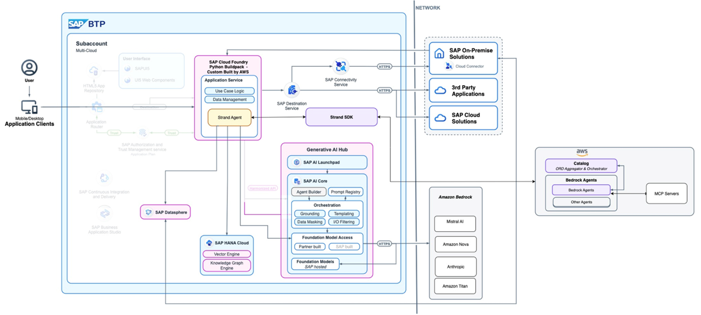
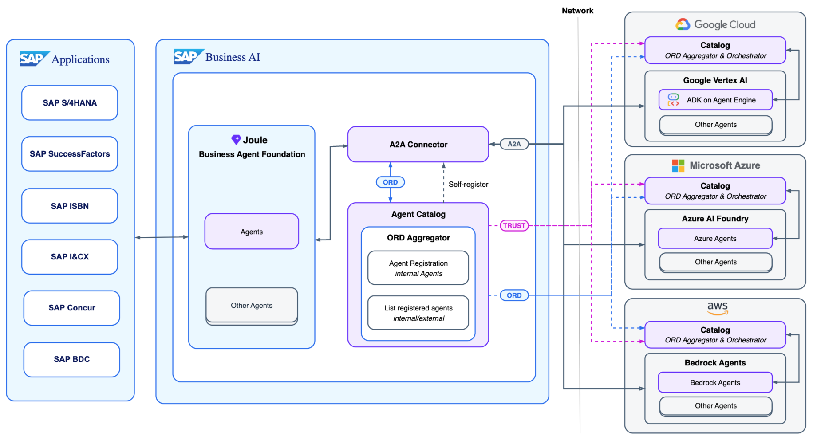

# Strands Agent

[Strands Agent](https://strandsagents.com/latest/ "https://strandsagents.com/latest/") is an open-source SDK created by AWS for building AI agents that use large language models (LLMs) to reason and act. The [Strands Agents SDK](https://github.com/strands-agents/sdk-python "https://github.com/strands-agents/sdk-python") simplifies the process of creating AI agents by focusing on three core components:

- **A language model**: Strands supports a wide range of LLMs from providers like Anthropic, OpenAI, and Meta, giving developers flexibility.
- **A system prompt**: This defines the agent’s role and overall behaviour.
- **A set of tools**: These are the specific functions and capabilities the agent can invoke to perform tasks.
  Benefit of strands SDK:

- Strands SDK enables fast, secure development of advanced AI agents on SAP Generative AI Hub.
- Developers can build complex automations quickly - saving time and resources.
- Strands SDK supports multiple AI models and future technology shifts.
- It has enterprise-grade security and robust monitoring ensure safe, reliable use.

The above architecture describes the integration option between Strands Agents, SAP Generative AI Hub to access Amazon Bedrock FMs, and Bedrock Agent SDK which allows integration to [Model Context Protocol (MCP)](https://www.anthropic.com/news/model-context-protocol "https://www.anthropic.com/news/model-context-protocol") servers to access available APIs to automate workflows.

The most effective way in SAP is to have a Strands-built agent act as an external tool that an SAP Joule agent can call. This allows for specialized, custom logic to be developed in Strands, which is then orchestrated by SAP Joule within the business context of SAP applications. The architecture above describes how the [Agent-to-Agent](https://github.com/a2aproject/A2A "https://github.com/a2aproject/A2A") protocol works.
