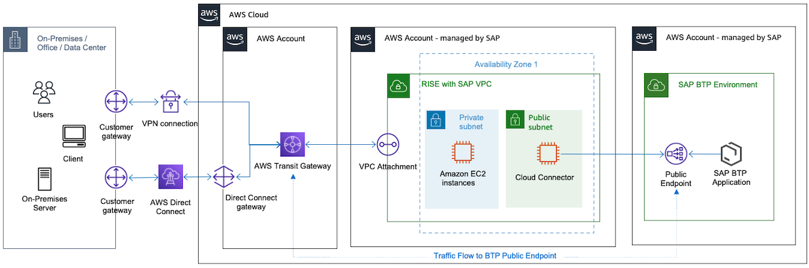
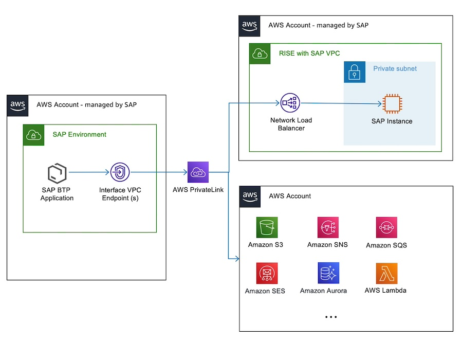
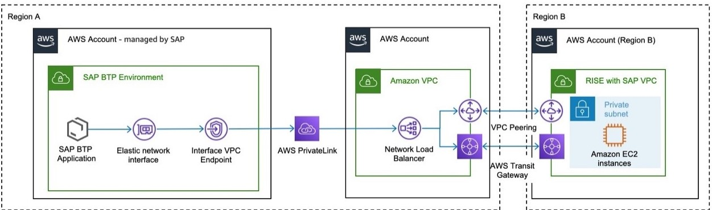

# SAP BTP with RISE on AWS

You can use SAP Business Technology Platform BTP services on AWS to extend the functionality of the RISE with SAP. SAP recommends SAP Cloud Connector to connect RISE with SAP VPC with SAP BTP via internet. When both RISE with SAP and SAP BTP run on AWS (in the same AWS region or different AWS regions), the network traffic is encrypted and contained within AWS Global Network, without going through the internet (see the following diagram). This provides better security and performance for any integration use-cases between RISE with SAP and SAP BTP. For more information, see [Amazon VPC FAQs - Does traffic go over the internet when two instances communicate using public IP addresses or when instances communicate with a public AWS service endpoint ?](https://aws.amazon.com/vpc/faqs/ "https://aws.amazon.com/vpc/faqs/").

As displayed in the preceding diagram, you can configure Transit Gateway to handle both RISE and BTP network traffic. For more information, see [How to route internet traffic from on-premises via Amazon VPC?](https://guide.aws.dev/articles/ARUIFmbCauTQeyJogByCa5xg/how-to-route-internet-traffic-from-on-premise-via-aws-vpc "https://guide.aws.dev/articles/ARUIFmbCauTQeyJogByCa5xg/how-to-route-internet-traffic-from-on-premise-via-aws-vpc")

SAP also offers SAP Private Link Service for SAP BTP on AWS. SAP Private Link connects SAP BTP on AWS with a secure connection without using public IPs in your AWS account.

You can connect to an AWS endpoint service from an SAP BTP application running on Cloud Foundry. By establishing this connection, you can directly connect to AWS services, or for example, to an S/4HANA system. For a complete list of supported AWS services, see [Consume Amazon Web Services in SAP BTP](https://help.sap.com/docs/private-link/private-link1/consume-amazon-web-services-in-sap-btp-beta "https://help.sap.com/docs/private-link/private-link1/consume-amazon-web-services-in-sap-btp-beta").

You can establish a secure and private communication between SAP BTP and AWS services with [SAP Private Link Service](https://help.sap.com/docs/private-link/private-link1/what-is-sap-private-link-service "https://help.sap.com/docs/private-link/private-link1/what-is-sap-private-link-service"). By using private IP address ranges (RFC 1918), you reduce the attack surface of the application. The connection does not require an internet gateway. If you do not require this extra layer of security, you can still connect via the public APIs of SAP BTP without SAP Private Link, and benefit from AWS global network. For more information, see [Amazon VPC FAQs](https://aws.amazon.com/vpc/faqs/ "https://aws.amazon.com/vpc/faqs/").

SAP Private Link for AWS currently supports connections initiated from SAP BTP Cloud Foundry to AWS.

For AWS services across AWS Regions, you can create a VPC in the same AWS Region as your SAP BTP Cloud Foundry Runtime, and connect these VPCs via VPC peering or AWS Transit Gateway. For a list of supported Regions, see [Regions and API Endpoints Available for the Cloud Foundry Environment](https://help.sap.com/docs/btp/sap-business-technology-platform/regions-and-api-endpoints-available-for-cloud-foundry-environment "https://help.sap.com/docs/btp/sap-business-technology-platform/regions-and-api-endpoints-available-for-cloud-foundry-environment").

SAP Private Link Service is a paid service offered by SAP on SAP BTP. For more information see: [SAP Discovery Center – Services – SAP Private Link Service](https://discovery-center.cloud.sap/serviceCatalog/private-link-service "https://discovery-center.cloud.sap/serviceCatalog/private-link-service").

Cost associated to AWS Services in the AWS account - managed by the Customer to facilitate cross region connectivity for example the AWS Network Load Balancer, or Transit Gateway vary. For more information on price, see the dedicated pricing pages of the listed AWS Services.
