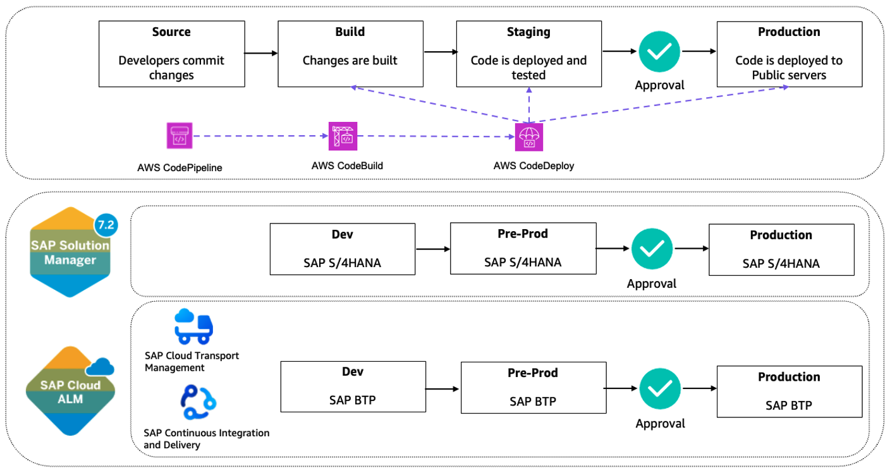

# Change Management for AWS Services

You manage the change management of the AWS services that are connected to RISE with SAP; therefore, AWS provides services to automate pipeline provisioning and control. [AWS for DevOps](https://aws.amazon.com/devops/ "https://aws.amazon.com/devops/") provides a comprehensive set of flexible services designed to help companies build and deliver products more rapidly and reliably using AWS and DevOps practices.

These services simplify infrastructure provisioning, application code deployment, software release process automation, and performance monitoring. AWS offers fully managed services that require no setup, are ready to use with an AWS account, and can scale from a single instance to thousands. The platform supports automation of manual tasks, secure access control through IAM, and integrates with a large ecosystem of partners.

[AWS CodePipeline](https://aws.amazon.com/codepipeline/ "https://aws.amazon.com/codepipeline/"), [AWS CodeBuild](https://aws.amazon.com/codebuild/ "https://aws.amazon.com/codebuild/"), and [AWS CodeDeploy](https://aws.amazon.com/codedeploy/ "https://aws.amazon.com/codedeploy/") together form a highly effective CI/CD automation suite that supports synchronized deployments across development (dev), pre-production (pre-prd), and production (prd) landscapes by enabling automated build, test, and deployment workflows that are tailored for multi-environment scenarios.

How the Services Work Together

- CodePipeline orchestrates the workflow by connecting stages for source, build, test, and deploy actions across environments.
- CodeBuild handles compiling, packaging, and testing code for each environment (dev, pre-prd, prd), offering isolation for dependencies and configuration.
- CodeDeploy manages the deployment process to targets such as EC2, ECS, Lambda, and supports advanced strategies like blue/green and canary deployments for safe releases to production.
  Multi-Environment Design

- Separate pipelines or stages can be configured for dev, pre-prd, and prd. Typically:
  - A new commit triggers a pipeline that builds in dev, runs automatic tests, and deploys to the dev landscape.
  - Upon successful tests, a manual or automated approval can promote the artifact to pre-prd for further integration or user acceptance testing.
  - After all checks in pre-prd, another approval or trigger deploys the artifact to prd, leveraging deployment strategies to minimize risk.

- Best practice is to isolate environments using separate AWS accounts or permission boundaries to enhance security and traceability.
  Key Considerations for DEV, PRE-PRD, PRD CI/CD

- Use infrastructure-as-code (CloudFormation/Terraform) to ensure repeatable, auditable landscape setup.
- Automate unit, integration, and end-to-end tests at every stage.
- Apply environment-specific variables and configuration with modular pipeline stages.
- Implement approval gates for high-stake environments, especially for production releases.
- Enable monitoring (CloudWatch/X-Ray) and restrict direct environment access, particularly for the production landscape.
  Each environment benefits from isolated configuration, targeted testing, and deployment strategies that ensure defects are detected early and mitigated before reaching production.

This modular and environment-aware CI/CD setup automates releases, enables fast iteration in dev, thorough scrutiny in pre-prd, and secure, reliable deployments in prd, supporting the full development lifecycle while protecting production stability.

