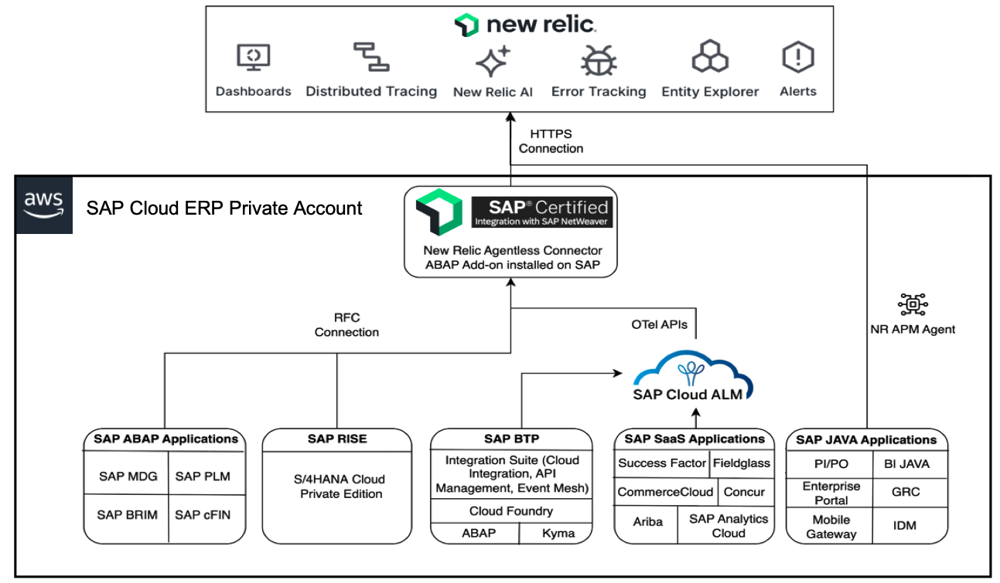

# New Relic Monitoring for SAP

New Relic Monitoring for SAP is a comprehensive observability solution that provides a holistic, end-to-end view connecting SAP performance to business outcomes and non-SAP systems. The solution enables organizations to monitor their entire enterprise stack through a single pane of glass, offering unified visibility across SAP landscapes with AI-driven insights and powerful visualizations.

Key Benefits:

- Over 175 monitoring points, 35 dashboards, and 17 alert policies out-of-the-box
- Certified for SAP Cloud ERP Private with agentless architecture
- Minimal performance impact through agentless architecture and non-SAP Monitoring with unified "single pane of glass" view
- End-to-end distributed traces for full transaction flow monitoring and business process step monitoring with key process performance indicators
  Architecture

The solution utilizes a truly agentless architecture through a native, SAP-certified ABAP Add-on installed on a single, central monitoring system. This centralized connector pulls data from other SAP systems, eliminating the need for agents on each production system. The solution provides comprehensive monitoring across six key areas:

1. System Health: Monitors overall system health, central/enqueue server status, ABAP message server, and network connectivity
2. Resource Utilization: Tracks user activity, memory utilization, CPU usage, and system efficiency metrics
3. Database: Provides detailed insights for both HANA and Non-HANA databases
4. Performance: Measures Dialog Response Time, RFC Response Time, and Background Jobs
5. Security: Monitors critical security components, certificates, and compliance
6. BTP Monitoring: Integrates with SAP CloudALM OpenTelemetry APIs for comprehensive BTP environment monitoring

New Relic Monitoring for SAP Solutions [product documentation](https://docs.newrelic.com/docs/data-apis/custom-data/sap-integration/ "https://docs.newrelic.com/docs/data-apis/custom-data/sap-integration/") details technical details along with installation and configuration steps. You can procure your [New Relic solution from AWS Marketplace](https://aws.amazon.com/marketplace/pp/prodview-yg3ykwh5tmolg "https://aws.amazon.com/marketplace/pp/prodview-yg3ykwh5tmolg"), or get a quick overview through the [data sheet](https://newrelic.com/sites/default/files/2025-08/new-relic-sap-data-sheet-2025-aug.pdf "https://newrelic.com/sites/default/files/2025-08/new-relic-sap-data-sheet-2025-aug.pdf").

Disclaimer: New Relic, and the New Relic logo are trademarks of the New Relic, Inc.. All other trademarks are the property of their respective owners.
