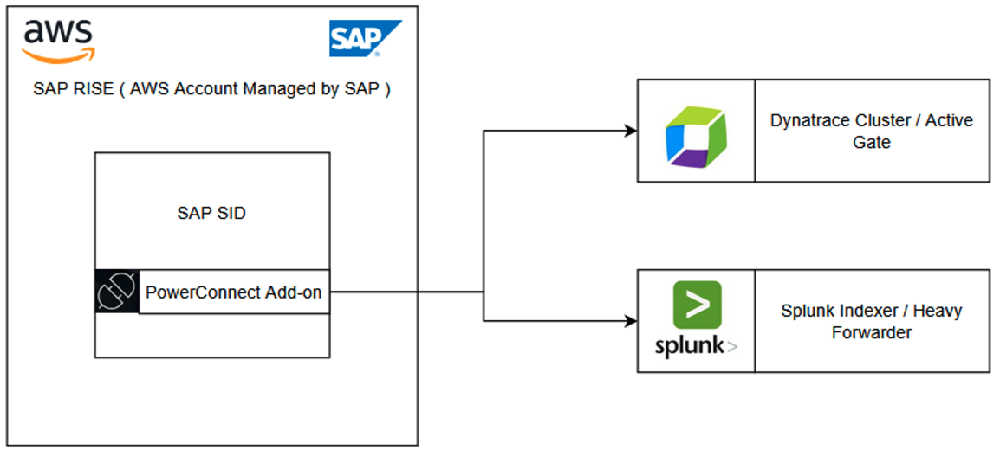

# SoftwareOne: PowerConnect for SAP Solutions

PowerConnect, an SAP-certified advanced observability and security monitoring solution that streams real-time telemetry, performance, business, and security data from SAP systems into leading observability platforms such as Splunk and Dynatrace. It enables organizations to extend their existing monitoring investments into the SAP landscape, providing deep visibility into application performance, user activity, security events, and system health without disrupting core business operations.

Key Capabilities:

- Out-of-the-box connectors for SAP NetWeaver, S/4HANA, ECC, BW, and more.
- Pre-built dashboards and analytics for rapid time-to-value.
- Configurable data capture for performance metrics, change events, and business transactions.
- Low-overhead data collection that does not impact SAP system performance.
  Architecture

PowerConnect ensures full compatibility and compliance with SAP standards. The solution can be deployed and configured in under 45 minutes per SAP system, enabling rapid time-to-value. Out of the box, PowerConnect can capture over 360 key SAP metrics across performance, security, and business process domains, and delivers over 1600 pre-defined use cases ready to consume in your chosen monitoring or observability platform, reducing implementation effort and accelerating insights.

SoftwareOne PowerConnect for SAP Solutions' [product documentation](https://help.powerconnect.io/powerconnectdocumentation/powerconnect-documentation-landing-page "https://help.powerconnect.io/powerconnectdocumentation/powerconnect-documentation-landing-page") details comprehensive technical details along with installation and configuration steps and it is available through [AWS Marketplace](https://aws.amazon.com/marketplace/pp/prodview-bdpl5zjkasukg "https://aws.amazon.com/marketplace/pp/prodview-bdpl5zjkasukg").

Disclaimer: SoftwareOne, and PowerConnect are trademarks of the SoftwareOne AG. All other trademarks, names, and logos are the property of their respective owners.
