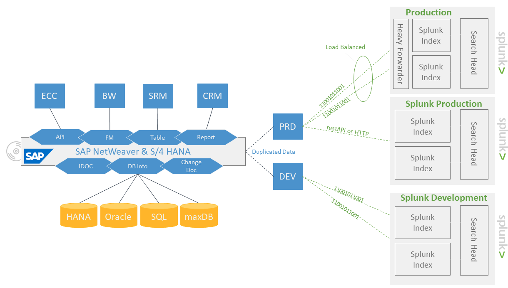

# Splunk Service Intelligence for SAP Solutions

Splunk Service Intelligence for SAP Solutions is a comprehensive out-of-the-box solution that provides proactive, end-to-end monitoring of SAP environment. It gives the ability to monitor various infrastructure elements that run SAP and the application components that connect to it, as well as the system’s underlying infrastructure. Use this app with the monitoring capabilities in Splunk IT Service Intelligence (ITSI) to quickly and proactively detect problems in SAP environment to reduce issues and avoid costly outages.

Key Benefits

- Out-of-the-box monitoring capability for SAP landscapes and real-time insights into SAP’s health, performance, and security status
- Proactive management of unplanned downtime
- Over 2000 SAP-specific use cases and hundreds of pre-delivered dashboards
- Instant visibility into transaction logs, security use cases, system performance, and user experience
- Advanced big data analysis and visualization capabilities
  Architecture

Service Intelligence for SAP Solutions can be deployed in under an hour with the help of a simple ticket logged to SAP ECS. At its core, the solution utilizes SoftwareOne’s PowerConnect agents (ABAP and Java) for direct integration with SAP Cloud ERP private environments, while for SaaS and public cloud solutions, it deploys a dedicated AWS virtual machine running the PowerConnect Cloud component. Using PowerConnect to access SAP information in real- time and leveraging Splunk machine learning, artificial intelligence, advanced big data, and visualization capabilities unlocks unprecedented insight, understanding, and preventive actions.

Splunk Service Intelligence for SAP Solutions [product documentation](https://help.splunk.com/en/splunk-it-service-intelligence/extend-itsi-and-ite-work/service-intelligence-for-sap-solutions/2.4/overview/overview-of-splunk-service-intelligence-for-sap-solutions "https://help.splunk.com/en/splunk-it-service-intelligence/extend-itsi-and-ite-work/service-intelligence-for-sap-solutions/2.4/overview/overview-of-splunk-service-intelligence-for-sap-solutions") details comprehensive technical details along with installation and configuration steps.

Disclaimer: Splunk, ITSI, and the Splunk logo are trademarks of the Splunk Inc, owned by Cisco Systems, Inc.. All other trademarks are the property of their respective owners.
