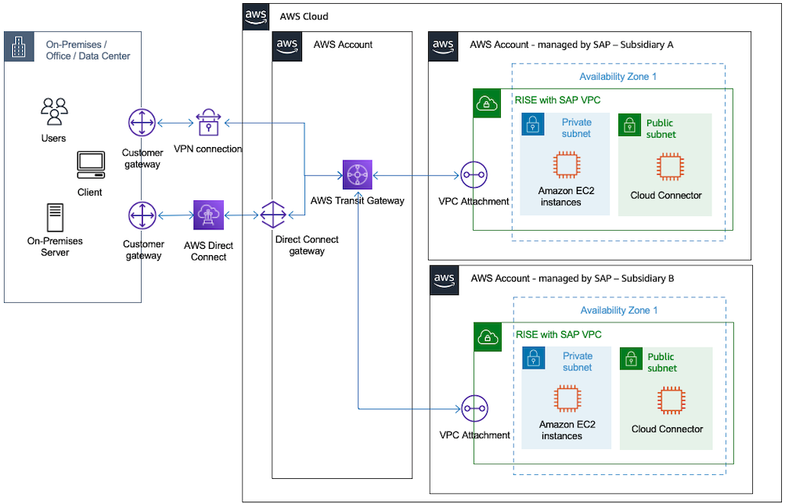

# Implement chargeback for connectivity to RISE

If you are a company with subsidiaries, you may have different RISE contracts, leading to deployments in separate AWS accounts while requiring an interlinked network connectivity. In this instance, you must deploy Transit Gateway connection in a Landing Zone (multi-account) setup. It can scale your RISE deployment and integrate with multiple RISE with SAP VPCs.

Transit Gateway Flow Logs enables effective cost management. Transit Gateway Flow Logs can be integrated with Cost and Usage Report (CUR) that can be attributed as chargeback to the business units. For more information, see [Logging network traffic using Transit Gateway Flow Logs](../../../vpc/latest/tgw/tgw-flow-logs.md "../../../vpc/latest/tgw/tgw-flow-logs.md").

The preceding diagram displays how Transit Gateway can be used to connect multiple RISE with SAP VPCs and provide chargeback capability through the Flow Logs.

For more information, see the following blogs:

- [Using AWS Transit Gateway Flow Logs to chargeback data processing costs in a multi-account environment](https://aws.amazon.com/blogs/networking-and-content-delivery/using-aws-transit-gateway-flow-logs-to-chargeback-data-processing-costs-in-a-multi-account-environment/ "https://aws.amazon.com/blogs/networking-and-content-delivery/using-aws-transit-gateway-flow-logs-to-chargeback-data-processing-costs-in-a-multi-account-environment/")
- [How-to chargeback shared services: An AWS Transit Gateway example](https://aws.amazon.com/blogs/aws-cloud-financial-management/gs-chargeback-shared-services-an-aws-transit-gateway-example/ "https://aws.amazon.com/blogs/aws-cloud-financial-management/gs-chargeback-shared-services-an-aws-transit-gateway-example/")
  Use the following steps to enable this setup:

1. Enable Transit Gateway Flow Logs. For more information, see [Create a flow log that publishes to Amazon S3](../../../vpc/latest/tgw/flow-logs-s3.md#flow-logs-s3-create-flow-log "../../../vpc/latest/tgw/flow-logs-s3.md#flow-logs-s3-create-flow-log").
2. Setup Cost and Usage Reporting and setup Athena to utilize the reporting. For more information, see [Creating Cost and Usage Reports](../../../cur/latest/userguide/cur-create.md "../../../cur/latest/userguide/cur-create.md") and [Querying Cost and Usage Reports using Amazon Athena](../../../cur/latest/userguide/cur-query-athena.md "../../../cur/latest/userguide/cur-query-athena.md").
3. Obtain the Transit Gateway data processing charge per-account.
   1. Decide a cost allocation strategy - distribute costs evenly across all accounts or distribute proportionally across all accounts.
   2. Calculate the total network traffic and percentage allocation per account using [AWS Transit Gateway](https://catalog.workshops.aws/cur-query-library/en-US/queries/networking-and-content-delivery#aws-transit-gateway "https://catalog.workshops.aws/cur-query-library/en-US/queries/networking-and-content-delivery#aws-transit-gateway") query.
   3. Estimate cost per account, by collecting from CloudWatch that collects Network In(Upload) and NetworkOut(Download).
      1. NetworkIn(Upload) + NetworkOut(Download) per usage account/ total data processed in network account
      2. % of usage x total cost = chargeback cost per usage account
