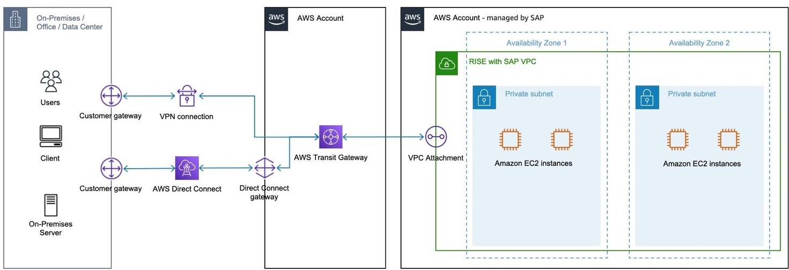
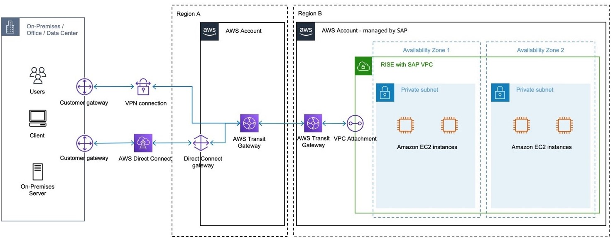

# Connecting to RISE using your single AWS account

You can establish connectivity between on-premises and RISE with SAP VPC using your AWS account. This method provides you with more control but also requires managing AWS services in your AWS account. You can use any one of the following options.

- AWS Transit Gateway – Share AWS Transit Gateway resource in you AWS account with AWS account managed by SAP.
- AWS VPN with AWS Transit Gateway – Create an IPsec VPN connection between your remote network and transit gateway over the internet. For more information, see [How AWS Site-to-Site VPN works](../../../vpn/latest/s2svpn/how_it_works.md "../../../vpn/latest/s2svpn/how_it_works.md") and [Transit gateway VPN attachments](../../../vpc/latest/tgw/tgw-vpn-attachments.md "../../../vpc/latest/tgw/tgw-vpn-attachments.md").
- Direct Connect gateway – Create a Direct Connect gateway with a transit virtual interface. For more information, see [Transit gateway attachments to a Direct Connect gateway](../../../vpc/latest/tgw/tgw-dcg-attachments.md "../../../vpc/latest/tgw/tgw-dcg-attachments.md").

To strengthen the security, see [How do I establish an AWS VPN over an AWS Direct Connect connection?](https://repost.aws/knowledge-center/create-vpn-direct-connect "https://repost.aws/knowledge-center/create-vpn-direct-connect")
The following image shows this option within the same AWS Regions.

The following image shows this option across different AWS Regions.

When you choose AWS Site-to-Site VPN and/or AWS Direct Connect to establish connectivity between on-premises and RISE with SAP VPC using a Transit Gateway in the AWS account - managed by the Customer, either in the same AWS Region or a different AWS Region than the RISE with SAP VPC, the following applies.

**Hourly cost:**

As the AWS Site-to-Site VPN is residing in the AWS account – managed by Customer and is attached to the Transit Gateway that resides in the AWS account – managed by Customer, the cost for the VPN connection and the cost for the Transit Gateway attachment are billed to the AWS account – managed by Customer

As the Direct Connect and Direct Connect Gateway is residing in the AWS account – managed by Customer and is attached to the Transit Gateway that resides in the AWS account – managed by Customer the cost for the AWS Direct Connect ports hours and the cost for the Transit Gateway attachment are billed to the AWS account – managed by Customer.

For peering attachments, each Transit Gateway owner is billed hourly for the peering attachment with the other Transit Gateway.

**Data processing charges:**

Data processing charges apply for each gigabyte sent from a VPC, Direct Connect or VPN to/via the Transit Gateway.

Depending on the source and destination the data processing charges vary and will be billed to the AWS account – managed by Customer, or are already included in the RISE subscription (For a cost estimation example: see below)

For more information see:

- [AWS Site-to-Site VPN Pricing](https://aws.amazon.com/vpn/pricing/ "https://aws.amazon.com/vpn/pricing/")
- [AWS Direct Connect Pricing](https://aws.amazon.com/directconnect/pricing/ "https://aws.amazon.com/directconnect/pricing/")
- [Transit Gateway pricing](https://aws.amazon.com/transit-gateway/pricing/ "https://aws.amazon.com/transit-gateway/pricing/")

|                                                                                                                                                                                                                                                                                                                                                                                                                                                                                                                                                                                                                                                                                                                                                                                                                                                                                                                                                                                                                                                                                                                                                                                                                                                                                                                                                                                                                                                                                                                                                                                                                                                                                                                                                                                                                                                                                                                                                                                                                                                                                                                                                                                                                                                                                                                                                                                                                                                                                                                                                                                                                                                                                                                                                                                                                                                                                                                            |
| -------------------------------------------------------------------------------------------------------------------------------------------------------------------------------------------------------------------------------------------------------------------------------------------------------------------------------------------------------------------------------------------------------------------------------------------------------------------------------------------------------------------------------------------------------------------------------------------------------------------------------------------------------------------------------------------------------------------------------------------------------------------------------------------------------------------------------------------------------------------------------------------------------------------------------------------------------------------------------------------------------------------------------------------------------------------------------------------------------------------------------------------------------------------------------------------------------------------------------------------------------------------------------------------------------------------------------------------------------------------------------------------------------------------------------------------------------------------------------------------------------------------------------------------------------------------------------------------------------------------------------------------------------------------------------------------------------------------------------------------------------------------------------------------------------------------------------------------------------------------------------------------------------------------------------------------------------------------------------------------------------------------------------------------------------------------------------------------------------------------------------------------------------------------------------------------------------------------------------------------------------------------------------------------------------------------------------------------------------------------------------------------------------------------------------------------------------------------------------------------------------------------------------------------------------------------------------------------------------------------------------------------------------------------------------------------------------------------------------------------------------------------------------------------------------------------------------------------------------------------------------------------------------------------------- |
| **Pricing example – Transit Gateway in VPCs in the same region via VPN or Direct Connect** _[note: cost between AWS Regions vary. For more information see: [Amazon EC2 pricing Data Transfer](https://aws.amazon.com/ec2/pricing/on-demand/#Data_Transfer "https://aws.amazon.com/ec2/pricing/on-demand/#Data_Transfer")]_ Transit Gateway in VPCs in the same region via VPN or Direct Connect 1). 200GB of data sent from a VPC in the AWS account – managed by SAP via the Transit Gateway that resided in the AWS account – managed by Customer via a VPN or Direct Connect in the AWS account – managed by SAP towards On-Premises: 200GB \* $0.02per-GB = $4 (Transit Gateway data processing) + 100 GB \* $0.09per-GB = $9 (VPN data transfer out, with the first 100 GB are free, then $ 0.09 per-GB) = $13 (Total data transfer out billed to AWS account – managed by SAP) or 200GB \* $0.02per-GB = $4 (Transit Gateway data processing) + 200GB \* ($0.02-$0.19per-GB) = $4-$38 (Direct Connect data transfer out) = $8-$42 (Total data transfer out billed to AWS account – managed by SAP) Data processing is charged to the VPC owner who sends the traffic to Transit Gateway. As the sending VPC is residing in the AWS account – managed by SAP and the cost for data transfer is included in the RISE Subscription, therefore the AWS account – managed by Customer will not incur Data Transfer cost in this example. 2). 200GB of data sent from On-Premises via a VPN or Direct Connect in the AWS account – managed by Customer via the Transit Gateway that resided in the AWS account – managed by Customer towards VPC in the AWS account – managed by SAP: 200GB \* $0.00per-GB = $0 (VPN data transfer in) + 200GB \* $0.02per-GB = $4 (Transit Gateway data processing) + $0 (VPN data transfer in) = $4 (Total data transfer in billed to AWS account – managed by Customer) or 200GB \* $0.00per-GB = $0 (Direct Connect data transfer in) + 200GB \* $0.02per-GB = $4 (Transit Gateway data processing) = $4 (Total data transfer in billed to AWS account – managed by Customer) Data transfer into AWS is free and this also applies to VPN and Direct Connect therefore the only data processing charge is the data processing of the Transit Gateway. As Transit Gateway resides in the AWS account – managed by Customer the cost for data transfer is billed to the AWS account – managed by Customer                                                                                                                                                                                                                                                                                                                                                                                                                                                                               |
| **Pricing example – Transit Gateway in VPCs in the different regions via VPN or Direct Connect** _[note: cost between AWS Regions vary. For more information see: [Amazon EC2 pricing Data Transfer](https://aws.amazon.com/ec2/pricing/on-demand/#Data_Transfer "https://aws.amazon.com/ec2/pricing/on-demand/#Data_Transfer")]_ Transit Gateway in VPCs in the different regions via VPN or Direct Connect 1). 200GB of data sent from a VPC in the AWS account – managed by SAP via the Transit Gateway that resided in the AWS account – managed by SAP that is peered with an Transit Gateway in a different Region in the AWS account – managed by Customer via a VPN OR Direct Connect in the AWS account – managed by Customer towards On-Premises: 200GB \* $0.02per-GB = $4 (Transit Gateway data processing) + 200GB \* ($0.01-$0.138per-GB) = $2-$27.6 (Region out) + 100GB \* $0.09per-GB = $9 (VPN data transfer out, with the first 100 GB are free, then $ 0.09 per-GB) = $15-$40.6 (Total data transfer out billed to AWS account – managed by SAP) or 200GB \* $0.02per-GB = $4 (Transit Gateway data processing) + 200GB \* ($0.01-$0.138per-GB) = $2-$27.6 (Region out) + 200GB \* ($0.02-$0.19per-GB) = $4-$38 (Direct Connect data transfer out) = $10-$69.6 (Total data transfer out billed to AWS account – managed by SAP) Data processing is charged to the VPC owner who sends the traffic to Transit Gateway. As the sending VPC is residing in the AWS account – managed by SAP and the cost for Data Transfer is included in the RISE subscription, therefore the AWS account – managed by Customer will not incur Data Transfer cost in this example. 2). 200GB of data sent from On-Premises via a VPN or Direct Connect in the AWS account – managed by Customer via the Transit Gateway that resided in the AWS account – managed by Customer via a peered Transit Gateway in a different region in the AWS account – managed by SAP towards a VPC in the AWS account – managed by SAP: 200GB \* $0.02per-GB = $4 (Transit Gateway data processing) + 200GB \* $0.00per-GB = $0 (VPN data transfer in) + 200GB \* ($0.01-$0.138per-GB) = $2-$27.6 (Region out) = $6-$31.6 (Total data transfer in billed to AWS account – managed by Customer) or 200GB \* $0.02per-GB = $4 (Transit Gateway data processing) + 200GB \* $0.00per-GB = $0 (Direct Connect data transfer in) + 200GB \* ($0.01-$0.138per-GB) = $2-$27.6 (Region out) = $6-$31.6 (Total data transfer in billed to AWS account – managed by Customer) Data transfer into AWS in is free and this also applies to VPN and Direct Connect therefore the data processing charge is the data processing of the Transit Gateway and the inter-region data transfer charges. As Transit Gateway resides in the AWS account – managed by Customer, the cost for data transfer is billed to the AWS account – managed by Customer. |
