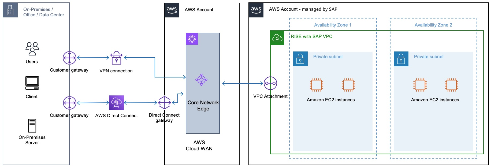
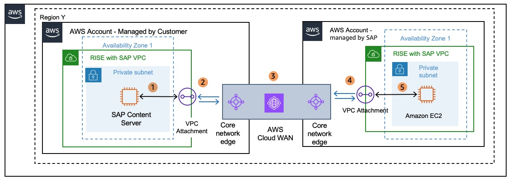
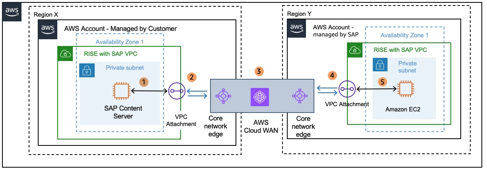

# AWS Cloud WAN

[AWS Cloud WAN](https://aws.amazon.com/cloud-wan/ "https://aws.amazon.com/cloud-wan/") is a managed wide-area networking (WAN) service designed to simplify the process of building, managing, and monitoring unified global networks that connect cloud and on-premises resources. It enables organizations to centrally connect data centers, branch offices, remote sites, and Amazon Virtual Private Clouds (VPCs) across the AWS global backbone, using a centralized dashboard and policy-driven automation. For more information, see [AWS Cloud WAN documentation](../../../network-manager/latest/cloudwan/what-is-cloudwan.md "../../../network-manager/latest/cloudwan/what-is-cloudwan.md").

**Connecting to RISE from on-premises using AWS Cloud WAN in your AWS account**

To establish a connection with RISE Environment (AWS account managed by SAP), create and share AWS Cloud WAN via AWS Resource Access Manager (RAM) in your AWS account. Afterwards, SAP will accept the shared Cloud WAN and create an VPC attachment to enable traffic flow through an entry in route table. As AWS Cloud WAN resides in your AWS account, you can retain control over traffic routing.

Here is high level step-by-step guide to create Cloud WAN global:

1. In AWS Network Manager, create a global network and associated core network.
2. Create a Core Network Policy (CNP) that defines segments, Autonomous System Number (ASN) range, AWS Regions and tags to be used to attach to segments.
3. Apply the network policy.
4. Share the core network using the resource access manager with SAP ECS that manages RISE with SAP Account.
5. Create and tag attachments.
6. Update routes in your attached VPCs to include the core network.
   You can find out more details from these documentations:

- [Quick start: Create an AWS Cloud WAN global network and core network](../../../network-manager/latest/cloudwan/cloudwan-getting-started.md "../../../network-manager/latest/cloudwan/cloudwan-getting-started.md")
- [Configure the core network settings in an AWS Cloud WAN policy version](../../../network-manager/latest/cloudwan/cloudwan-core-network-config.md "../../../network-manager/latest/cloudwan/cloudwan-core-network-config.md")
- [Building a Scalable and Secure Multi VPC AWS Network Infrastructure – Cloud WAN](../../../whitepapers/latest/building-scalable-secure-multi-vpc-network-infrastructure/aws-cloud-wan.md "../../../whitepapers/latest/building-scalable-secure-multi-vpc-network-infrastructure/aws-cloud-wan.md")

1. **Attaching AWS Site-to-Site VPN (S2S VPN) to AWS Cloud WAN** – Create a Site-to-Site VPN connection with Target Gateway Type set to Not Associated. You can create an AWS S2S VPN attachment for AWS Cloud WAN under Site-to-Site VPN connections from the Amazon VPC console. Once the AWS S2S VPN is created, you can [attach it to AWS Cloud WAN core network](../../../network-manager/latest/cloudwan/cloudwan-vpn-attachment-add.md "../../../network-manager/latest/cloudwan/cloudwan-vpn-attachment-add.md"). For more information, see [How Site-to-Site VPN connection can be created for AWS Cloud WAN](../../../vpn/latest/s2svpn/create-cwan-vpn-attachment.md "../../../vpn/latest/s2svpn/create-cwan-vpn-attachment.md").
2. **Attaching AWS Direct Connect gateway with AWS Cloud WAN** – Create a Direct Connect gateway with a transit virtual interface and attach Cloud WAN to Direct Connect gateway which exist in your AWS Account. For more information, see [AWS Cloud WAN attachment to a Direct Connect gateway](https://aws.amazon.com/blogs/networking-and-content-delivery/simplify-global-hybrid-connectivity-with-aws-cloud-wan-and-aws-direct-connect-integration/ "https://aws.amazon.com/blogs/networking-and-content-delivery/simplify-global-hybrid-connectivity-with-aws-cloud-wan-and-aws-direct-connect-integration/"). For detailed steps to create the transit virtual interface for Direct Connect Gateway, you can refer to AWS documentation - [Create a transit virtual interface to the AWS Direct Connect gateway](../../../directconnect/latest/UserGuide/create-transit-vif-dx.md "../../../directconnect/latest/UserGuide/create-transit-vif-dx.md").
   You can estimate the costs of deploying AWS Cloud WAN from the [pricing documentation](https://aws.amazon.com/cloud-wan/pricing/ "https://aws.amazon.com/cloud-wan/pricing/"). Below are pricing examples for you to consider.

**Scenario A. AWS Cloud WAN connecting two VPCs in same Region**

|                                                                                                                                                                                                                                                                                                                                                                                                                                                                                                                                                                                                                                                                                                                                                                                                                                                                                                                                                                                                                                                                                                                                                                                                                                                                                                                                                                                                                                                                                                                                                                                                                                                                                                                                                                      |
| -------------------------------------------------------------------------------------------------------------------------------------------------------------------------------------------------------------------------------------------------------------------------------------------------------------------------------------------------------------------------------------------------------------------------------------------------------------------------------------------------------------------------------------------------------------------------------------------------------------------------------------------------------------------------------------------------------------------------------------------------------------------------------------------------------------------------------------------------------------------------------------------------------------------------------------------------------------------------------------------------------------------------------------------------------------------------------------------------------------------------------------------------------------------------------------------------------------------------------------------------------------------------------------------------------------------------------------------------------------------------------------------------------------------------------------------------------------------------------------------------------------------------------------------------------------------------------------------------------------------------------------------------------------------------------------------------------------------------------------------------------------------- | ----------------------------------------------------------------------------------------------------------------------------------------------------------------- |
| **Pricing example – AWS Cloud WAN connecting two VPCs in same Regions** _[note: cost between AWS Regions vary. For more information see: [Amazon EC2 pricing Data Transfer](https://aws.amazon.com/ec2/pricing/on-demand/#Data_Transfer "https://aws.amazon.com/ec2/pricing/on-demand/#Data_Transfer")]_ 100GB of data sent from a VPC in Region X in the AWS account – managed by SAP via Cloud WAN that resides in the AWS account – managed by customer ending at a VPC managed by customer. 100GB \* $0.02 per-GB = $2 (Cloud WAN data processing) (Billed to AWS account – managed by SAP) Apart from data processing there would be VPC attachment cost to AWS account – managed by SAP. [Cloud WAN pricing](https://aws.amazon.com/cloud-wan/pricing/ "https://aws.amazon.com/cloud-wan/pricing/") would vary depending upon region where SAP VPC is attached to Cloud WAN. For example, SAP VPC is in Region US East (N. Virginia). You pay $0.065 per hour for VPC attachments in the US East (N. Virginia) Region. $0.065 \* 730 = $47.45 (Monthly fixed cost billed to AWS account , managed by SAP) Hence the total cost = $49.45 Data processing and VPC Attachment costs are charged to the VPC owner who sends the traffic to AWS Cloud WAN. As the sending VPC is residing in the AWS account – managed by SAP and the cost for data transfer is included in the RISE subscription, thus the AWS account – managed by Customer will not incur data transfer and attachment cost for this example. The AWS account - managed by customer will only be billed for the price Cloud WAN per VPC attachment per hour. Data out of an AZ will always go via Cloud WAN endpoint in that AZ to reach other VPC, so there is no cross AZ Data Transfer costs. | **Scenario B. AWS Cloud WAN connecting two VPCs in different Regions**  |
|                                                                                                                                                                                                                                                                                                                                                                                                                                                                                                                                                                                                                                                                                                                                                                                                                                                                                                                                                                                                                                                                                                                                                                                                                                                                                                                                                                                                                                                                                                                                                                                                                                                                                                                                                                      |
| ---                                                                                                                                                                                                                                                                                                                                                                                                                                                                                                                                                                                                                                                                                                                                                                                                                                                                                                                                                                                                                                                                                                                                                                                                                                                                                                                                                                                                                                                                                                                                                                                                                                                                                                                                                                  |
| **Pricing example – AWS Cloud WAN connecting two VPCs in different Regions** _[note: cost between AWS Regions vary. For more information see: [Amazon EC2 pricing Data Transfer](https://aws.amazon.com/ec2/pricing/on-demand/#Data_Transfer "https://aws.amazon.com/ec2/pricing/on-demand/#Data_Transfer")]_ 100GB of data sent from a VPC in region Y in the AWS account - managed by Customer via AWS Cloud WAN to AWS Account - managed by SAP in different region X. 100GB \* $0.02 per-GB = $2 (Cloud WAN data processing) + 100GB \* ($0.01 - $0.138 per-GB) = $1 - $13.8 (Region out) = $3 - $15.8 (Total - billed to AWS account – managed by Customer) Data processing is charged to the VPC owner who sends the traffic to Cloud WAN. As the sending VPC is residing in the AWS account – managed by customer all data transfer costs for this example are billed to the AWS account – managed by Customer. In addition, the AWS account – managed by Customer will be billed for the price per VPC attachment per hour in region Y. VPC attachment charges in Region X would be charged to AWS account – managed by SAP and the charges are included in the RISE subscription.                                                                                                                                                                                                                                                                                                                                                                                                                                                                                                                                                                           |
