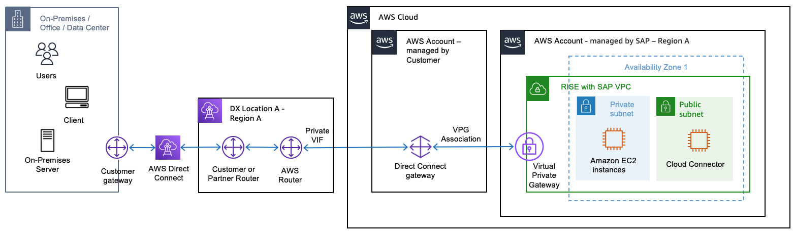
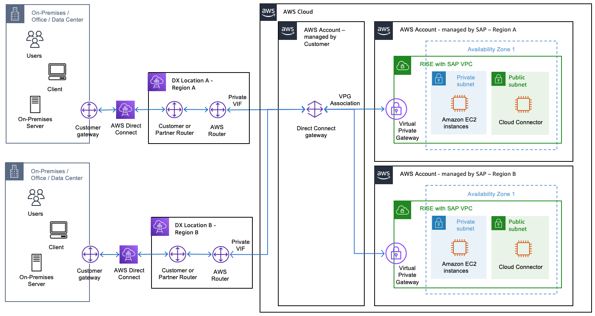
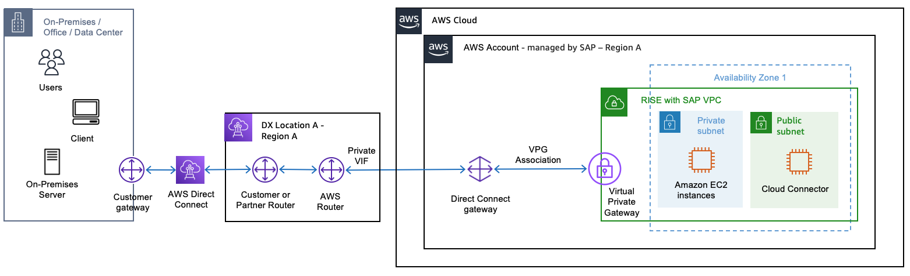

# AWS Direct Connect gateway

[AWS Direct Connect gateway](../../../directconnect/latest/UserGuide/direct-connect-gateways.md "../../../directconnect/latest/UserGuide/direct-connect-gateways.md") is a global service that enables you to establish private connectivity between your on-premises networks and multiple Amazon VPCs across different AWS regions. This centralized connection hub allows you to consolidate your network architecture, reduce complexity, and maintain secure, high-bandwidth connections while avoiding public internet for your mission-critical workloads.

**AWS Direct Connect gateway in your own AWS account**

To establish connection with AWS account managed by SAP, create AWS Direct Connect gateway that routes traffic from Private VIF to VPC Private Gateway. As AWS Direct Connect gateway resides in your AWS account, you can retain control over traffic routing.

When you have a requirement for connectivity from multiple on-premises sites and/or are using multiple AWS regions for RISE with SAP (i.e. for long range DR), you can simplify the connectivity utilizing Direct Connect Gateway

**AWS Direct Connect gateway in AWS account managed by SAP**

If you do not have any requirement to own and manage an AWS account, you can request for SAP to provide the AWS Direct Connect gateway that is part of AWS Account which is managed by SAP.

There is no additional charges for AWS Direct Connect gateway itself. You can find out more from the [AWS Direct Connect FAQs](https://aws.amazon.com/directconnect/faqs/#Direct_Connect_Gateway "https://aws.amazon.com/directconnect/faqs/#Direct_Connect_Gateway").
