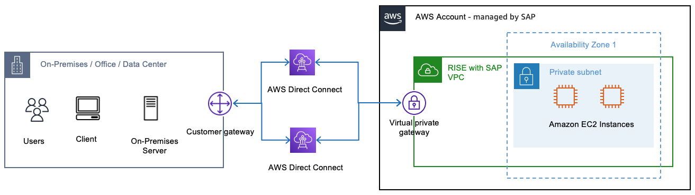
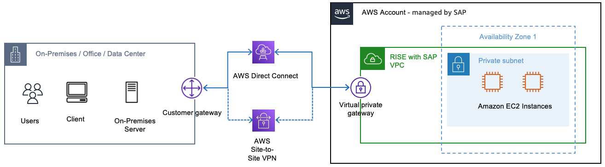

# Implementation steps for connectivity

This section provides a deeper dive into the implementation steps for connectivity between RISE with SAP and your on-premises environments (without any Customer managed AWS Account usage). The two options we will step into are: first, creating highly resilient deployment for critical workloads, and second, creating cost effective alternative for non-critical workloads.

For each option we’ll provide clarity on the details SAP needs, the steps you will take in your on-premises environment.

## Option 1: Resilient Deployment for Critical Workloads

[AWS Direct Connect (DX)](https://aws.amazon.com/directconnect/?nc=sn&loc=0 "https://aws.amazon.com/directconnect/?nc=sn&loc=0") comes in two connection types, namely [Dedicated](../../../directconnect/latest/UserGuide/dedicated_connection.md "../../../directconnect/latest/UserGuide/dedicated_connection.md") and [Hosted](../../../directconnect/latest/UserGuide/hosted_connection.md "../../../directconnect/latest/UserGuide/hosted_connection.md"). A Dedicated DX is a physical Ethernet connection associated with a single customer, between the customer’s private network and AWS. Hosted DX is a physical Ethernet connection that an [AWS Direct Connect Partner](https://aws.amazon.com/directconnect/partners/ "https://aws.amazon.com/directconnect/partners/") provisions on behalf of a customer. Learn about [AWS Direct Connect](https://aws.amazon.com/directconnect/ "https://aws.amazon.com/directconnect/") to familiarize yourself with the service.

To set up a resilient Direct Connect solution for your RISE with SAP deployment, follow these implementation steps:

**Prerequisites**

Before configuring the Direct Connect connection, ensure your on-premises network is ready. This includes:

- Reviewing the AWS documentation on [BGP with AWS Direct Connect](../../../directconnect/latest/UserGuide/routing-and-bgp.md "../../../directconnect/latest/UserGuide/routing-and-bgp.md") for detailed guidance on router configuration.
- Configuring Border Gateway Protocol (BGP) on your routers with MD5 authentication. BGP is a requirement for using Direct Connect.
- Verifying that your network can support multiple BGP connections for redundancy.

**Initiate the Setup Process**

Start by contacting your SAP ECS (Enterprise Cloud Services) representative and request the "AWS Connectivity Questionnaire" for RISE with SAP on AWS Direct Connect setup. This questionnaire will help gather the necessary information to provision the Direct Connect connection.

We advise you to set up redundant connections for high availability by completing the questionnaire for each Direct Connect connection you plan to establish. Review the [Direct Connect Resiliency Recommendations](https://aws.amazon.com/directconnect/resiliency-recommendation/ "https://aws.amazon.com/directconnect/resiliency-recommendation/") to understand best practices.

**Complete the SAP Questionnaire**

When filling out the AWS Connectivity Questionnaire, specify that you want to set up a resilient AWS Direct Connect configuration.

In the questionnaire, provide the following details about your Direct Connect connection:

- Whether it’s a new or dedicated Direct Connect connection
- The Direct Connect provider or partner you’ll be using
- The specific Direct Connect region/location
- The minimum number of Direct Connect links required
- The subnet CIDR blocks for the primary and secondary Direct Connect links (in /30 CIDR format)
- The VLAN ID
- The Autonomous System Number (ASN) of your on-premises router
- The IP address ranges of your on-premises network (to allow for proper firewall configuration)
  Additionally, include information about your on-premises router, such as the make, model, and interface details.

Submit the completed questionnaire to your SAP ECS representative. SAP will then use this information to provision the necessary Direct Connect resources in your RISE with SAP environment on AWS.

**SAP’s Responsibilities**

After you submit the completed questionnaire, SAP will handle the following tasks (the list below is illustrative only for this context):

- Create a virtual interface (depending on your DX type: hosted or dedicated)
- Create the Direct Connect Gateway
- If you need SAP to provision Transit Gateway in RISE VPC,
  - Setup the Transit Gateway (including the ASN you provided)
  - Create the Transit Gateway attachment for your VPC
  - Update the route tables to allow the Transit Gateway to communicate with the RISE with SAP network VPC
  - Associate the Transit Gateway with the Direct Connect Gateway, including the CIDR of the RISE with SAP network that will be advertised to your network

**Complete the Setup Process**

Once you receive the necessary information from SAP, such as the VLAN ID, BGP peer IPs, and optional BGP authentication key, configure your on-premises routers accordingly. This includes setting up the VLAN interface and BGP for the Direct Connect connection. Consult the AWS documentation on [router configuration for Direct Connect](../../../directconnect/latest/UserGuide/router-configuration.md "../../../directconnect/latest/UserGuide/router-configuration.md") for detailed instructions.

Configure for active/active topology: Implement routing policies to balance traffic across the redundant Direct Connect connections, leveraging BGP communities or more-specific subnet advertisements to influence path selection from AWS to your on-premises network.

**Establish and Test the Connections**

Coordinate with SAP to enable the BGP sessions for both Direct Connect connections. Verify the BGP paths and test failover scenarios by simulating the failure of one connection to ensure traffic properly fails over to the other.

Confirm end-to-end connectivity with SAP for both paths. You can also leverage the [AWS Direct Connect Resiliency Toolkit](../../../directconnect/latest/UserGuide/resiliency_toolkit.md "../../../directconnect/latest/UserGuide/resiliency_toolkit.md") to [perform scheduled failover tests](../../../directconnect/latest/UserGuide/resiliency_failover.md "../../../directconnect/latest/UserGuide/resiliency_failover.md") and verify the resiliency of your connections. and validate the resiliency of your connections.

**Maintain the Connections**

Regularly review and update the Direct Connect configurations as needed. Coordinate any changes with SAP. Monitor the performance and availability of both connections, and refer to the AWS documentation on [Monitoring Direct Connect](../../../directconnect/latest/UserGuide/monitoring-overview.md "../../../directconnect/latest/UserGuide/monitoring-overview.md") for best practices.

By following these steps, you can establish a resilient AWS Direct Connect solution to securely connect your on-premises infrastructure with the RISE with SAP environment on AWS, ensuring high availability and reliable network performance.

## Option 2: Cost Effective Alternative for Non-Critical Workloads

Some AWS customers prefer the benefits of one or more AWS Direct Connect connections as their primary connectivity to AWS, coupled with a lower-cost backup solution. Additionally, they may want an agile and adaptable connection that can be quickly established or decommissioned between network locations globally. To achieve these objectives, they can implement AWS Direct Connect connections with an AWS Site-to-Site VPN backup.

The Site-to-Site VPN connection consists of three key components:

1. Virtual Private Gateway (VGW) - The router on the AWS side
2. Customer Gateway (CGW) - The router on the customer side
3. The S2S VPN connection that binds the VGW and CGW together over two secure IPSec tunnels in an active/passive configuration
   For in-depth documentation on establishing the AWS Site-to-Site VPN connection, you can refer to the AWS documentation at https://docs.aws.amazon.com/vpn/latest/s2svpn/SetUpVPNConnections.html.

**Prerequisites**

This approach builds on the steps outlined in the previous Option 1 for setting up a Resilient AWS Direct Connect solution. After completing those Direct Connect implementation steps, you can add an Site-to-Site VPN connection as a failover option.

While your Direct Connect connections are being provisioned, you can begin preparing your on-premises infrastructure for the VPN setup: \* Review the AWS documentation on Site-to-Site VPN to understand the requirements and best practices. \* Ensure your firewalls allow the necessary traffic for the VPN tunnels. \* Confirm you have two customer gateway devices or a single device capable of managing multiple VPN tunnels.

The addition of an Site-to-Site VPN connection provides a faster and more agile backup to your primary Direct Connect links. It’s a similar process to setting up the Direct Connect, but with a few key differences.

**Initiate the Setup Process**

Start by contacting your SAP ECS representative again and request the "AWS Connectivity Questionnaire" for adding an AWS Site-to-Site VPN connection to your RISE on AWS setup. Inform SAP of your intent to implement the VPN as a failover to your Direct Connect links.

**Complete the SAP Questionnaire**

When filling out the AWS Connectivity Questionnaire this time, specify that you want to set up an AWS Site-to-Site VPN in addition to the Direct Connect connections.

In the AWS Connectivity Questionnaire, you’ll need to provide the following information about the VPN connection in addition to the details filled out for the DX:

- Customer VPN Gateway details such as the make and model of your customer gateway device(s)
- Customer VPN Gateway Internet facing public IP Address
- Type of Routing (static / dynamic)
- BGP ASN for Dynamic Routing (Customer gateway ASN for BGP. Only 16 bit ASN is supported.)
- ASN for the AWS side of the BGP session (16- or 32-bit ASN)
- Customer Side BGP Peer IP-address (if different from VPN peer IP provided)
- Second Public IP Address (OPTIONAL: only if active-active mode is used)
- Customer On-Premises Network IP ranges
  Submit the completed questionnaire to SAP. They will then create the VPN connection and provide you with the configuration details.

**SAP’s Responsibilities**

After you submit the completed questionnaire, SAP will handle the following tasks (the list below is illustrative only for this context): \* Create the customer gateway (with your provided information like BGP ASN, IP address, and optional private certificate) \* Create the AWS Site-to-Site VPN and attach it to the RISE with SAP Transit Gateway and your customer gateway \* Provide the VPN configuration file for you to set up on your on-premises router \* If you need SAP to provision Transit Gateway in RISE VPC, SAP will add the necessary route to the Transit Gateway route table and update the security groups

Using the information received from SAP, configure the VPN tunnels on your on-premises router. Implement routing policies to prefer the Direct Connect connection over the VPN as the primary path.

Refer to the AWS documentation on [router configuration for Direct Connect](../../../directconnect/latest/UserGuide/router-configuration.md "../../../directconnect/latest/UserGuide/router-configuration.md") for guidance on the necessary settings.

**Test and Verify Connections**

Coordinate with SAP to enable the VPN connection and verify end-to-end connectivity. Test failover scenarios by simulating a Direct Connect failure and ensure traffic properly fails over to the VPN.

Confirm with SAP that the failover is working as expected for both the Direct Connect and VPN paths.

**Maintain the Connections**

Regularly review and update the configurations for both the Direct Connect and VPN connections. Coordinate any changes with SAP.

Monitor the performance and availability of both connections, and refer to the AWS documentation on [monitoring Direct Connect and VPN for best practices](../../../directconnect/latest/UserGuide/monitoring-overview.md "../../../directconnect/latest/UserGuide/monitoring-overview.md").

By implementing this Direct Connect with Site-to-Site VPN failover solution, you can achieve a highly resilient connectivity setup for your RISE with SAP deployment on AWS, ensuring seamless failover and reliable network performance.
