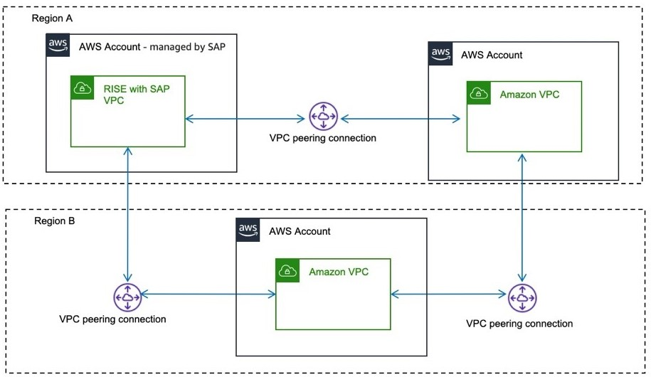

# Amazon VPC peering

VPC peering enables network connection between two AWS VPCs using private IPv4 and IPv6 addresses. Instances can communicate over the same network. For more information, see [What is VPC peering?](../../../vpc/latest/peering/what-is-vpc-peering.md "../../../vpc/latest/peering/what-is-vpc-peering.md")

Before setting up a VPC peering connection, you need to create a request for SAP’s approval. For a successful VPC peering, the defined IPv4 Classless Inter-Domain Routing (CIDR) block must not overlap. Check with SAP for the CIDR ranges that can be used in RISE with SAP VPC.

VPC peering is one-on-one connection between VPCs, and is not transitive. Traffic cannot transit from one VPC to another via an intermediary VPC. You must setup multiple peering connections to establish direct communication between RISE with SAP VPC and multiple VPCs.

VPC peering works across AWS Regions. All inter-Region traffic is encrypted with no single point of failure or bandwidth bottleneck. Traffic stays on AWS Global Network and never traverses the public internet, reducing threats of common exploits and DDoS attacks.

Data transfer for VPC peering within an Availability Zone is free, and for across Availability Zones is charged per-GB for "data in" to and "data out". Data transfer for VPC peering for across regions is charged for "out" per-GB. For more information, see [Amazon EC2 pricing](https://aws.amazon.com/ec2/pricing/on-demand/ "https://aws.amazon.com/ec2/pricing/on-demand/"). In your AWS account, use the Availability Zone ID of AWS account managed by SAP to avoid cross-Availability Zone data transfer charges. You can ask for the Availability Zone ID from SAP. For more information, see [Availability Zone IDs for your AWS resources](../../../ram/latest/userguide/working-with-az-ids.md "../../../ram/latest/userguide/working-with-az-ids.md").

|                                                                                                                                                                                                                                                                                                                                                                                                                                                                                                                                                                                                                                                                                                                                                                                                                                                                                                                                                                                                                                                                             |
| --------------------------------------------------------------------------------------------------------------------------------------------------------------------------------------------------------------------------------------------------------------------------------------------------------------------------------------------------------------------------------------------------------------------------------------------------------------------------------------------------------------------------------------------------------------------------------------------------------------------------------------------------------------------------------------------------------------------------------------------------------------------------------------------------------------------------------------------------------------------------------------------------------------------------------------------------------------------------------------------------------------------------------------------------------------------------- |
| **Pricing example - VPC peering across Availability Zones** VPC peering across Availability Zones 100GB of data sent from the AWS account – managed by SAP via VPC Peering toward the AWS account – managed by Customer across AZs: 100GB \* $0.01per-GB = $1 (out - billed to AWS account – managed by SAP) and 100GB \* $0.01per-GB = $1 (IN - billed to AWS account – managed by Customer) As the cost for data transfer is included In the RISE subscription, the AWS account – managed by Customer will only incur the cost for traffic IN e.g. $0.01 per-GB. _[note: the cost example also applies when Sender is AWS account – managed by Customer and Receiver is AWS account – managed by SAP]_                                                                                                                                                                                                                                                                                                                                                                    |
| **Pricing example - VPC peering across Regions** _[note: cost between AWS Regions vary. For more information see: [Amazon EC2 pricing Data Transfer](https://aws.amazon.com/ec2/pricing/on-demand/#Data_Transfer "https://aws.amazon.com/ec2/pricing/on-demand/#Data_Transfer")]_ VPC peering across Regions 1). 100GB of data sent from the AWS account – managed by SAP via VPC Peering toward the AWS account – managed by Customer across Regions. 100GB \* ($0.01-$0.138per-GB) = $1-$13.8 (out - billed to AWS account – managed by SAP) As the cost for data transfer is included In the RISE subscription the AWS account – managed by Customer will not incur cost for this example. 2). 100GB of data sent from the AWS account – managed by Customer via VPC Peering toward the AWS account – managed by SAP across Regions. 100GB \* ($0.01-$0.138per-GB) = $1-$13.8 (out - billed to AWS account – managed by Customer) As the cost for data transfer is calculated for "data out" the AWS account – managed by Customer will incur the cost for this example. |
