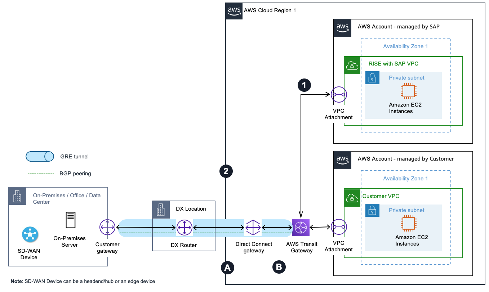
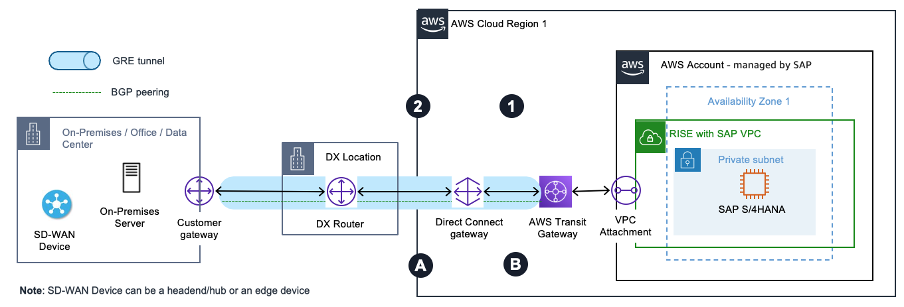
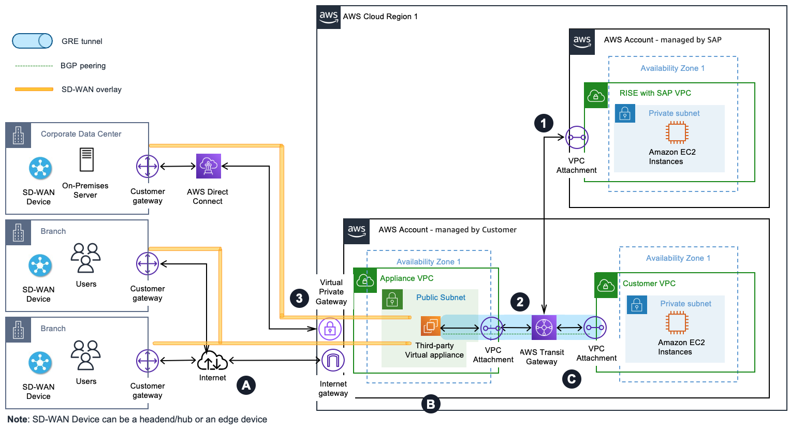
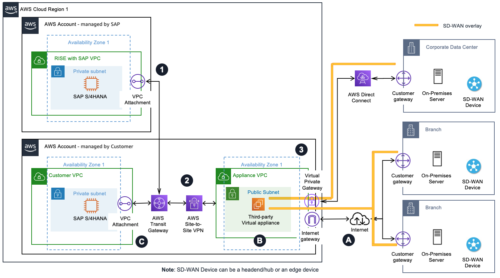

# Connecting to RISE using SD-WAN

**What is SD-WAN**

[Software-Defined Wide Area Networking (SD-WAN)](https://en.wikipedia.org/wiki/SD-WAN "https://en.wikipedia.org/wiki/SD-WAN") is a networking technology that uses software to manage and route traffic across different networks such as Multi-Path Label Switching (MPLS), public internet, or the AWS backbone focusing on improving connectivity and application performance. SD-WAN primarily operates at layer 3 (Network Layer) of the network OSI model offering centralized control, routing, path selection, IP-based policies, and the ability to prioritize specific mission critical applications, such as SAP, making it well-suited for cloud-based RISE with SAP environments.

Although SD-WAN primarily operates at Layer 3, using an overlay network such as broadband internet, it can utilize Layer 2 (Data Link) technologies such as [AWS Direct Connect](https://aws.amazon.com/directconnect/ "https://aws.amazon.com/directconnect/") as the underlay network for transport, and Layer 3 (Network) technologies such as [AWS Site-to-Site VPN](../../../vpn/latest/s2svpn/VPC_VPN.md "../../../vpn/latest/s2svpn/VPC_VPN.md").

In SD-WAN architecture, an SD-WAN headend acts as a hub or centralized network component, while [SD-WAN edge devices](https://en.wikipedia.org/wiki/SD-WAN#SD-WAN_edge "https://en.wikipedia.org/wiki/SD-WAN#SD-WAN_edge") deployed at branch offices, remote sites or data centers which serves as the entry and exit points for WAN Traffic.

You can refer to more detailed information in the [Reference Architectures for Implementing SD-WAN Solutions on AWS](https://d1.awsstatic.com/architecture-diagrams/ArchitectureDiagrams/sd-wan-deployment-models-ra.pdf?did=wp_card&trk=wp_card "https://d1.awsstatic.com/architecture-diagrams/ArchitectureDiagrams/sd-wan-deployment-models-ra.pdf?did=wp_card&trk=wp_card").

**Scenario A: SD-WAN appliances (edge and/or headend/hub) on-premises**

[AWS Transit Gateway Connect](../../../vpc/latest/tgw/tgw-connect.md "../../../vpc/latest/tgw/tgw-connect.md") allows you to extend your SD-WAN network to AWS using [GRE (Generic Routing Encapsulation)](https://en.wikipedia.org/wiki/Generic_routing_encapsulation "https://en.wikipedia.org/wiki/Generic_routing_encapsulation") tunnels without needing additional AWS infrastructure. Through [Transit Gateway Connect Peer](../../../vpc/latest/tgw/tgw-connect.md#tgw-connect-peer "../../../vpc/latest/tgw/tgw-connect.md#tgw-connect-peer"), you can establish GRE tunnels between your transit gateway in your AWS account and the SD-WAN appliance on-premises which are connected via AWS Direct Connect connection as underlying transport.

The appliance must be configured to send and receive traffic over a GRE tunnel to and from the transit gateway using the [Connect attachment](../../../vpc/latest/tgw/create-tgw-connect-attachment.md "../../../vpc/latest/tgw/create-tgw-connect-attachment.md"). The appliance must be configured to use [BGP (Border Gateway Protocol)](https://aws.amazon.com/what-is/border-gateway-protocol/ "https://aws.amazon.com/what-is/border-gateway-protocol/") for dynamic route updates and health checks.

Each connection can be configured with its own route table and BGP peer, enabling you to extend your on-premises network segmentation via [Virtual routing and forwarding (VRF)](../../../prescriptive-guidance/latest/patterns/extend-vrfs-to-aws-by-using-aws-transit-gateway-connect.md "../../../prescriptive-guidance/latest/patterns/extend-vrfs-to-aws-by-using-aws-transit-gateway-connect.md") to AWS. The RISE with SAP VPC is attached to the AWS Transit Gateway.

This setup provides a streamlined way to connect your SD-WAN environment with RISE with SAP on AWS using AWS Direct Connect, maintaining network separation while simplifying the overall architecture.

In this scenario, the [overlay network](https://en.wikipedia.org/wiki/Overlay_network "https://en.wikipedia.org/wiki/Overlay_network") is SD-WAN (with GRE Tunnels) with the headend/hub or edge devices deployed on on-premises, and the underlay transport is AWS Direct Connect

**Pattern A-1: SD-WAN devices integration with AWS Transit Gateway and AWS Direct Connect with your AWS landing zone**

The preceding diagram illustrates a pattern of how you can extend and segment your SD-WAN traffic to AWS without adding extra infrastructure. You can create Transit Gateway connect attachments using an AWS Direct Connect connection as underlying transport in your AWS account.

Outbound from RISE with SAP VPC:

1. Traffic initiated from the RISE VPC to the corporate data center is routed to the Transit Gateway.
2. The Transit Gateway connect attachment uses the Direct Connect connection as the underlay transport and connects the Transit Gateway to the corporate data center SD-WAN device with GRE tunneling and BGP.
   Inbound to RISE with SAP VPC:

3. Traffic from the corporate data center SD-WAN device to the RISE VPC is forwarded to the Transit Gateway via the GRE tunnel of the Transit Gateway attachment over the Direct Connect link.
4. Transit Gateway forwards the traffic to the destination RISE with SAP VPC.

**Pattern A-2: SD-WAN devices integration with AWS Transit Gateway and AWS Direct Connect with no AWS landing zone**

The preceding diagram illustrates a pattern of how you can extend and segment your SD-WAN traffic to AWS without adding extra infrastructure. In RISE with SAP, you can request SAP to create Transit Gateway connect attachments using a Direct Connect connection as underlying transport. Customers can leverage SAP-managed [Direct Connect gateway (DXGW)](../../../directconnect/latest/UserGuide/direct-connect-gateways-intro.md "../../../directconnect/latest/UserGuide/direct-connect-gateways-intro.md") if required.

Outbound from RISE with SAP VPC:

1. Traffic initiated from RISE VPC to the corporate data center is routed to the Transit Gateway.
2. The Transit Gateway connect attachment uses the Direct Connect connection as transport and connects the Transit Gateway to the corporate data center SD-WAN device using GRE tunneling and BGP.
   Inbound to RISE with SAP VPC:

3. Traffic from the corporate data center SD-WAN device to the RISE VPC is forwarded to the Transit Gateway via the GRE tunnel of the Transit Gateway attachment over the Direct Connect link.
4. Transit Gateway forwards the traffic to the destination RISE with SAP VPC.

**Scenario B: SD-WAN appliances (edge and/or headend/hub devices) in AWS**

In this scenario, the virtual appliances of the SD-WAN network are deployed in a VPC within AWS. Then, you use a VPC attachment as underlying transport for the Transit Gateway connect attachment between the SD-WAN virtual appliances and the Transit Gateway in your AWS account(s). Similar to Scenario A, Transit Gateway connect attachments support GRE for higher bandwidth performance compared to a VPN connection. It supports BGP for dynamic routing and removes the need to configure static routes. In addition, its integration with [Transit Gateway Network Manager](../../../vpc/latest/tgwnm/what-is-network-manager.md "../../../vpc/latest/tgwnm/what-is-network-manager.md") provides advanced visibility through global network topology, attachment level performance metrics, and telemetry data.

Between on-premises and AWS, the [overlay network](https://en.wikipedia.org/wiki/Overlay_network "https://en.wikipedia.org/wiki/Overlay_network") is SD-WAN with GRE or IPSec tunnels with the headend/hub deployed within AWS, and the underlay transport could be Internet, MLPS, or Direct Connect. Following are the architecture patterns under this scenario:

Note: Network patterns covered in the following sections are applicable only with your existing or a new landing zone setup on AWS. For SD-WAN appliances deployment and connectivity directly with AWS Account – managed by SAP, refer to Pattern A-2.

**Pattern B-1: SD-WAN appliances in AWS integrated with AWS Transit Gateway Connect with your AWS landing zone**

The preceding diagram illustrates a pattern of integrating your SD-WAN network with Transit Gateway using [connect attachments](../../../vpc/latest/tgw/tgw-connect.md "../../../vpc/latest/tgw/tgw-connect.md") and placing (third-party) virtual appliances of the SD-WAN network in an Appliance VPC within AWS. It’s common to have SD-WAN edge appliances deployed at branch locations, and on-premises data center to create a full mesh topology.

Outbound from RISE with SAP:

1. Traffic initiated from the RISE VPC to the corporate data center is routed to the Transit Gateway.
2. The Transit Gateway connect attachment uses the VPC attachment as transport and connects Transit Gateway to the third-party appliance in the Appliance VPC using GRE tunneling and BGP.
3. The third-party virtual appliance encapsulates the traffic, which uses the SD-WAN overlay – on top of the Direct Connect link – to reach the corporate data center.
   Inbound to RISE with SAP:

4. Traffic from branches outside AWS to the RISE VPC reaches the internet gateway of the appliance VPC via the SD-WAN overlay over the internet. Similarly, traffic from the corporate data center to the RISE VPC reaches the virtual private gateway of the Appliance VPC via the SD-WAN overlay over the Direct Connect link.
5. The third-party virtual appliance in the appliance VPC forwards the traffic to the Transit Gateway via the connect attachment.
6. Transit Gateway forwards the traffic to the destination RISE VPC.

**Pattern B-2: SD-WAN appliances in AWS integrated with AWS Site-to-Site VPN**

The diagram above illustrates a pattern of integrating your SD-WAN network with Transit Gateway using an AWS Site-Site VPN connection and placing (third party) virtual appliances of the SD-WAN network in an Appliance VPC within AWS. You may use this option when your third-party virtual appliance does not support GRE. It’s common to have SD-WAN edge appliances deployed at branch locations, and on-premises data center to create a full mesh topology.

Outbound from RISE with SAP:

1. Traffic initiated from the RISE VPC to the corporate data center is routed to the Transit Gateway Elastic Network Interface (TGW ENI).
2. The traffic is routed between the Transit Gateway and the third-party virtual appliance using the Site-to-Site VPN connection.
3. The third-party virtual appliance encapsulates the traffic, which uses the SD-WAN overlay – on top of the Direct Connect link – to reach the corporate data center.
   Inbound to RISE WITH SAP:

4. Traffic from branches outside AWS to the RISE VPC reaches the internet gateway of the appliance VPC via the SD-WAN overlay over the internet. Similarly, traffic from the corporate data center to the RISE VPC reaches the virtual private gateway of the appliance VPC via the SD-WAN overlay over the AWS Direct Connect link.
5. The third-party virtual appliance in the appliance VPC forwards the traffic to the Transit Gateway via Site-to-Site VPN connection.
6. Transit Gateway forwards the traffic to TGW ENI of the destination RISE VPC.
