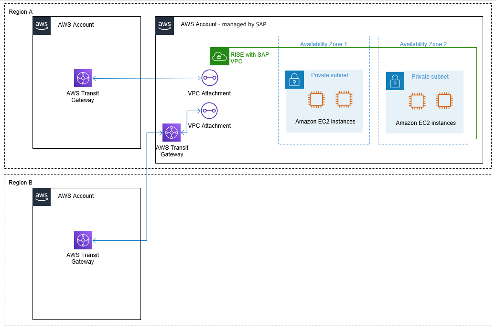

# AWS Transit Gateway

AWS Transit Gateway is a network transit hub to interconnect Amazon VPCs. It acts as a cloud router, resolving complex peering setup issues by acting as the central communication hub. You need to establish this connection with AWS account managed by SAP only once.

**Transit Gateway in your own AWS account**

To establish connection with AWS account managed by SAP, create and share AWS Transit Gateway via AWS Resource Access Manager (RAM) in your AWS account. SAP then creates an attachment to enable traffic flow through an entry in route table. As AWS Transit Gateway resides in your AWS account, you can retain control over traffic routing. For more information, see [Transit gateway peering attachments](../../../vpc/latest/tgw/tgw-peering.md "../../../vpc/latest/tgw/tgw-peering.md").

**Transit Gateway in AWS account managed by SAP**

When you already have an Transit Gateway in another AWS Region, and cannot create another AWS account with Transit Gateway in the Region that has RISE with SAP account, then SAP can provide the Transit Gateway in the RISE with SAP account that will be managed by SAP. You can enable communication between your Transit Gateway and SAP managed Transit Gateway through Transit Gateway Peering. You cannot connect VPC attachments of VPCs outside of the RISE environment to the SAP-managed Transit Gateway.

For peering attachments, each Transit Gateway owner is billed hourly for the peering attachment with the other Transit Gateway, thus the hourly cost for the peering attachment of the Transit Gateway in the SAP account - managed by SAP (for the purpose of Inter Region Transit Gateway Peering) is part of the RISE subscription. However the hourly cost for the peering attachment of the Transit Gateway in the Customer account – Customer managed is billed to the Customer. For more information, see: [Transit Gateway pricing](https://aws.amazon.com/transit-gateway/pricing/ "https://aws.amazon.com/transit-gateway/pricing/")

|                                                                                                                                                                                                                                                                                                                                                                                                                                                                                                                                                                                                                                                                                                                                                                                                                                                                                                                                                                                                                                                                                                                                                                                                                                                                                                                                                                                                                                                                                                                                                                                                                                                                                                                                                                                                                                                                                                                                                                                                                                                                                                                                                                                                                                                                                                                                                                                                                                                                                                                                                                                                                                                        |
| ------------------------------------------------------------------------------------------------------------------------------------------------------------------------------------------------------------------------------------------------------------------------------------------------------------------------------------------------------------------------------------------------------------------------------------------------------------------------------------------------------------------------------------------------------------------------------------------------------------------------------------------------------------------------------------------------------------------------------------------------------------------------------------------------------------------------------------------------------------------------------------------------------------------------------------------------------------------------------------------------------------------------------------------------------------------------------------------------------------------------------------------------------------------------------------------------------------------------------------------------------------------------------------------------------------------------------------------------------------------------------------------------------------------------------------------------------------------------------------------------------------------------------------------------------------------------------------------------------------------------------------------------------------------------------------------------------------------------------------------------------------------------------------------------------------------------------------------------------------------------------------------------------------------------------------------------------------------------------------------------------------------------------------------------------------------------------------------------------------------------------------------------------------------------------------------------------------------------------------------------------------------------------------------------------------------------------------------------------------------------------------------------------------------------------------------------------------------------------------------------------------------------------------------------------------------------------------------------------------------------------------------------------ |
| **Pricing example - Transit Gateway across VPCs in different Regions** _[note: cost between AWS Regions vary. For more information see: [Amazon EC2 pricing Data Transfer](https://aws.amazon.com/ec2/pricing/on-demand/#Data_Transfer "https://aws.amazon.com/ec2/pricing/on-demand/#Data_Transfer")]_ Transit Gateway across VPCs in different Regions 1). 100GB of data sent from a VPC in Region X in the AWS account – managed by SAP via the Transit Gateway that resided in the AWS account – managed by SAP, towards a peered Transit Gateway, in a different Region Y, that resided in the AWS account – managed by Customer ending at a VPC in the AWS account – managed by Customer: 100GB \* $0.02per-GB = $2 (Transit Gateway data processing) + 100GB \* ($0.01-$0.138per-GB) = $1-$13.8 (Region out) = $3-$15.8 (Total - billed to AWS account – managed by SAP) Data processing is charged to the VPC owner who sends the traffic to Transit Gateway. As the sending VPC is residing in the AWS account – managed by SAP and the cost for data transfer is included in the RISE Subscription, thus the AWS account – managed by Customer will not incur data transfer cost for this example. As data processing charges do not apply for data sent from a peering attachment to a Transit Gateway and inbound inter-Region data transfer charges are free, no further Data Transfer charges apply to the AWS account – managed by Customer. The AWS account – managed by Customer will only be billed for the price per Transit Gateway peering attachment per hour. Data out of an AZ will always go via Transit Gateway endpoint in that AZ to reach other VPC, so there is no cross AZ Data Transfer costs. 2). 100GB of data sent from a VPC in region Y in the AWS account – managed by Customer via the Transit Gateway that resided in the AWS account – managed by Customer, towards a peered Transit Gateway, in a different region X, that resided in the AWS account – managed by SAP ending at a VPC in the AWS account – managed by SAP: 100GB \* $0.02per-GB = $2 (Transit Gateway data processing) + 100GB \* ($0.01-$0.138per-GB) = $1-$13.8 (Region out) = $3-$15.8 (Total - billed to AWS account – managed by Customer) Data processing is charged to the VPC owner who sends the traffic to Transit Gateway. As the sending VPC is residing in the AWS account – managed by Customer all data transfer cost for this example are billed to the AWS account – managed by Customer. In addition, the AWS account – managed by Customer will be billed for the price per Transit Gateway peering attachment per hour. |
