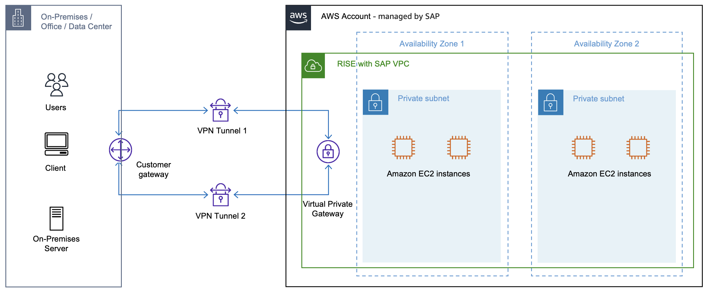
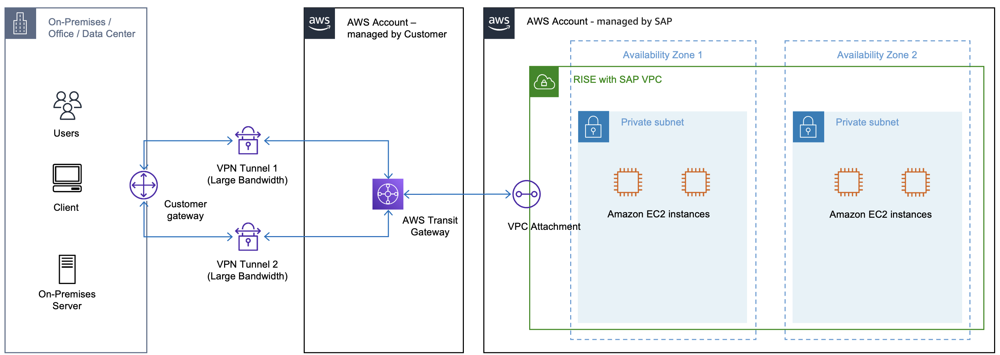

# Connecting to RISE using AWS VPN

Enable access from your remote network to the RISE with SAP VPC using [AWS Site-to-Site VPN](../../../vpn/latest/s2svpn/VPC_VPN.md "../../../vpn/latest/s2svpn/VPC_VPN.md"). AWS Site-to-Site VPN encrypts traffic between the AWS Cloud and your on-premises location using Internet Protocol Security (IPsec) and transfers it through a secure tunnel over the internet. This option is faster to implement than a dedicated private connection such as AWS Direct Connect. For more information, see [Connect your VPC to remote networks using AWS Virtual Private Network](../../../vpc/latest/userguide/vpn-connections.md "../../../vpc/latest/userguide/vpn-connections.md").

You can configure the bandwidth capacity for your VPN tunnels with one of these two options:

- Standard bandwidth: Up to 1.25 Gbps per tunnel (default)
- Large Bandwidth Tunnel (LBT): Up to 5 Gbps per tunnel
  By default, each VPN connection includes two tunnels.

For more information, see [Tunnel options for your AWS Site-to-Site VPN connection](../../../vpn/latest/s2svpn/VPNTunnels.md "../../../vpn/latest/s2svpn/VPNTunnels.md").

###### Note

Pricing examples are for illustration purposes only and are subject to change. For current pricing, see [AWS Site-to-Site VPN pricing](https://aws.amazon.com/vpn/pricing/ "https://aws.amazon.com/vpn/pricing/").

## Standard bandwidth: Up to 1.25 Gbps per tunnel

The following diagram shows the architecture for a standard bandwidth Site-to-Site VPN connection to the RISE with SAP VPC.

When using this option, SAP requires the following details and handles the AWS-side configuration on your behalf:

- BGP ASN
- IP address of your device

You can obtain these details from your on-premises AWS VPN device.

For redundancy, configure a second VPN connection.

## Pricing example 1: Single 1.25 Gbps Site-to-Site VPN connection

###### Note

Costs vary between AWS Regions. For more information, see [Amazon EC2 pricing Data Transfer](https://aws.amazon.com/ec2/pricing/on-demand/#Data_Transfer "https://aws.amazon.com/ec2/pricing/on-demand/#Data_Transfer").

A Site-to-Site VPN connection is created and connected directly to the RISE Account VPC in US East (Ohio). The connection is active for 30 days, 24 hours a day, with 1 TB transferred.

- AWS Site-to-Site VPN connection fee (1.25 Gbps): At USD $0.05 per hour in US East (Ohio) per VPN connection, the monthly connection fee is USD $36.00.
- Data transfer out fee: The first 100 GB are free, leaving 924 GB (1 TB = 1,024 GB) chargeable at $0.09 per GB — a monthly fee of $83.16.
- For example, total monthly cost: USD $119.16

When you connect your remote network directly to RISE using AWS Site-to-Site VPN, the RISE subscription covers the AWS VPN Connection and data transfer out costs.

###### Note

As the cost associated with the lifecycle and operation of a "Customer gateway device" (a physical device or software application on your side of the Site-to-Site AWS VPN connection) varies, this is not taken into consideration in this document.

## Large Bandwidth Tunnel: Up to 5 Gbps per tunnel

With Large Bandwidth Tunnels, you can configure Site-to-Site VPN tunnels that support up to 5 Gbps bandwidth per tunnel, compared to the standard 1.25 Gbps. For more information, see [Large Bandwidth Tunnels](../../../vpn/latest/s2svpn/vpn-limits.md "../../../vpn/latest/s2svpn/vpn-limits.md").

Large Bandwidth Tunnels work with VPN connections attached to a Transit Gateway or AWS Cloud WAN — not Virtual Private Gateways — so you cannot use them to connect directly from your remote network to the RISE with SAP VPC. To use Large Bandwidth Tunnels, route traffic through your own AWS managed account. For more information on this architecture pattern, see [Connecting to RISE using your single AWS account](rise-connection-accounts.md "rise-connection-accounts.md").

The following diagram shows the architecture for a Large Bandwidth Tunnel VPN connection through your own AWS account to the RISE with SAP VPC.

When using this option, you are responsible for the configuration. For more information, see [Create an AWS Site-to-Site VPN connection](../../../vpn/latest/s2svpn/SetUpVPNConnections.md "../../../vpn/latest/s2svpn/SetUpVPNConnections.md") and [Introducing AWS Site-to-Site VPN 5 Gbps tunnels to support high-throughput workloads](https://aws.amazon.com/blogs/networking-and-content-delivery/introducing-aws-site-to-site-vpn-5-gbps-tunnels/ "https://aws.amazon.com/blogs/networking-and-content-delivery/introducing-aws-site-to-site-vpn-5-gbps-tunnels/").

Because you are using your own AWS account in this option, these costs are not included in the RISE subscription.

## Pricing example 2: Single 5 Gbps Site-to-Site VPN

###### Note

Costs vary between AWS Regions. For more information, see [Amazon EC2 pricing Data Transfer](https://aws.amazon.com/ec2/pricing/on-demand/#Data_Transfer "https://aws.amazon.com/ec2/pricing/on-demand/#Data_Transfer").

Create a Large Bandwidth Site-to-Site VPN connection in your Amazon VPC, terminating in an AWS Transit Gateway in US East (Ohio). The connection is active for 30 days, 24 hours a day, with 1 TB transferred.

- AWS Site-to-Site VPN connection fee (5 Gbps): At USD $0.60 per hour in US East (Ohio) per VPN connection, the monthly connection fee is USD $432.00.
- AWS Transit Gateway fee: At $0.05 per hour per attachment in US East (Ohio), the monthly fee for 1 attachment is $36.00.
- AWS Transit Gateway data processing fee: At $0.02 per GB, the monthly fee is $20.48.
- Data transfer out fee: The first 100 GB are free, leaving 924 GB (1 TB = 1,024 GB) chargeable at $0.09 per GB — a monthly fee of $83.16.
- For example, total monthly cost: USD $571.64

For more information, see [AWS Site-to-Site VPN pricing](https://aws.amazon.com/vpn/pricing/ "https://aws.amazon.com/vpn/pricing/").

Because you connect via VPN to your own AWS account, which is then connected to the RISE account, these costs are split between you and the RISE subscription, depending on the direction of data traffic.

###### Note

Because the cost associated with the lifecycle and operation of a "Customer gateway device" (a physical device or software application on your side of the Site-to-Site AWS VPN connection) varies, this is not taken into consideration in this document.

To scale beyond the default limit of 5 Gbps throughput per VPN tunnel, see [Achieve ECMP routing with multiple Site-to-Site VPN tunnels associated with a transit gateway](https://repost.aws/knowledge-center/transit-gateway-ecmp-multiple-tunnels "https://repost.aws/knowledge-center/transit-gateway-ecmp-multiple-tunnels").

## Summary

- **Standard VPN (up to 1.25 Gbps)** — Connects directly to the RISE VPC. The RISE subscription covers these costs. Best for use when you don’t have your own AWS account.
- **Large Bandwidth Tunnel (up to 5 Gbps)** — Routes through the customer’s own AWS account via Transit Gateway. Costs (approximately $572/month) are split between customer and RISE subscription based on data traffic direction — expect some additional cost beyond the subscription.
- **ECMP (above 5 Gbps)** — Aggregates multiple VPN connections via Transit Gateway to scale bandwidth beyond 5 Gbps. Same cost-split model as above, but costs scale linearly with each additional VPN connection.

For a full decision tree on how to connect to RISE on AWS, see [Decision tree on connectivity to RISE](rise-decision-tree.md "rise-decision-tree.md").
