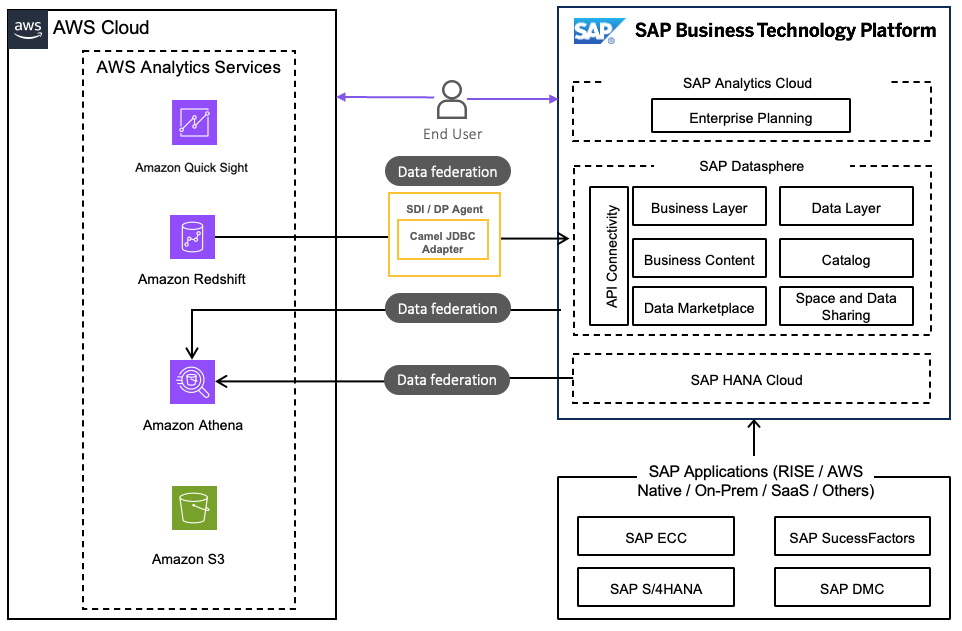

# Data Federation using AWS Services

Data federation is a data management strategy that enables, real-time analytics, single source-of-trust, no data duplication or expensive pipelines.

When there is a business requirement to have a consolidated data for transactional, analytics, machine learning, it is preferred for the data to be accessed from the source rather than replicated to avoid latency, inconsistency and extra storage cost.

In the context of SAP and AWS services, it allows organizations to access, combine, and analyze data from both SAP systems and AWS cloud services seamlessly.

**Amazon Athena**

[Amazon Athena](https://aws.amazon.com/athena/ "https://aws.amazon.com/athena/") is a serverless, scalable and flexible interactive query service by AWS that allows to analyze data directly in Amazon S3. The data stored in Amazon S3 from multiple sources can be further transformed into tables and views using Amazon Athena and queried to replicate meaningful information in a structured way.

Data in Athena can be accessed from SAP Datasphere through [data federation](https://discovery-center.cloud.sap/missiondetail/3401/3441/ "https://discovery-center.cloud.sap/missiondetail/3401/3441/") from SAP Datasphere connections. Users can also access SAP Datasphere tables and views from Athena by [querying SAP HANA](https://aws.amazon.com/blogs/big-data/query-sap-hana-using-athena-federated-query-and-join-with-data-in-your-amazon-s3-data-lake/ "https://aws.amazon.com/blogs/big-data/query-sap-hana-using-athena-federated-query-and-join-with-data-in-your-amazon-s3-data-lake/") using an [Athena Federated Query](../../../athena/latest/ug/connect-to-a-data-source.md "../../../athena/latest/ug/connect-to-a-data-source.md").

Data can also be federated to the SAP HANA Cloud by configuring Athena as a remote source using the [Smart Data Access – Athena adapter](https://community.sap.com/t5/technology-blogs-by-sap/federating-queries-in-hana-cloud-from-amazon-athena-using-athena-api/ba-p/13476091 "https://community.sap.com/t5/technology-blogs-by-sap/federating-queries-in-hana-cloud-from-amazon-athena-using-athena-api/ba-p/13476091"). The [Athena Federated Query connection](https://aws.amazon.com/blogs/big-data/query-sap-hana-using-athena-federated-query-and-join-with-data-in-your-amazon-s3-data-lake/ "https://aws.amazon.com/blogs/big-data/query-sap-hana-using-athena-federated-query-and-join-with-data-in-your-amazon-s3-data-lake/") can also be used to read data from a stand-alone SAP HANA Cloud environment.

**Amazon Redshift**

[Amazon Redshift](https://aws.amazon.com/redshift/ "https://aws.amazon.com/redshift/") iis a fully managed, peta-byte scale data warehouse service from AWS. Customers have built their data warehouses and build data models for analytics and reporting.

[Data federation](https://discovery-center.cloud.sap/missiondetail/3406/3446/ "https://discovery-center.cloud.sap/missiondetail/3406/3446/") from Amazon Redshift into SAP Datasphere is possible with SAP HANA Smart Data Integration (SDI) or the SAP Data Provisioning Agent. Amazon Redshift data can also be federated through the Athena Federated Query data source connector.

**Further resources**

The [Guidance for Data Federation](https://aws.amazon.com/solutions/guidance/data-federation-between-sap-and-aws/ "https://aws.amazon.com/solutions/guidance/data-federation-between-sap-and-aws/") between SAP and AWS outlines the process of federating data between SAP and AWS cloud analytics services, enabling you to establish a data mesh architecture. By federating data between SAP and AWS. you can easily transform and visualize your data in a scalable, secure, and cost-effective way, helping you inform your decision-making.
