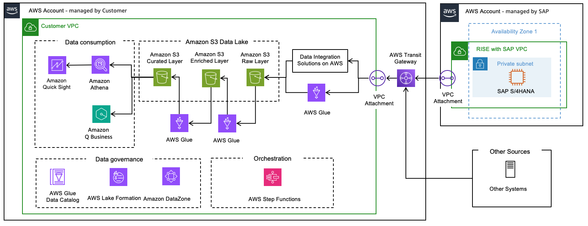

# Data Lake Architecture

The [Data lake](https://aws.amazon.com/what-is/data-lake/ "https://aws.amazon.com/what-is/data-lake/") architecture provides building blocks that demonstrate how to combine and consolidate SAP and non-SAP data from disparate sources using analytics and machine learning services on AWS.

Data lake enables customers to handle structured and unstructured data. It is designed based on a “schema-on-read” approach, meaning data can be stored in raw form and, only applies schema or structure upon consumption (i.e.: to create a Financial Report). The structure is defined when reading the data from the source, defining data types and lengths at that point. Due to this, storage and compute is decoupled, leveraging low cost storage that can scale to petabyte sizes at a fragment of cost compared to traditional databases.

Data lake enables organizations to perform various analytical tasks like creating interactive dashboards, generating visual insights, processing large-scale data, conducting real-time analysis, and implementing machine learning algorithms across diverse data sources.

The Data Lake reference architecture provides three distinct layers to transform raw data into valuable insights:

**Raw Layer**

The raw layer is the initial layer in a data lake, built on [Amazon S3](https://aws.amazon.com/s3/ "https://aws.amazon.com/s3/"), where data arrives in its original format directly from source systems without any transformation. The data in this layer is used to determine changes and data to consolidate in the next layer since it will contain multiple versions of the same data (changes, full loads, etc).

Data extracted from SAP (via [SAP ODP OData](https://help.sap.com/docs/SAP_NETWEAVER_750/825e9222e7ad4fe1988c6cc600bda779/c1c48cd6d78d4afe8ceb6a1ddc481db1.html "https://help.sap.com/docs/SAP_NETWEAVER_750/825e9222e7ad4fe1988c6cc600bda779/c1c48cd6d78d4afe8ceb6a1ddc481db1.html") or other mechanisms) needs to be prepared for further processing. The extracted data will be packaged in several files (defined by the package or page size in the extraction tool) hence multiple files for a given extraction run can be generated.

**Enriched Layer**

The Enriched Layer is built on [Amazon S3](https://aws.amazon.com/s3/ "https://aws.amazon.com/s3/") and it contains a true representation of the data in the source SAP system along with logical deletions and is stored [Amazon S3 Tables](https://aws.amazon.com/s3/features/tables/ "https://aws.amazon.com/s3/features/tables/") with built-in [Apache Iceberg format](https://aws.amazon.com/what-is/apache-iceberg/ "https://aws.amazon.com/what-is/apache-iceberg/"). The Iceberg Table file format allows the creation of [Glue or Athena Tables](../../../athena/latest/ug/understanding-tables-databases-and-the-data-catalog.md "../../../athena/latest/ug/understanding-tables-databases-and-the-data-catalog.md") within the [Glue Data Catalog](../../../glue/latest/dg/catalog-and-crawler.md "../../../glue/latest/dg/catalog-and-crawler.md"), supporting Database type operations such as Insert, Update and Deletion, with the Iceberg file format handling the file operations (deletion of records, etc). Iceberg tables also supports the concept of [Time Travel](../../../athena/latest/ug/querying-iceberg-time-travel-and-version-travel-queries.md "../../../athena/latest/ug/querying-iceberg-time-travel-and-version-travel-queries.md"), which enables querying data for a specific point in time.

Data from the Raw Layer is inserted or updated in the Enriched layer in the right order based on the table key and persisted in its original format (no transformation or changes). Each records needs to be enriched with certain attributes such as time of extraction and record number, this can be achieved with the [AWS Glue jobs](../../../glue/latest/dg/author-glue-job.md "../../../glue/latest/dg/author-glue-job.md").

**Curated Layer**

The Curated Layer is the layer where data is stored for data consumption. Records deleted on the source are deleted physically. Any calculations (averages, time between dates, etc) or data manipulation (format changes, lookup from another table) can be stored in this layer, ready to be consumed. Data is updated in this layer using the AWS Glue jobs. Amazon Athena views are created on top of these tables for downstream consumption through Amazon Quick Sight or similar tools.

The [Data Lakes with SAP and Non-SAP Data on AWS Solution Guidance](https://aws.amazon.com/solutions/guidance/data-lakes-with-sap-and-non-sap-data-on-aws/ "https://aws.amazon.com/solutions/guidance/data-lakes-with-sap-and-non-sap-data-on-aws/") provides a detailed architecture, steps to implement and accelerators to fast track the implementation of a Data Lake for SAP and non-SAP data. You can refer to the different available options to extract data from SAP to the Data Lake in the prior Data Integration section.
