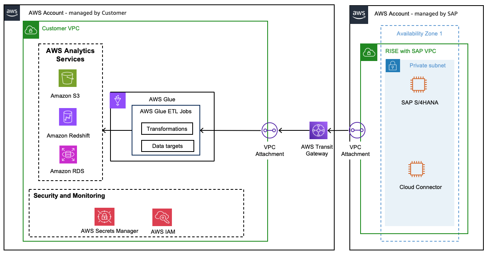

# Replicating data using AWS Services

**AWS Glue**

[AWS Glue](https://aws.amazon.com/glue/ "https://aws.amazon.com/glue/") is a serverless data integration service that makes it easy for analytics users to discover, prepare, move, and integrate data from multiple sources. With AWS Glue, you can discover and connect to SAP using OData and manage your data in a centralized data catalog. You can visually create, run, and monitor extract, transform, and load (ETL) pipelines to load SAP data into your data lakes and data warehouses.

The [Connecting to SAP OData using Glue](../../../glue/latest/dg/connecting-to-data-sap-odata.md "../../../glue/latest/dg/connecting-to-data-sap-odata.md") user guide offers comprehensive instructions for setting up Glue ETL jobs, configuring SAP OData connections, and reading data from SAP, including handling incremental transfers.

[AWS Glue Zero-ETL](../../../glue/latest/dg/zero-etl-using.md "../../../glue/latest/dg/zero-etl-using.md") is a set of fully managed integrations by AWS that minimizes the need to build ETL data pipelines for common ingestion and replication use cases. It makes data available in Amazon SageMaker Lakehouse and Amazon Redshift from multiple operational, transactional, and application sources. Leveraging the SAP OData Connectors, you can create full data replication jobs from SAP, with fully managed replication (Inserts, updates and deletions) as well as schema evolution.

AWS Glue and Glue Zero-ETL serve distinct roles in data integration, with each offering unique advantages for different use cases. While AWS Glue excels in complex ETL operations, data discovery, preparation, and extraction, particularly for specialized scenarios like SAP ODP-based replication. AWS Glue Zero-ETL is designed as a more streamlined, no-code solution for fully managed data replication scenarios.

AWS Glue requires more hands-on management, including code deployment and maintenance, but offers greater flexibility and control over data transformation processes. AWS Glue performance is enhanced by its serverless, scale-out Apache Spark environment, which allows you to allocate Data Processing Units (DPUs) for scalable compute. This allows parallel processing and event-driven execution.
