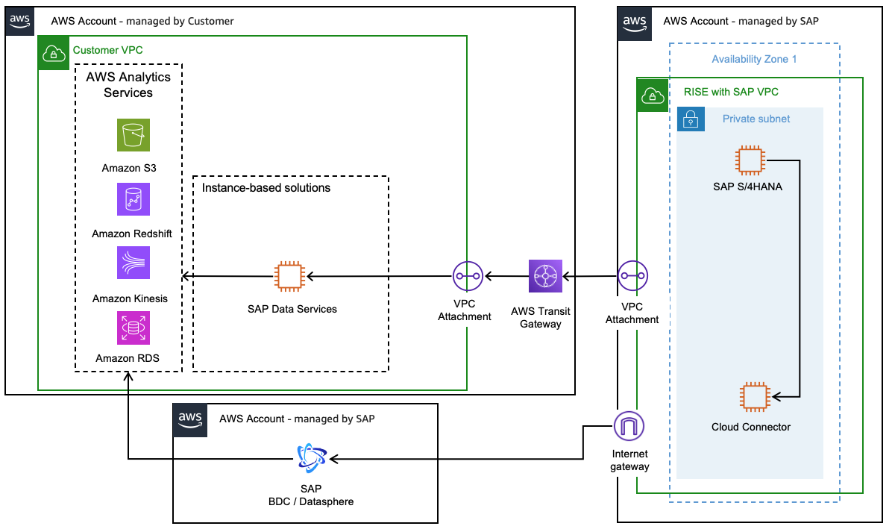

# Replicating data using SAP services

**SAP BDC / Datasphere**

[SAP Datasphere](https://www.sap.com/products/data-cloud/datasphere.html "https://www.sap.com/products/data-cloud/datasphere.html") offers various connection types such as SAP ABAP Connections, SAP ECC Connections, SAP S/4HANA Cloud Connections supporting RFC and ODP protocols. Refer to [SAP BDC / Datasphere documentation](https://help.sap.com/docs/SAP_DATASPHERE/be5967d099974c69b77f4549425ca4c0/eb85e157ab654152bd68a8714036e463.html "https://help.sap.com/docs/SAP_DATASPHERE/be5967d099974c69b77f4549425ca4c0/eb85e157ab654152bd68a8714036e463.html") to choose most appropriate connectivity to replicate SAP data. Using [premium outbound integration for [Amazon Simple Storage Connection (Amazon S3)](https://help.sap.com/docs/SAP_DATASPHERE/be5967d099974c69b77f4549425ca4c0/a7b660a0a4ef4a4fbee57b44f5b2147d.html "https://help.sap.com/docs/SAP_DATASPHERE/be5967d099974c69b77f4549425ca4c0/a7b660a0a4ef4a4fbee57b44f5b2147d.html"), configure SAP Datasphere replication flow to ingest data to Amazon S3.

**SAP Data Services**

[SAP Data Services](https://www.sap.com/products/technology-platform/data-services.html "https://www.sap.com/products/technology-platform/data-services.html") offer various connections to replicate data from SAP ECC data. Refer to [SAP Data Services documentation](https://help.sap.com/docs/SAP_DATA_SERVICES "https://help.sap.com/docs/SAP_DATA_SERVICES") to choose most appropriate connectivity. SAP Data Services offers [Amazon Redshift Datastore](https://help.sap.com/docs/SAP_DATA_SERVICES/af6d8e979d0f40c49175007e486257f0/731d7026ae3b4fef9ebadfbe23ffff12.html "https://help.sap.com/docs/SAP_DATA_SERVICES/af6d8e979d0f40c49175007e486257f0/731d7026ae3b4fef9ebadfbe23ffff12.html") and [Amazon S3 datastore](https://help.sap.com/docs/SAP_DATA_SERVICES/af6d8e979d0f40c49175007e486257f0/e1ed075446344b5ca098e2382cfca78d.html "https://help.sap.com/docs/SAP_DATA_SERVICES/af6d8e979d0f40c49175007e486257f0/e1ed075446344b5ca098e2382cfca78d.html") to ingest data to AWS. It also offers options for [Amazon S3 file location protocol](https://help.sap.com/docs/SAP_DATA_SERVICES/af6d8e979d0f40c49175007e486257f0/a611106693ea422eb0b04705298516b7.html "https://help.sap.com/docs/SAP_DATA_SERVICES/af6d8e979d0f40c49175007e486257f0/a611106693ea422eb0b04705298516b7.html") such as encryption type, compression type, batch-size, number of threads, Amazon S3 storage class, etc.
