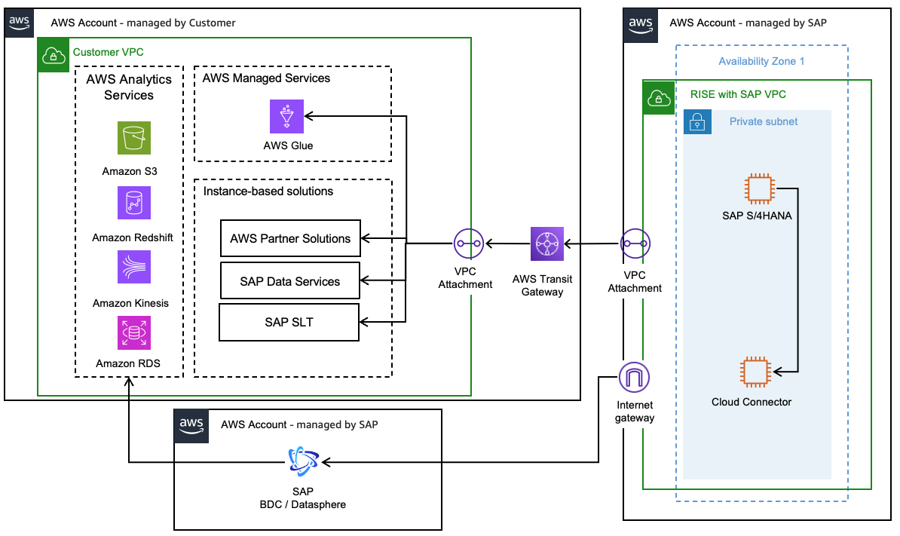

# Data Replication

Data Replication from SAP is a crucial step in making the data usable for reporting, analysis, and integration with other systems. Below is the reference architecture on how this can be done in AWS.

