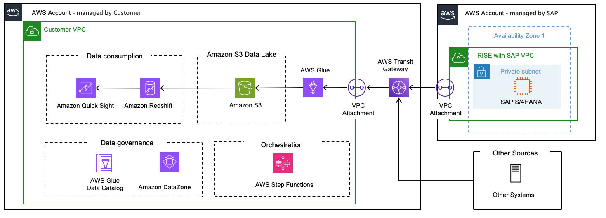
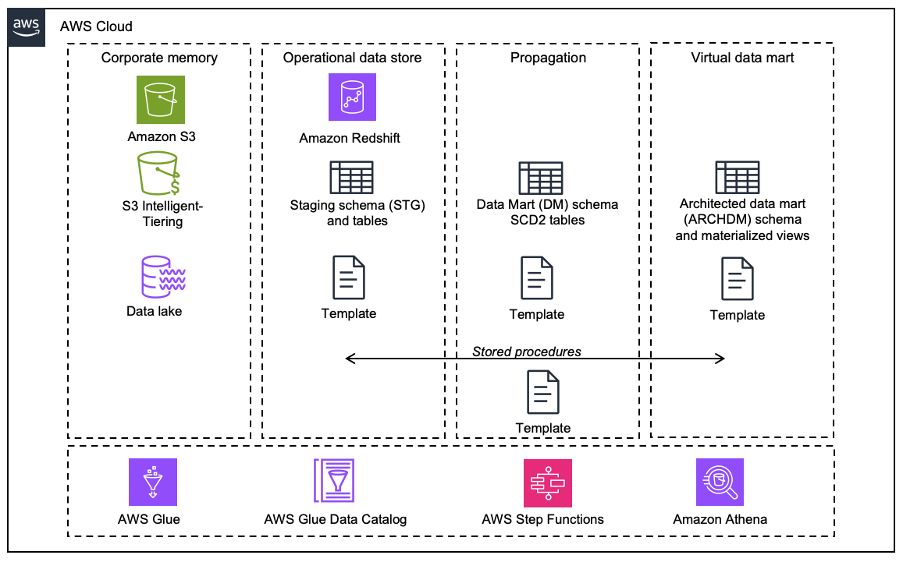

# Data Warehouse Architecture

A [Data Warehouse](https://aws.amazon.com/what-is/data-warehouse/ "https://aws.amazon.com/what-is/data-warehouse/") is a centralized repository based on “schema-on-write” approach that aggregates structured, historical data from multiple sources (both SAP and non-SAP) to enable advanced analytics, reporting, and business intelligence (BI). It enables organizations to analyze vast amounts of integrated data for informed decision-making, using optimized architectures for complex queries rather than transactional processing.

Business analysts, data engineers, data scientists, and decision-makers utilize business intelligence (BI) tools, SQL clients, and other analytics applications to access data warehouse. The architecture comprises tiers: a front-end client for presenting results, an analytics engine for data access and analysis, and a database server for data loading and storage.

Data is stored in tables and columns within databases, organized by schemas. Data warehouses consolidate data from multiple sources, enabling historical data analysis and ensuring data quality, consistency, and accuracy. Separating analytics processing from transactional databases enhances the performance of both systems, supporting reports, dashboards, and analytics tools by efficiently storing data to minimize I/O and deliver rapid query results to numerous concurrent users.

Key Characteristics

- Integrated: Consolidates data from disparate sources (e.g., CRM, ERP) into a unified schema, resolving inconsistencies in formats or naming conventions.
- Time-variant: Tracks historical data, allowing trend analysis over months or years.
- Subject-oriented: Organized around business domains like sales or inventory, rather than operational processes.
- Non-volatile: Data remains static once stored; updates occur via scheduled Extract, Transform, Load (ETL) processes rather than real-time changes.
- Price-optimized: SAP and non-SAP data is stored in a cost-optimized architecture.
  Architecture Components

- ETL Tools: Automate data extraction from sources, transformation (cleaning and standardizing), and loading into the warehouse.
- Storage Layer:
  - Relational databases for structured data
  - OLAP (Online Analytical Processing) cubes for multidimensional analysis

- Metadata: Describes data origins, transformations, and relationships.
- Access Tools: SQL clients, BI platforms, and machine learning interfaces.

Data warehouses utilize a layered architecture to organize data at different levels of granularity, which helps ensure consistency and flexibility. The most common data warehouse architecture layers are the source, staging, warehouse, and consumption layers. SAP systems also employ a layer-based architecture for data warehouses. In the context of building a SAP cloud data warehouse on AWS. the architecture involves several key layers and components for data acquisition, storage, transformation, and consumption.

**Corporate Memory**

Amazon S3 Intelligent-Tiering is a storage class that automatically optimizes storage costs by moving data between access tiers based on changing access patterns. This ensures that frequently accessed data is readily available, while less frequently accessed or "colder" data is stored at a lower cost tier. For more details, you can refer to [Amazon S3 Storage Classes](https://aws.amazon.com/s3/storage-classes/#topic-0 "https://aws.amazon.com/s3/storage-classes/#topic-0").

**Operational Data Storage Layer**

Amazon Redshift is utilized for operational data storage, propagation, and data mart functionalities. Scripts are provided to create schemas and deploy Data Definition Language (DDL) with the necessary structures to load SAP source data. These DDLs can be customized to include SAP-specific fields.

**Data Propagation Layer**

Delta data loaded into S3 via Glue job is used to generate Slowly Changing Dimension Type 2 (SCD2) tables, which maintain a complete history of changes.

**Data Mart Layer**

Architected data mart models are created using Materialized Views in Redshift. Transactional data is enriched with master data (attributes and text), building data models that are ready for data consumption.

The [Building SAP Data Warehouse on AWS Solution Guidance](https://aws.amazon.com/solutions/guidance/building-a-sap-cloud-data-warehouse-on-aws/ "https://aws.amazon.com/solutions/guidance/building-a-sap-cloud-data-warehouse-on-aws/") provides a detailed architecture, steps to implement and accelerators to fast track the implementation of a Data Warehouse for SAP.
