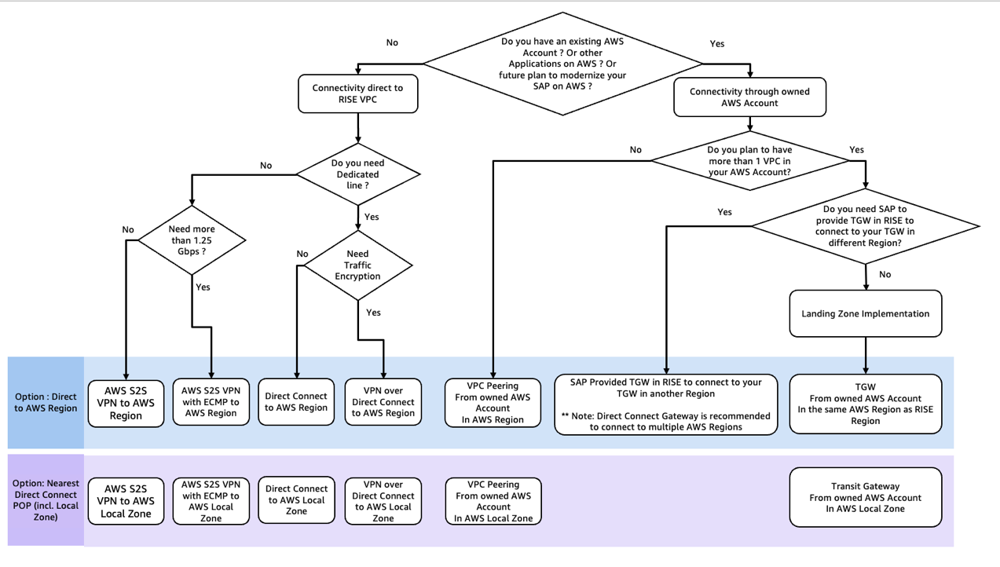

# Decision tree on connectivity to RISE

You must establish required connectivity to proceed with RISE with SAP on AWS. The following are a few connectivity patterns described in the preceding sections:

- direct to RISE VPC, supported with Site-to-Site VPN
- direct to RISE VPC, supported with Direct Connect
- connectivity through your AWS account via VPC Peering
- connectivity through Transit Gateway, supporting multi-account deployments
- connectivity through SAP-managed Transit Gateway supporting multi-account deployments
  You must also consider if you want to connect:

- directly to an AWS Region where the RISE with SAP VPC is going to be deployed
- or through AWS Local Zone (nearest AWS Direct Connect POP) to benefit from lower setup and running costs, with the same or lower network latency to connect to your RISE with SAP VPC
  The decision tree displayed in the following diagram helps you decide which connectivity is suitable based on your requirements, such as future plan of additional AWS or RISE accounts, dedicated line (security, performance), and bandwidth needs.

Note:

1. ECMP requires Transit Gateway for S2S VPN.
2. Direct Connect Gateway is recommended to connect to multiple AWS regions. This simplifies the connectivity setup and avoids TGW peering between AWS regions.
