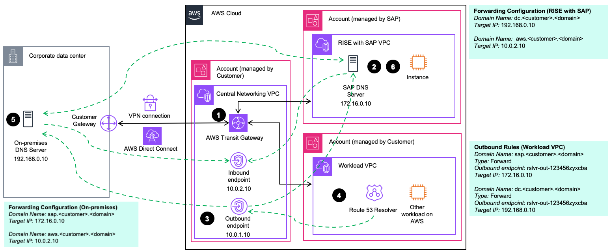
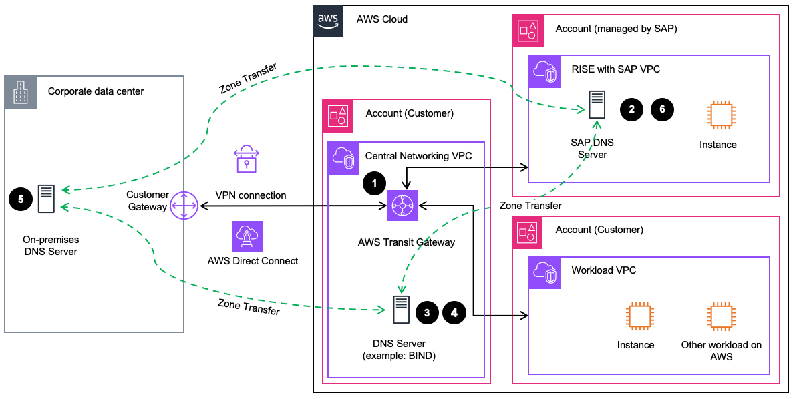
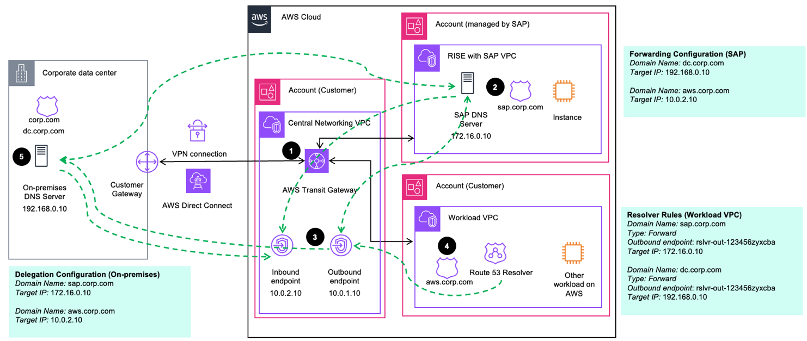
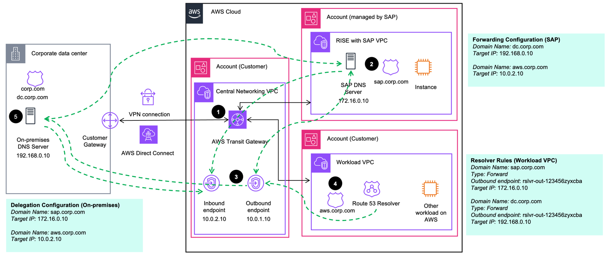

# Integrating DNS to RISE and Route 53

This documentation offers guidance on Domain Name System (DNS) integration options for “RISE with SAP” deployments on AWS, focusing on enterprise scenarios where customers want to enable name resolution between RISE with SAP workloads and their existing workloads across AWS and external environments.

A bi-directional DNS integration is essential for connecting RISE with SAP systems to various AWS cloud and on-premises resources and enterprise infrastructure. In manufacturing environments, a common use case involves connecting SAP applications to shop floor equipment. For example, SAP might need to communicate with printers located on the production floor to generate labels, work orders, or shipping documents. This requires the ability to resolve internal hostnames like “printer-line1.factory.company.local” within the RISE with SAP environment.

Conversely, external systems and applications usually require a DNS lookup to access resources in the RISE with SAP environment, particularly when calling ODATA API endpoints to execute business transactions such as generating a work orders.
Integration scenarios between RISE with SAP systems and existing enterprise systems typically require internal network connectivity due to compliance and security requirements. This is particularly true for RISE with SAP deployments, which is why the following sections focus on DNS resolution within private networks.

Integration scenarios between RISE with SAP systems and existing enterprise systems typically require internal network connectivity due to compliance and security requirements. This is particularly true for RISE with SAP deployments, which is why the following sections focus on DNS resolution within private networks.

**Architectural options**

When integrating RISE with SAP with your existing DNS setup, you have two primary architectural options, which is Conditional DNS Forwarding and DNS Zone Transfer. You also have to consider DNS Zone Delegation aspect. These options and considerations are designed for AWS-only deployments and hybrid scenarios where AWS connects with external environments (e.g. on-premises or another cloud provider).

The selection of a DNS integration architecture depends on your service reliability needs, existing DNS infrastructure capabilities, and acceptable operational complexity level, with managed services generally demanding less maintenance and expertise than self-operated DNS infrastructure.

For DNS integration with RISE with SAP, we recommend implementing conditional DNS forwarding with [Amazon Route 53](https://aws.amazon.com/route53/ "https://aws.amazon.com/route53/") resolver endpoints. Route 53 provides a highly available, scalable DNS service that minimizes operational overhead. This approach eliminates the need to setup and operate your own DNS servers, further reducing operational complexity.
Furthermore, Route 53 offers straightforward integration with your existing environments and monitoring capabilities through Amazon CloudWatch. However, if you have specific requirements or technical limitations, you can refer to alternative approaches detailed in subsequent sections.

The recommended DNS segregation pattern is to implement dedicated subdomains for each environment (e.g., aws.corp.com, dc.corp.com, and sap.corp.com), keeping DNS resolution local to each environment with conditional cross-environment forwarding. This approach optimizes performance by keeping local DNS requests within their respective environments, reducing latency, and improving system resilience while simplifying DNS management. It’s particularly effective in reducing the impact of network link failures between environments.

**Common Infrastructure Requirements**

Before implementing DNS integration approach, ensure the following prerequisites are in place (see also subsequent diagrams):

1. Network Connectivity: AWS Transit Gateway (or Cloud WAN or VPC Peering) connecting external environments through AWS Direct Connect or AWS Site-to-Site VPN, your AWS environment, and the RISE with SAP VPC.
2. Domain Delegation: During RISE with SAP setup, SAP requires delegation of a sub-domain (sap.<customer>.<domain>) to RISE DNS servers in the RISE with SAP VPC. This enables end users and applications to access RISE with SAP systems through your organization’s domain.

**Conditional DNS Forwarding (recommended approach)**

Conditional DNS Forwarding allows for selectively forwarding queries for specific domain names to another DNS server for resolution (e.g. Amazon Route 53 forwards DNS queries of sap.corp.com to RISE DNS Servers). We recommend implementing conditional DNS forwarding, unless technical constraints prevent this approach. The primary advantage of this approach is that customers can leverage Route 53 instead of setting up and operating own DNS infrastructure on AWS. This results in a simplified integration path while benefiting from Route 53 highly available and reliable global infrastructure.

The reference architecture below outlines the components needed for this approach:

1.  Network Connectivity: refer to Common Infrastructure Requirements
2.  Domain Delegation: refer to Common Infrastructure Requirements
3.  Create Route 53 resolver endpoints (Inbound and Outbound) in your central Networking VPC to handle DNS queries between your AWS accounts and RISE with SAP account. Please follow [the best practices for operating Resolver endpoints](../../../Route53/latest/DeveloperGuide/best-practices-resolver.md "../../../Route53/latest/DeveloperGuide/best-practices-resolver.md"). We recommend deploying multiple endpoints across all availability zones and monitoring their utilization in CloudWatch to allow for proactive scaling. Provide SAP with details of your on-premises DNS server and the IP addresses of your Route 53 Resolver endpoints (needed for forwarding and firewall configuration).
4.  Configure the Route 53 Resolver rules in your workload VPCs to forward DNS queries as follows:
    1. SAP-bound DNS queries: Forward to Outbound endpoint to resolve queries through SAP DNS servers
    2. Corporate data center-bound DNS queries: Forward to Outbound endpoint to resolve queries through on-premises DNS servers

5.  Configure your on-premises DNS server to forward DNS queries as follows:
    1. SAP-bound queries: Forward to the SAP DNS server (alternatively, zone transfer of sap.<customer>.<domain> from SAP DNS server)
    2. AWS-bound queries: Forward to the Inbound endpoint

6.  SAP DNS servers are configured as follows:

        1. Corporate data center-bound DNS queries: Forward to on-premises DNS server
        2. AWS-bound DNS queries: Forward to the Inbound endpoint

    Ensure your Workload VPCs have all relevant resolver rules associated with them for DNS forwarding through your central Networking VPC. We recommend using Route 53 Profiles to manage these configurations, as they enable consistent DNS settings across multiple VPCs and AWS accounts. This approach simplifies DNS management by allowing you to define and apply standardized DNS configurations throughout your AWS infrastructure.

Please note that for DNS resolution in hybrid environments, DNS delegation can be an alternative approach to conditional forwarding. While conditional forwarding is generally recommended for RISE with SAP environments, DNS delegation might be beneficial in specific scenarios, particularly in environments with many distributed DNS resolvers without a centralized upstream resolver. However, for scenarios involving SAP DNS servers, additional technical considerations apply as outlined in the DNS Zone Delegation section.

**DNS Zone Transfer**

With zone transfers, the DNS database of an authoritative DNS server is replicated across a set of secondary DNS servers. You can implement zone transfers directly between your on-premises DNS servers and the SAP DNS servers in your RISE environment. However, if you want to extend zone transfers to include your AWS DNS namespace (e.g., aws.<customer>.<domain>) for communication between on-premises and your Workload VPCs, you’ll need to operate your own DNS servers (such as BIND) in your AWS environment. This is because Route 53 doesn’t support zone transfers. Keep in mind that this approach increases operational complexity compared to using Route 53 with DNS forwarding.

Please consult your SAP Cloud Architect or your AWS Account Team for details on this approach. For best practices regarding running your own BIND DNS server, please refer to [this link](https://kb.isc.org/docs/bind-best-practices-authoritative "https://kb.isc.org/docs/bind-best-practices-authoritative").

The following diagram shows a reference architecture for integrating the RISE environment with your existing DNS landscape ( on-premises / AWS ) through zone transfers.

1. Network Connectivity: refer to Common Infrastructure Requirements
2. Domain Delegation: refer to Common Infrastructure Requirements
3. Setup a central DNS server in your Networking VPC (e.g. BIND on EC2) or decentralized in each Workload VPC by [modifying VPC DHCP options sets accordingly](../../../vpc/latest/userguide/VPC_DHCP_Options.md "../../../vpc/latest/userguide/VPC_DHCP_Options.md"). Please provide SAP with the details of your on-premises DNS Server and the AWS-hosted DNS servers (needed for zone transfer and firewall configuration).
4. Configure your AWS-hosted DNS server as follows:
   1. SAP-bound queries: Zone transfer of sap.<customer>.<domain> from SAP DNS server
   2. Data center-bound queries: Zone transfer of dc.<customer>.<domain> from on-premises DNS server

5. Configure the on-premises DNS server as follows:
   1. SAP-bound DNS queries: Zone transfer of sap.<customer>.<domain> from SAP DNS server
   2. AWS-bound DNS queries: Zone transfer of aws.<customer>.<domain> from AWS-hosed DNS server

6. SAP DNS servers are configured as follows:
   1. Customer data center-bound DNS queries: Zone transfer of dc.<customer>.<domain> from on-premises DNS server
   2. AWS-bound DNS queries: Zone transfer of aws.<customer>.<domain> from AWS-hosed DNS server

**DNS Zone Delegation**

For customers operating many DNS resolvers distributed across multiple environments without a centralized DNS resolver service, configuring and maintaining DNS forwarding rules or zone transfers can become operationally challenging. DNS zone delegation allows you to define authority for specific subdomains at a single point in the DNS hierarchy, simplifying DNS management across your infrastructure.

Using Amazon Route 53 Resolver endpoints with DNS delegation enables you to build and maintain a unified private DNS namespace spanning on-premises and AWS environments.

However, zone delegation with SAP DNS servers in RISE environments comes with specific technical considerations. Without a centralized upstream resolver, zone delegation to SAP DNS servers increases concurrent query load due to reduced cache efficiency. Additionally, all DNS resolvers require direct network paths to SAP DNS servers, potentially requiring additional connectivity configurations. Please consult with SAP ECS before implementing this approach.

There are 2 main scenarios:

**Scenario 1. Parent domain in Route 53 on AWS**

For customers who run the majority of their workloads in the cloud and operate their private DNS root zone on AWS with Route 53, you can delegate subdomains to external DNS servers. This includes delegating to both SAP DNS servers (e.g., sap.corp.com) and on-premises DNS servers (e.g., dc.corp.com).

1. Network Connectivity: refer to Common Infrastructure Requirements
2. Domain Delegation: refer to Common Infrastructure Requirements
3. Set up Route 53 Resolver endpoints (Inbound and Outbound) in your central Networking VPC
4. Configure the IPs of your on-premises and SAP DNS servers as NS records in the Private Hosted Zone (PHZ) of your parent domain (e.g. corp.com) and associate the PHZ with your Workload VPCs ([Route 53 Profiles](../../../Route53/latest/DeveloperGuide/profiles.md "../../../Route53/latest/DeveloperGuide/profiles.md") can help with the management of PHZ associations and resolver rules). If your DNS servers are part of the same domain (e.g. ns.dc.corp.com), you also need to configure [glue records](../../../Route53/latest/DeveloperGuide/domain-name-servers-glue-records.md "../../../Route53/latest/DeveloperGuide/domain-name-servers-glue-records.md") in the parent domain. Create Route 53 Resolver delegation rules for the relevant subdomains (dc.corp.com) and associate them with your Workload VPCs (see diagram above).
5. Configure conditional DNS forwarding at your on-premises resolvers to allow for resolution of the parent domain and SAP domain (SAP will need to do the same on their side)

**Scenario 2. Parent domain on-premises**

For customers who are in the beginning of their cloud journey and still maintain their root zone on-premises, DNS delegation provides an efficient way to integrate both SAP and AWS environments while maintaining DNS control on-premises.

1. Network Connectivity: refer to Common Infrastructure Requirements
2. Domain Delegation: refer to Common Infrastructure Requirements
3. Set up Route 53 Resolver endpoints (inbound and outbound) in your central Networking VPC
4. Configure a PHZ for aws.corp.com and associate it your central Networking and Workload VPCs. Configure conditional DNS forwarding rules to allow your VPC to resolve queries for workloads on-premises and your RISE with SAP systems (SAP will need to do the same on their side).
5. Update the corp.com zone with delegation (NS) records for sap.corp.com and aws.corp.com (for example ns1.corp.com) in your domain’s authoritative nameserver on-premises.
   Configure IPs of your AWS Route 53 Resolver inbound endpoint and SAP DNS servers as target records in your ns1.corp.com zone file. If your DNS servers are part of the same domain, you also need to configure glue records in the parent domain.

Please consult the Route 53 documentation for more details on the zone delegation feature. The following blog post provides you with a more in-depth step-by-step guide on how to make use of Route 53 delegation feature for private DNS: [Streamline hybrid DNS management using Amazon Route 53 Resolver endpoints delegation](https://aws.amazon.com/blogs/networking-and-content-delivery/streamline-hybrid-dns-management-using-amazon-route-53-resolver-endpoints-delegation/ "https://aws.amazon.com/blogs/networking-and-content-delivery/streamline-hybrid-dns-management-using-amazon-route-53-resolver-endpoints-delegation/").

For more information on the above described integration approaches, please reach out to your SAP Cloud Architect or your AWS Account Team.
