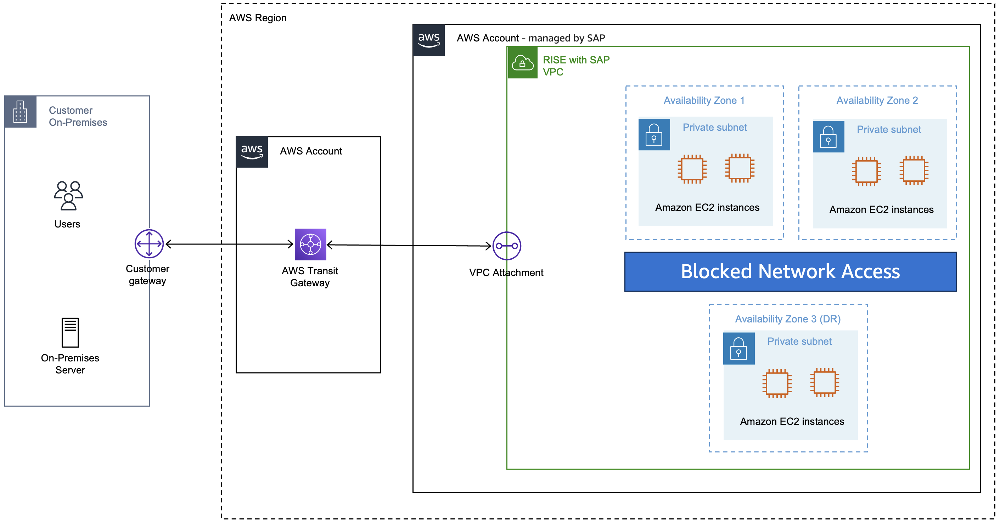
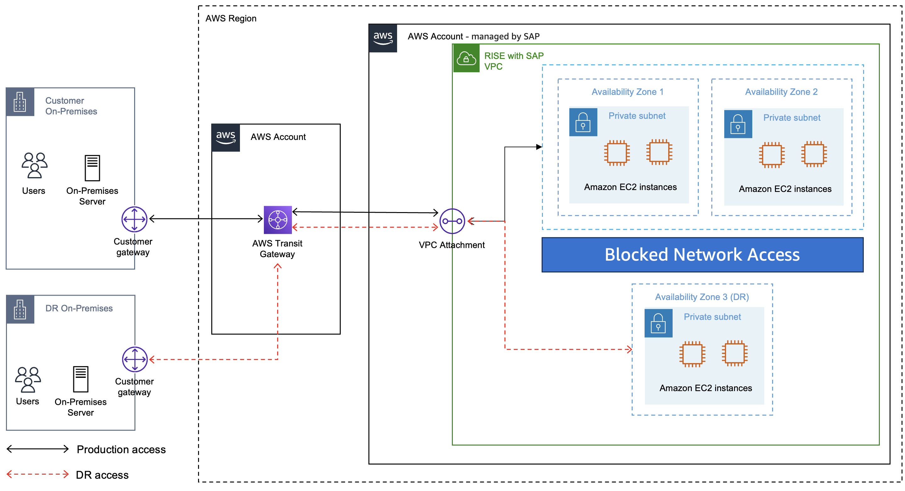

# Fenced (Live) DR Testing

Fenced DR Testing is a disaster recovery testing capability for RISE with SAP customers using Long Distance Disaster Recovery (LDDR) or Short Distance Disaster Recovery (SDDR). It uses network isolation to create a segregated testing environment where production and DR systems operate simultaneously, eliminating the need for planned downtime during DR validation. The isolation is maintained at multiple layers, including network routing, DNS resolution, and application connectivity, which prevents cross-contamination between environments.

###### Note

AWS best practices recommend using multiple AWS Regions for disaster recovery. The term "Short Distance Disaster Recovery" (SDDR) is SAP-specific terminology used within the RISE with SAP context. In standard AWS terminology, deploying across multiple Availability Zones within a single Region provides high availability (HA), not disaster recovery. For more information about AWS disaster recovery strategies, see the [AWS Well-Architected Framework – Reliability Pillar](../../../wellarchitected/latest/reliability-pillar/welcome.md "../../../wellarchitected/latest/reliability-pillar/welcome.md").

###### Note

Fenced DR Testing is available in all AWS regions if you subscribe to RISE with SAP Long Distance Disaster Recovery (LDDR) or Short Distance Disaster Recovery (SDDR).

## Benefits of fenced DR Testing

### Zero Production Impact

- Test DR failover without production downtime
- Eliminates the multi-hour outage window typically required for DR testing
- Business operations continue uninterrupted during testing

### Complete Network Isolation

- Production and DR environments operate in isolated network segments using routing controls
- Maintains strict separation of DNS namespaces and IP address ranges

### End-to-End Integration Testing

- Test complete disaster recovery scenarios including on-premises system integration
- Validate network connectivity paths, data replication mechanisms, and application failover procedures
- Verify recovery time objectives (RTO) and recovery point objectives (RPO) under realistic conditions
- Conduct full application stack testing including SAP application servers, databases, and supporting infrastructure

### Operational Readiness

- Prepare operations teams to execute disaster recovery procedures
- Identify and resolve issues before an actual disaster occurs
- Document and refine recovery procedures based on test results
- Establish baseline performance metrics for recovery operations

## Architecture Overview

Fenced DR Testing creates a parallel network environment that mirrors your production topology while maintaining isolation. The architecture includes:

- **Network Segmentation**: Dedicated subnets and routing tables for the DR test environment
- **DNS Isolation**: Separate DNS resolution to prevent production traffic from reaching test systems
- **Traffic Control**: Network access control lists (ACLs) and security groups ensuring traffic separation
- **Monitoring Integration**: Observability of both production and test environments during validation

## LDDR Fenced Testing

Long Distance Disaster Recovery (LDDR) Fenced Testing allows you to validate your DR environment without disrupting production. During a fenced test, the DR system in the standby AWS Region is isolated from production. Your primary system continues to run normally in the primary Region, including local high-availability replication across Availability Zones. While the test is active, replication to the standby Region is paused, meaning there is no cross-region protection during this window; a regional failure could result in data loss. After testing is complete, replication resumes automatically and the DR system re-synchronizes with production.

There are two scenarios for LDDR DR testing:

### LDDR Internal Fencing

Production and DR sites remain accessible to you with complete network isolation between sites.

The following diagram shows the network topology for LDDR Internal Fencing.

You must configure network separation on-premises to isolate the DR landscape, to prevent accidental access to production during DR testing. This scenario allows you to perform end-to-end DR testing, for example third-party interfaces and authentication (SSO, LDAP, Kerberos).

### LDDR Complete Fencing

DR site is completely isolated; you provide specific IPs for testing team access to fenced environment.

The following diagram shows the network topology for LDDR Complete Fencing.

The DR site is completely isolated from both the production SAP RISE systems and external networks. You must provide specific IP addresses or ranges for testing team access to the isolated DR systems. Testing IPs will have access to both primary and DR sites, so teams must carefully verify which environment they are working in during tests. No data replication occurs between sites during DR testing, preventing production users from accidentally accessing the DR environment.

## SDDR Fenced Testing

Short Distance Disaster Recovery (SDDR) Fenced Testing allows you to validate your DR environment within a single AWS Region. During a fenced test, an isolated DR system is used in a third Availability Zone (AZ3), separate from your production workloads. Your primary system continues to operate normally in AZ1, and high-availability replication to AZ2 remains active and unaffected. While the test is running, replication to the fenced system in AZ3 is paused. After testing is complete, replication resumes and the DR system re-synchronizes automatically.

The same two scenarios apply to SDDR.

### SDDR Internal Fencing

Similar to LDDR Internal Fencing, Production in AZ1/AZ2 and DR (AZ3) remain accessible to you with complete network isolation between Production and DR sites. No cross-traffic between AZ1/AZ2 and AZ3.

You configure on-premises network separation to prevent accidental DR access during testing.

The following diagram shows the network topology for SDDR Internal Fencing.

### SDDR Complete Fencing

Similar to LDDR Complete Fencing, DR site is completely isolated; you provide specific IPs for testing team access to fenced environment.

The following diagram shows the network topology for SDDR Complete Fencing.

The DR site is completely isolated from both the production SAP RISE systems and external networks. You must provide specific IP addresses or ranges for testing team access to the isolated DR systems. Testing IPs will have access to both primary and DR sites, so teams must carefully verify which environment they are working in during tests. No data replication occurs between sites during DR testing, preventing production users from accidentally accessing the DR environment.

We recommend that you coordinate with SAP on DR test procedures, as you might have existing DR Standard Operating Procedures (SOPs) that can be adapted. As part of the DR test preparation, create a Responsible, Accountable, Consulted, and Informed (RACI) matrix for all parties involved, that is, you, your vendors, and SAP.
