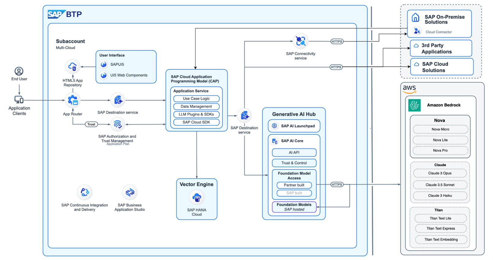
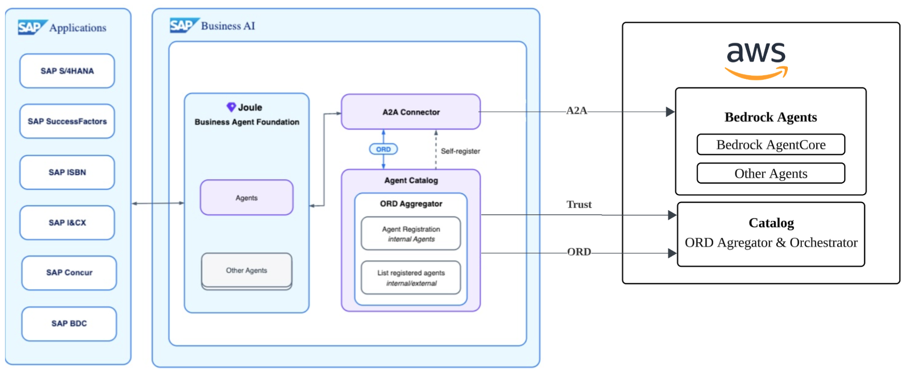

# Artificial Intelligence

[Amazon Bedrock](https://aws.amazon.com/bedrock/ "https://aws.amazon.com/bedrock/") and [SAP Generative AI Hub](https://help.sap.com/docs/ai-launchpad/sap-ai-launchpad/generative-ai-hub "https://help.sap.com/docs/ai-launchpad/sap-ai-launchpad/generative-ai-hub") combine through Joint Reference Architecture (JRA) to provide enterprise-grade AI capabilities for RISE with SAP environments. This integration addresses the need for intelligent process automation while maintaining system security and clean core principles.

Amazon Bedrock serves as the foundational AI service layer, providing managed access to various foundation models including Anthropic Claude and Amazon Nova. The service enables organizations to fine-tune these models with proprietary data and implement Retrieval Augmented Generation (RAG) within a secure computing environment.

SAP Generative AI Hub complements this foundation by providing enterprise-specific governance and control mechanisms. The hub manages model selection, knowledge base indexing, and retrieval operations while enforcing necessary safety guardrails and risk controls. This ensures AI deployments remain compliant with enterprise standards and business requirements.

In this documentation, we will focus into JRA aspect as these components create a robust framework for implementing AI capabilities across SAP processes and AWS services, from customer order management to production design, while maintaining enterprise security and reliability standards.

**AWS-SAP Joint Reference Architecture in Generative AI**

Key components from the architecture:

- [Amazon Bedrock](https://aws.amazon.com/bedrock/ "https://aws.amazon.com/bedrock/") is a service that provides access to various Foundational Models (FMs) through API interfaces. It features models like [Amazon Titan](https://aws.amazon.com/bedrock/amazon-models/titan/ "https://aws.amazon.com/bedrock/amazon-models/titan/"), [Amazon Nova](https://aws.amazon.com/ai/generative-ai/nova/ "https://aws.amazon.com/ai/generative-ai/nova/") and [Anthropic Claude](https://www.anthropic.com/claude "https://www.anthropic.com/claude"), which are comprehensive new generation FMs with industry leading price performance. These models are versatile and can handle many different applications.
- [SAP AI Core](https://www.sap.com/india/products/artificial-intelligence/ai-core.html "https://www.sap.com/india/products/artificial-intelligence/ai-core.html") with [Generative AI Hub](https://help.sap.com/docs/sap-ai-core/sap-ai-core-service-guide/generative-ai-hub-in-sap-ai-core "https://help.sap.com/docs/sap-ai-core/sap-ai-core-service-guide/generative-ai-hub-in-sap-ai-core") provides customers access to AI capabilities, including FMs, and offers standardized interfaces for SAP BTP applications. It serves as a management layer that controls access to Bedrock and creates endpoints for applications to utilize FMs. Generative AI Hub enforces centralized safety controls and risk mitigation measures to ensure secure and compliant AI in enterprise deployment. For further details on the SAP’s Generative AI Hub supported models through Bedrock, please refer to [SAP Note 3437766](https://me.sap.com/notes/3437766 "https://me.sap.com/notes/3437766").
- [SAP HANA Cloud](https://discovery-center.cloud.sap/serviceCatalog/sap-hana-cloud?region=all "https://discovery-center.cloud.sap/serviceCatalog/sap-hana-cloud?region=all") as database management with [vector engine support](https://help.sap.com/docs/hana-cloud-database/sap-hana-cloud-sap-hana-database-vector-engine-guide/introduction?locale=en-US "https://help.sap.com/docs/hana-cloud-database/sap-hana-cloud-sap-hana-database-vector-engine-guide/introduction?locale=en-US") for RAG implementation that can be used for grounding capabilities by efficiently finding and fetching relevant business documents that relate to specific questions or tasks. This information is then used as context for the foundational model by enhancing its ability to provide accurate and context-specific responses.
- [SAP Cloud Application Programming (CAP)](https://pages.community.sap.com/topics/cloud-application-programming "https://pages.community.sap.com/topics/cloud-application-programming") Model is a development framework that provides a structured approach to enterprise services and applications. CAP simplifies development by providing integrated frameworks with [SAP UI5](https://sapui5.hana.ondemand.com/ "https://sapui5.hana.ondemand.com/") frontend.
- [SAP Identity Provisioning Services](https://help.sap.com/docs/identity-provisioning "https://help.sap.com/docs/identity-provisioning") is used for authentication and access management to secure the delivery of these AI capabilities.
  The above diagram provides reference architecture for consuming generative AI capabilities of Amazon Bedrock with SAP Generative AI Hub. Using this, SAP workloads can now be supplemented with Foundational Models to harness the power of SAP data, resulting in improved business insights and operational efficiencies at a lower cost.

You can find out more from SAP Architecture Center under [Generative AI and SAP BTP](https://architecture.learning.sap.com/docs/ref-arch/e5eb3b9b1d "https://architecture.learning.sap.com/docs/ref-arch/e5eb3b9b1d").

**AWS-SAP Joint Reference Architecture in Agent2Agent**

Key components from the architecture:

- [Amazon Bedrock Agents](https://aws.amazon.com/bedrock/ "https://aws.amazon.com/bedrock/") is a service that provides capability of reasoning of foundation models, APIs and data to break down user requests, gathers relevant information, and efficiently completes tasks. With its multi-agent collaboration, it allows developers to build, deploy, and manage multiple specialized agents seamlessly working together to address increasingly complex business workflows.
- [Amazon Bedrock AgentCore](https://aws.amazon.com/bedrock/agentcore/ "https://aws.amazon.com/bedrock/agentcore/") enables you to deploy and operate highly capable AI agents securely, at scale. AgentCore services can be used together or independently and work with any framework including CrewAI, LangGraph, LlamaIndex, and Strands Agents, as well as any foundation model in or outside of Amazon Bedrock, giving you ultimate flexibility. AgentCore eliminates the undifferentiated heavy lifting of building specialized agent infrastructure, so you can accelerate agents to production.
  You can find out more from SAP Architecture Center under [Agent2Agent (A2A) Interoperability in Enterprise AI](https://architecture.learning.sap.com/docs/ref-arch/e5eb3b9b1d/8 "https://architecture.learning.sap.com/docs/ref-arch/e5eb3b9b1d/8").
