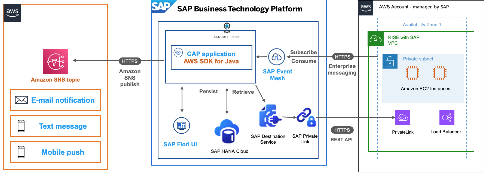
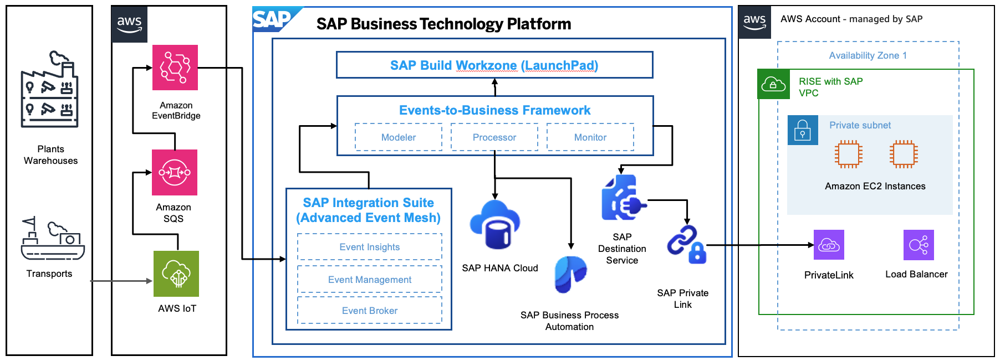
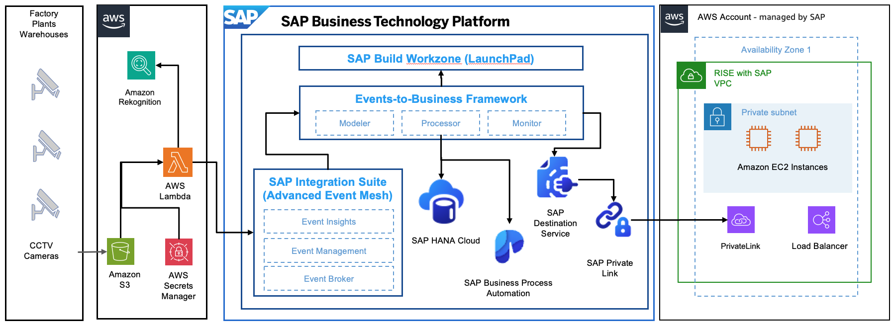

# Custom Application

Custom applications are created by customers to address their unique business needs and challenges that cannot be fully met by off-the-shelf software solutions. Organizations often require specific functionality, workflows, or integrations that align precisely with their business processes, industry regulations, or competitive advantages. By developing custom applications, companies can maintain complete control over their software’s features, security requirements, and user experience while ensuring seamless integration with their existing systems and databases. Custom applications also allow businesses to adapt quickly to changing market conditions and scale their solutions as they grow, ultimately providing them with a tailored tool that directly supports their operational efficiency and strategic objectives.

When developing custom applications that interact with SAP systems, it’s crucial to adhere to [SAP’s clean core concept](https://www.sap.com/sea/products/erp/rise/methodology/clean-core.html "https://www.sap.com/sea/products/erp/rise/methodology/clean-core.html"), which emphasizes keeping the core SAP system as clean as possible while building extensions and customizations outside the core. This approach ensures long-term maintainability and reduces the total cost of ownership by making it easier to implement SAP updates, upgrades, and innovations without disrupting custom functionality. By leveraging [SAP Business Technology Platform (BTP)](https://www.sap.com/sea/products/technology-platform.html "https://www.sap.com/sea/products/technology-platform.html"), [AWS Cloud Services](https://aws.amazon.com/products/ "https://aws.amazon.com/products/") and following clean core principles, organizations can create side-by-side extensions, custom applications, and integrations that preserve system stability while maintaining the agility to adapt to changing business requirements. This architectural strategy enables businesses to benefit from both customization and standardization, ensuring their applications remain sustainable and future-proof within the SAP ecosystem.

Some of the key AWS Services that will help on this custom applications:

- [Amazon Simple Notification Service (Amazon SNS)](https://aws.amazon.com/sns/ "https://aws.amazon.com/sns/") is a web service that makes it easy to set up, operate, and send notifications from the cloud. It provides developers with a highly scalable, flexible, and cost-effective capability to publish messages from an application and immediately deliver them to subscribers or other applications. For example: you can send email to notify a failed delivery of goods, trigger an event based programs, and others.
- [Amazon Simple Queue Services (SQS)](https://aws.amazon.com/sqs/ "https://aws.amazon.com/sqs/") lets you send, store, and receive messages between software components at any volume, without losing messages or requiring other services to be available. For example: you can queue burst of high volume incoming messages for sequential processing.
- [Amazon EventBridge](https://aws.amazon.com/eventbridge "https://aws.amazon.com/eventbridge") is a service that provides [real-time access to changes](https://aws.amazon.com/eventbridge/integrations/ "https://aws.amazon.com/eventbridge/integrations/") in data in AWS services, your own applications, and software as a service (SaaS) applications without writing code. For example: you can trigger a near-real-time event based ordering through an API Gateway to external SaaS from SAP when an out-of-stock situation happened in a warehouse.
- [AWS SDK for ABAP](https://aws.amazon.com/sdk-for-sap-abap/ "https://aws.amazon.com/sdk-for-sap-abap/") simplifies the use of AWS services alongside SAP applications with a client library of modules that are consistent and familiar to ABAP developers. For example: you can use this to automatically check the mailing address validation in SAP Business Partner maintenance screen using Amazon Location Services.
- [AWS AI Services](https://aws.amazon.com/ai/services/ "https://aws.amazon.com/ai/services/"), such as : [Amazon Polly](https://aws.amazon.com/polly/ "https://aws.amazon.com/polly/") to turn text to lifelike speech, [Amazon Transcribe](https://aws.amazon.com/transcribe/ "https://aws.amazon.com/transcribe/") to convert speech to text, [Amazon Rekognition](https://aws.amazon.com/rekognition/ "https://aws.amazon.com/rekognition/") to extract information and insights from images and videos.
- For more AWS services that you can use, please refer to [this link](https://aws.amazon.com/products/?nc2=h_prod "https://aws.amazon.com/products/?nc2=h_prod").
  You can upskill yourself and your team members to [Build Resilient Applications on SAP BTP with Amazon Web Services](https://learning.sap.com/courses/build-resilient-applications-on-sap-btp-with-amazon-web-services "https://learning.sap.com/courses/build-resilient-applications-on-sap-btp-with-amazon-web-services") learning module which was jointly built by AWS and SAP.

In the following sections, we will cover architectural patterns and reference architectures that leverage SAP and AWS technologies to extend SAP processes while keeping the core clean.

**Event-Based Application**

In traditional business process architectures, systems often operate in silos, with tightly coupled components and rigid, predefined workflows. This approach struggles to keep pace with the dynamic nature of modern business environments. Event-based architecture emerged as a solution to these limitations, addressing several critical challenges.

With event-based architectures, you can implement end-to-end Business Processes by decoupling system components by using asynchronous communication. With this approach, you can implement a more resilient systems and business processes that can better handle network issues, service outages, and other disruptions following [AWS Well Architected Framework for SAP Lens](../../../wellarchitected/latest/sap-lens/sap-lens.md "../../../wellarchitected/latest/sap-lens/sap-lens.md").

Example of Event Based notification through Amazon SNS :

In the architecture above, a user updates a Business Partner in SAP S/4HANA, you can trigger the update event through SAP Event Mesh. The CAP Application that is enhanced with AWS SDK for Java to trigger the Amazon SNS topic which enables you to notify Data Owner for this change either through an email, text message and mobile push notification. You can find out more in [this github respository](https://github.com/SAP-samples/cloud-cap-amazon-sns-integration "https://github.com/SAP-samples/cloud-cap-amazon-sns-integration").

Example of Event Based notification through Amazon SQS and EventBridge, as well as [AWS IoT services](https://aws.amazon.com/iot/ "https://aws.amazon.com/iot/") :

In the architecture above, Event-Driven Integration Architectures: Leverages SAP BTP for Industry 4.0 scenarios, showcasing the versatility of SAP-AWS integration to support Predictive Maintenance scenario reducing downtime for your manufacturing line. This leverages AWS IoT Services, Amazon SQS as well as Amazon EventBridge to provide early sensor data such as speed, temperature, vibration, and others that will indicate the need of maintenance before any outage or downtime occurs for certain mechanism.

**Artificial Intelligence and Machine Learning Application**

Safety hazards in every workplace come in many different forms: sharp edges, falling objects, flying sparks, chemicals, noise, and other potentially dangerous situations. Safety regulators such as Occupational Safety and Health Administration (OSHA) and European Commission often require that businesses protect their employees and customers from hazards that can cause injury by providing them personal protective equipment (PPE) and ensuring their use. With Amazon Rekognition PPE detection, customers can analyze images from their on-premises cameras across all locations to automatically detect if persons in the images are wearing the required Personal Protective Equipment (PPE) such as face covers, hand covers, and head covers. SAP customers use SAP Environment health and safety module to record these detections manually as safety observations.

We provide an integration framework between [Amazon Rekognition](https://aws.amazon.com/rekognition/ "https://aws.amazon.com/rekognition/") and [SAP Environment, Health and Safety (EHS)](https://help.sap.com/docs/SAP_S4HANA_ON-PREMISE/1b3596cc5dd5428d887966a4193ddc29/5b22b8d6606b4d32b8af9283901d3bdc.html?locale=en-US "https://help.sap.com/docs/SAP_S4HANA_ON-PREMISE/1b3596cc5dd5428d887966a4193ddc29/5b22b8d6606b4d32b8af9283901d3bdc.html?locale=en-US") and adopt the open-source Events-to-Business-Actions Framework, which will automate the process of creating safety observations.

In the architecture above, the information flow begins with CCTV cameras capturing images at a factory and storing them in [Amazon S3](https://aws.amazon.com/s3/ "https://aws.amazon.com/s3/"). An [AWS Lambda](https://aws.amazon.com/pm/lambda/ "https://aws.amazon.com/pm/lambda/") function triggers Amazon Rekognition’s PPE detection model to inspect for safety equipment compliance. If violations are detected, the Lambda function retrieves credentials from AWS Secrets Manager and communicates with [SAP Integration Suite’s Advanced Event Mesh](https://www.sap.com/products/technology-platform/integration-suite/advanced-event-mesh.html "https://www.sap.com/products/technology-platform/integration-suite/advanced-event-mesh.html"). The event is then processed by the Event-to-Business-Action framework, which uses [SAP Build Process Automation](https://www.sap.com/sea/products/technology-platform/process-automation.html "https://www.sap.com/sea/products/technology-platform/process-automation.html")'s Business Rules to determine appropriate actions. Finally, the system creates an EHS Incident Report Safety Observation in the SAP S/4HANA system through SAP Destination Service and Private Link Service. You can find out more in [this github repository](https://github.com/SAP-samples/btp-aws-ppe-detection-ehs "https://github.com/SAP-samples/btp-aws-ppe-detection-ehs").
